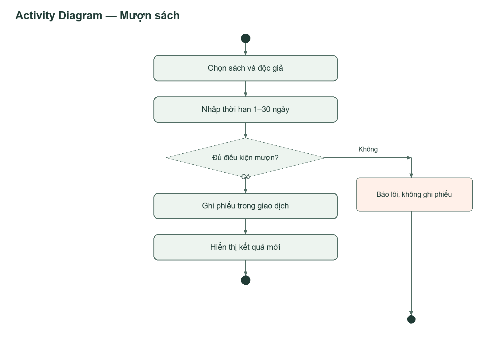
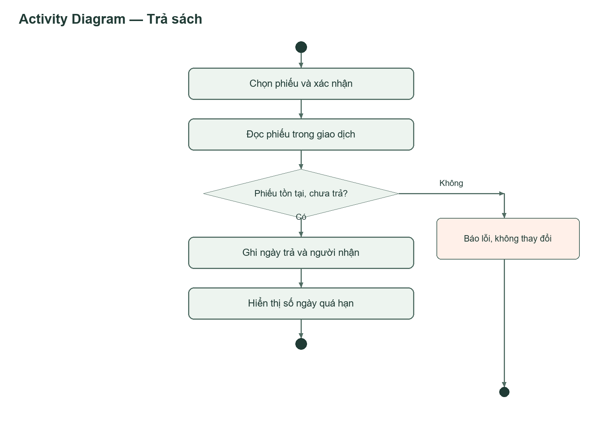
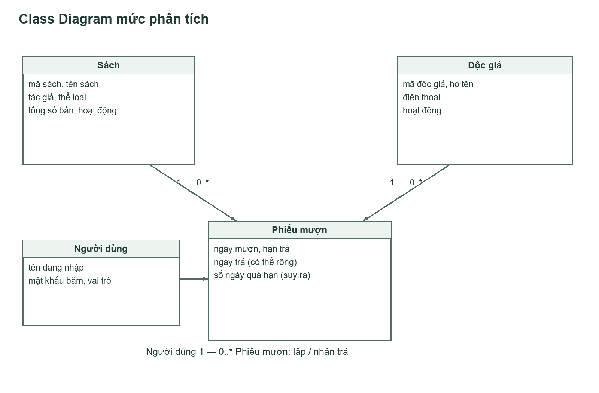
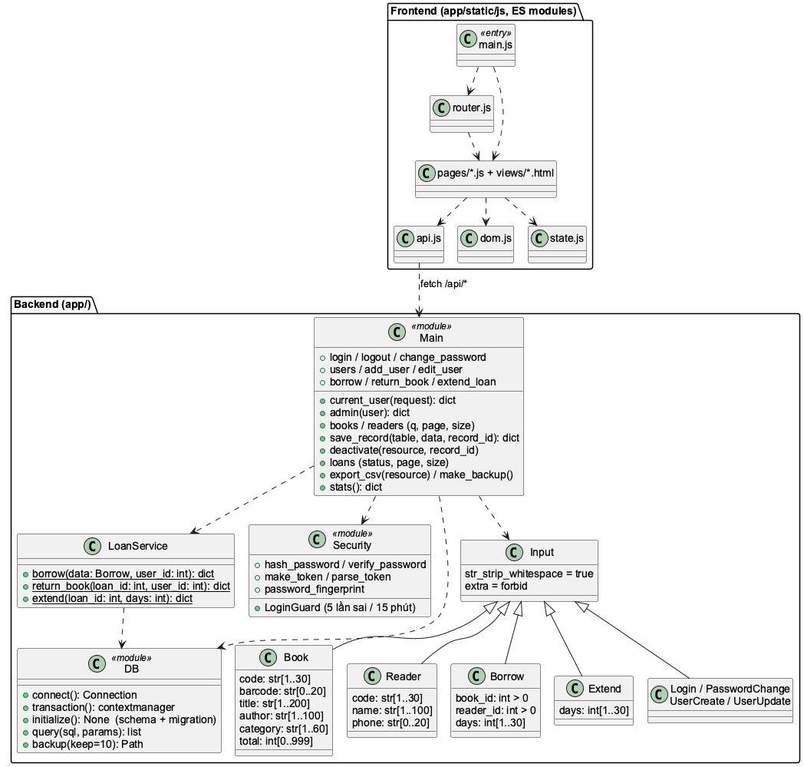
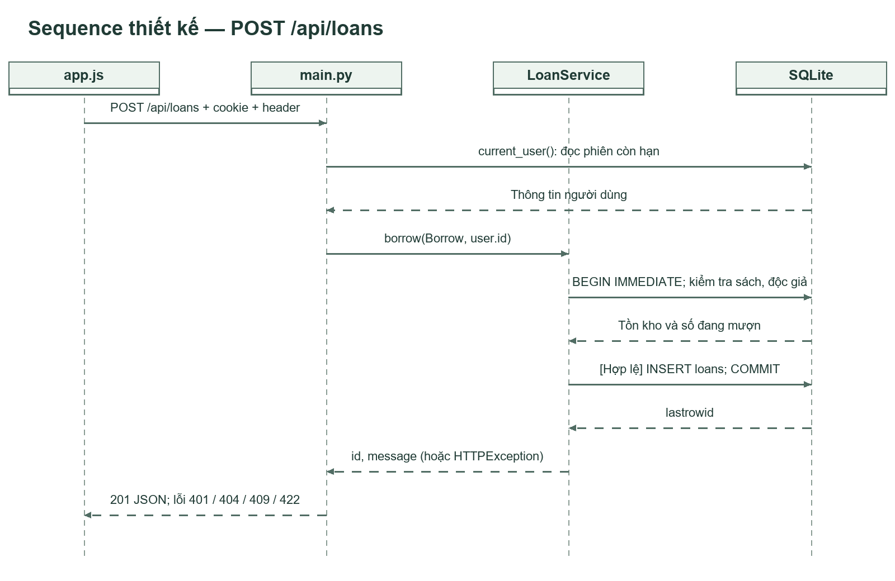
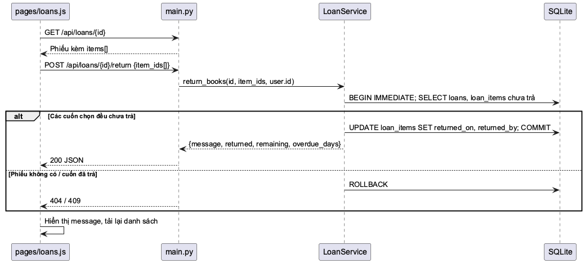

<!-- cover -->

BỘ KHOA HỌC VÀ CÔNG NGHỆ

HỌC VIỆN CÔNG NGHỆ BƯU CHÍNH VIỄN THÔNG

---

# BÁO CÁO ĐỒ ÁN MÔN HỌC

MÔN HỌC: NHẬP MÔN CÔNG NGHỆ PHẦN MỀM

ĐỀ TÀI: QUẢN LÝ THƯ VIỆN

**Giảng viên hướng dẫn:** Nguyễn Thị Bích Nguyên

**Thực hiện bởi nhóm sinh viên, bao gồm:**

| STT | Họ và tên       | MSSV       | Lớp SV     | Vai trò       |
| --- | ------------------ | ---------- | ----------- | -------------- |
| 1.  | Lê Ngọc Khôi    | B24DTCN061 | D24TXCN06-B | Trưởng nhóm |
| 2.  | Phạm Tuấn Anh    | B24DTCN057 | D24TXCN06-B | Thành viên   |
| 3.  | Phạm Phước Hòa | B24DTCN060 | D24TXCN06-B | Thành viên   |
| 4.  | Lê Bá Quảng     | K25DTCN499 | D25TXCN14-K | Thành viên   |

TP.HCM, tháng 9/2026

<!-- /cover -->

# MỤC LỤC

<!-- toc -->

- MỤC LỤC
- DANH SÁCH HÌNH, BẢNG
  - Danh sách hình
  - Danh sách bảng
- DANH MỤC TỪ VIẾT TẮT
- CHƯƠNG I. TỔNG QUAN
  - I. Giới thiệu đề tài
    - 1. Mục tiêu của đề tài
    - 2. Phạm vi áp dụng
    - 3. Nền tảng kỹ thuật
  - II. Cơ sở lý thuyết
    - 1. Phân tích thiết kế hướng đối tượng với UML
    - 2. Kiến trúc client–server và ứng dụng một trang
    - 3. Cơ sở dữ liệu quan hệ và giao dịch
    - 4. An toàn thông tin cơ bản cho ứng dụng web
    - 5. Kiểm thử phần mềm
- CHƯƠNG II. PHÂN TÍCH NỘI DUNG, YÊU CẦU
  - I. Giới thiệu quy trình mượn sách
    - 1. Diễn biến quy trình
    - 2. Điều kiện kiểm tra
    - 3. Kết quả
  - II. Giới thiệu quy trình trả sách và gia hạn
    - 1. Diễn biến quy trình trả
    - 2. Điều kiện kiểm tra
    - 3. Quy trình gia hạn
    - 4. Kết quả
  - III. Yêu cầu chức năng nghiệp vụ
    - 1. Chức năng của đối tượng Thủ thư
    - 2. Chức năng riêng của đối tượng Quản trị viên
    - 3. Danh mục yêu cầu chức năng
    - 4. Quy tắc nghiệp vụ
  - IV. Yêu cầu chức năng hệ thống và yêu cầu chất lượng
- CHƯƠNG III. PHÂN TÍCH THIẾT KẾ
  - I. Sơ đồ use case
    - 1. UC01 Đăng nhập
    - 2. UC02 Quản lý sách
    - 3. UC03 Quản lý độc giả
    - 4. UC04 Mượn sách
    - 5. UC05 Trả sách
    - 6. UC06 Gia hạn phiếu
    - 7. UC07 Quản lý tài khoản và sao lưu
  - II. Sơ đồ hoạt động
    - 1. Hoạt động mượn sách
    - 2. Hoạt động trả sách
  - III. Thiết kế cơ sở dữ liệu
    - 1. Mô hình ERD
    - 2. Sơ đồ lớp
    - 3. Cấu trúc các bảng
  - IV. Thiết kế giao diện
    - 1. Giao diện Đăng nhập
    - 2. Giao diện Quản lý sách
    - 3. Giao diện Quản lý độc giả
    - 4. Giao diện Mượn sách
    - 5. Giao diện Trả sách
    - 6. Giao diện Gia hạn phiếu
    - 7. Giao diện Quản lý tài khoản và sao lưu
  - V. Thiết kế xử lý
    - 1. Xử lý mượn sách
    - 2. Xử lý trả sách
    - 3. Xử lý thêm và sửa sách
    - 4. Xử lý giao dịch và tính nhất quán
    - 5. Xử lý phiên đăng nhập và bảo vệ đầu vào
- CHƯƠNG IV. PHÁT TRIỂN/THỰC THI
  - I. Màn hình Đăng nhập
  - II. Màn hình Quản lý sách
  - III. Màn hình Quản lý độc giả
  - IV. Màn hình Mượn sách
  - V. Màn hình Trả sách
  - VI. Màn hình Gia hạn phiếu
  - VII. Màn hình Quản lý tài khoản và sao lưu
  - VIII. Danh mục API
- CHƯƠNG V. TRIỂN KHAI
  - I. Cài đặt
  - II. Thử nghiệm
    - 1. Tài khoản dùng để thử nghiệm
    - 2. Test case chức năng chính
    - 3. Test case chức năng bổ sung và giao diện
    - 4. Kiểm thử biên, unit test và tích hợp
    - 5. Trình tự demo chức năng chính
- CHƯƠNG VI. KẾT LUẬN
  - I. Kết quả đã thực hiện
  - II. Ưu khuyết điểm
  - III. Hướng mở rộng trong tương lai
- TÀI LIỆU THAM KHẢO

<!-- /toc -->

# DANH SÁCH HÌNH, BẢNG

## Danh sách hình

| Hình | Tên hình |
| --- | --- |
| Hình 1 | Tác nhân và chức năng hệ thống |
| Hình 2 | Luồng điều khiển mượn sách |
| Hình 3 | Luồng điều khiển trả sách |
| Hình 4 | Lược đồ quan hệ SQLite |
| Hình 5 | Lớp phân tích và quan hệ một–nhiều |
| Hình 6 | Các gói chức năng, DTO và lớp xử lý nghiệp vụ |
| Hình 7 | Giao diện Đăng nhập |
| Hình 8 | Giao diện Quản lý sách và hộp thoại thêm, sửa |
| Hình 9 | Giao diện Quản lý độc giả |
| Hình 10 | Giao diện hộp thoại Lập phiếu mượn |
| Hình 11 | Giao diện Mượn & trả và hộp xác nhận |
| Hình 12 | Giao diện hộp thoại Gia hạn phiếu |
| Hình 13 | Giao diện Quản lý tài khoản |
| Hình 14 | Tương tác nghiệp vụ UC04 Mượn sách |
| Hình 15 | Ánh xạ UC04 tới route, service và SQLite |
| Hình 16 | Tương tác nghiệp vụ UC05 Trả sách |
| Hình 17 | Ánh xạ UC05 tới route, service và SQLite |
| Hình 18 | Tương tác thêm sách trong UC02 |
| Hình 19 | Màn hình Đăng nhập |
| Hình 20 | Màn hình Kho sách |
| Hình 21 | Hộp thoại thêm và sửa sách |
| Hình 22 | Màn hình Độc giả |
| Hình 23 | Hộp thoại lập phiếu mượn |
| Hình 24 | Danh sách phiếu đang mượn với nút Trả sách |
| Hình 25 | Lịch sử phiếu mượn và trả |
| Hình 26 | Hộp thoại gia hạn phiếu |
| Hình 27 | Danh sách phiếu quá hạn |
| Hình 28 | Màn hình Tài khoản |
| Hình 29 | Màn hình Tổng quan với nút Sao lưu dữ liệu |

## Danh sách bảng

| Bảng | Tên bảng |
| --- | --- |
| Bảng 1 | Đối tượng sử dụng và nhu cầu |
| Bảng 2 | Chức năng của đối tượng Thủ thư |
| Bảng 3 | Chức năng riêng của đối tượng Quản trị viên |
| Bảng 4 | Danh mục yêu cầu chức năng FR01–FR13 |
| Bảng 5 | Quy tắc nghiệp vụ BR01–BR10 |
| Bảng 6 | Yêu cầu chất lượng và cách thực hiện |
| Bảng 7 | Đặc tả UC01 Đăng nhập |
| Bảng 8 | Đặc tả UC02 Quản lý sách |
| Bảng 9 | Đặc tả UC03 Quản lý độc giả |
| Bảng 10 | Đặc tả UC04 Mượn sách |
| Bảng 11 | Đặc tả UC05 Trả sách |
| Bảng 12 | Đặc tả UC06 Gia hạn phiếu |
| Bảng 13 | Đặc tả UC07 Quản lý tài khoản và sao lưu |
| Bảng 14 | Thực thể nghiệp vụ và trách nhiệm |
| Bảng 15 | Từ điển dữ liệu bảng users |
| Bảng 16 | Từ điển dữ liệu bảng books và readers |
| Bảng 17 | Từ điển dữ liệu bảng loans |
| Bảng 18 | Danh mục API |
| Bảng 19 | Tình trạng cài đặt các chức năng |
| Bảng 20 | Tài khoản dùng để thử nghiệm |
| Bảng 21 | Test case TC01–TC11 |
| Bảng 22 | Test case TC12–TC22 |
| Bảng 23 | Test case bổ sung và giao diện TC23–UI08 |
| Bảng 24 | Dữ liệu biên và unit test |
| Bảng 25 | Phân chia nội dung trình bày |

# DANH MỤC TỪ VIẾT TẮT

| Từ viết tắt | Diễn giải                                                               |
| -------------- | ------------------------------------------------------------------------- |
| API            | Application Programming Interface — giao diện lập trình ứng dụng    |
| BR             | Business Rule — quy tắc nghiệp vụ                                     |
| CRUD           | Create, Read, Update, Delete — thêm, đọc, sửa, xóa                  |
| CSDL           | Cơ sở dữ liệu                                                         |
| CSV            | Comma-Separated Values — định dạng bảng phân tách bằng dấu phẩy |
| DTO            | Data Transfer Object — đối tượng truyền dữ liệu                   |
| EAN-13         | European Article Number, mã vạch 13 chữ số                            |
| ERD            | Entity Relationship Diagram — sơ đồ thực thể quan hệ               |
| FK             | Foreign Key — khóa ngoại                                               |
| FR             | Functional Requirement — yêu cầu chức năng                           |
| HMAC           | Hash-based Message Authentication Code                                    |
| HTTP / HTTPS   | HyperText Transfer Protocol (Secure)                                      |
| ISBN           | International Standard Book Number                                        |
| JSON           | JavaScript Object Notation                                                |
| PBKDF2         | Password-Based Key Derivation Function 2                                  |
| PK             | Primary Key — khóa chính                                               |
| SPA            | Single Page Application — ứng dụng một trang                          |
| SQL            | Structured Query Language                                                 |
| TC / UI        | Test Case / Test case giao diện                                          |
| UC             | Use Case — ca sử dụng                                                  |
| UML            | Unified Modeling Language                                                 |

# CHƯƠNG I. TỔNG QUAN

## I. Giới thiệu đề tài

### 1. Mục tiêu của đề tài

Thư viện nhỏ cần biết đang có những đầu sách nào, mỗi đầu sách còn bao nhiêu bản, độc giả nào đang giữ sách và thời điểm phải trả. Khi ghi chép rời rạc, việc đối chiếu số lượng và lịch sử dễ sai: cùng một cuốn bị cấp nhiều lần, phiếu trả bị ghi trùng hoặc dữ liệu độc giả bị xóa trong khi vẫn còn sách đang mượn.

Ứng dụng giải quyết bằng danh mục thống nhất và phiếu mượn có liên kết tới sách, độc giả, người lập. Khi nhận sách trả, hệ thống ghi ngày trả và người nhận. Số có sẵn được suy ra từ các phiếu chưa trả nên có thể đối chiếu trực tiếp với lịch sử.

Đề tài 1 là Quản lý thư viện với ba chức năng chính: quản lý sách, quản lý độc giả và mượn/trả sách. Các quy tắc định lượng bổ sung nêu trong báo cáo là giả định của bản triển khai.

Tiêu chí hoàn thành: người dùng thực hiện được một vòng khép kín gồm tạo sách và độc giả → mượn một bản → kiểm tra tồn giảm → trả → kiểm tra tồn tăng → xóa mềm bản ghi không còn phiếu mở. Các luồng này phải xuất hiện trong phân tích, thiết kế và kiểm thử, không chỉ mô tả trên giấy.

### 2. Phạm vi áp dụng

Nhóm xây dựng một ứng dụng web cho thư viện quy mô nhỏ. Thủ thư theo dõi sách, độc giả và phiếu mượn trên một giao diện; quản trị viên có thêm quyền xóa mềm dữ liệu, quản lý tài khoản và sao lưu. Phần mềm lưu dữ liệu tại máy, có tài khoản và dữ liệu mẫu để chạy thử trên Windows hoặc macOS/Linux.

Bảng 1. Đối tượng sử dụng và nhu cầu

| Đối tượng    | Vai trò và nhu cầu                                                                                                                                                   |
| ---------------- | ----------------------------------------------------------------------------------------------------------------------------------------------------------------------- |
| Thủ thư        | Đăng nhập, đổi mật khẩu; thêm/sửa/tìm sách (kể cả theo mã vạch) và độc giả; lập phiếu; gia hạn; nhận trả; xem quá hạn, thống kê; xuất CSV. |
| Quản trị viên | Có mọi quyền của thủ thư; được xóa mềm sách/độc giả đủ điều kiện, quản lý tài khoản nhân viên và sao lưu CSDL.                              |
| Độc giả       | Đối tượng được quản lý và nhận dịch vụ mượn/trả; chưa đăng nhập trực tiếp trong phiên bản này.                                                 |

Ứng dụng phục vụ một thư viện, một CSDL tại máy chủ. Không tích hợp thanh toán, SMS/email, thẻ từ hoặc tài khoản Google. Dữ liệu độc giả mẫu là giả lập. Giao diện dùng tiếng Việt, thao tác bằng trình duyệt; máy chủ chạy trên Windows, macOS hoặc Linux. Bản demo trên Vercel chỉ để xem và thao tác thử, không lưu dữ liệu bền.

Quy ước: “xóa” trong phạm vi này là xóa mềm bằng active=0, nút Ngừng trên giao diện. Một phiếu mượn đại diện cho một bản sách. Mã vạch/ISBN được ghi theo đầu sách (không bắt buộc, duy nhất khi có); nhóm chưa quản lý riêng từng bản vật lý.

### 3. Nền tảng kỹ thuật

Sản phẩm là một web application viết bằng Python với FastAPI, lưu dữ liệu trong SQLite, giao diện HTML/CSS/JavaScript thuần theo chuẩn ES modules và không có bước build. Trình duyệt nạp trực tiếp các module JavaScript; Node chỉ dùng ở máy phát triển để chạy Prettier, ESLint và kiểm tra kiểu TypeScript cho mã JavaScript. Bộ kiểm thử dùng pytest cho API và Playwright cho giao diện. Ứng dụng có bản demo công khai triển khai trên Vercel.

## II. Cơ sở lý thuyết

### 1. Phân tích thiết kế hướng đối tượng với UML

Các khái niệm phân tích, thiết kế và kiểm thử dùng trong báo cáo bám theo nội dung học phần Nhập môn Công nghệ phần mềm của Học viện [1]. Báo cáo dùng bốn loại sơ đồ UML: use case mô tả tác nhân và chức năng, class diagram mô tả thực thể và quan hệ, activity diagram mô tả luồng điều khiển, sequence diagram mô tả trình tự trao đổi thông điệp. Pha phân tích mô tả nghiệp vụ không gắn công nghệ; pha thiết kế ánh xạ cùng nội dung đó xuống route, service và câu lệnh SQL cụ thể.

### 2. Kiến trúc client–server và ứng dụng một trang

Ứng dụng tách lớp trình bày chạy trên trình duyệt và lớp xử lý chạy trên máy chủ, trao đổi bằng HTTP với dữ liệu JSON. Giao diện là SPA: một khung HTML chung, các màn hình được nạp và định tuyến bằng History API nên tải lại trang hay nút Back vẫn đúng màn hình.

### 3. Cơ sở dữ liệu quan hệ và giao dịch

Dữ liệu lưu trong SQLite theo mô hình quan hệ với khóa chính, khóa ngoại, ràng buộc UNIQUE và CHECK. Các thao tác làm thay đổi tồn kho được đặt trong giao dịch BEGIN IMMEDIATE để việc kiểm tra điều kiện và ghi dữ liệu diễn ra không tách rời; nếu một bước lỗi thì toàn bộ giao dịch rollback. Những giá trị suy ra được như số bản có sẵn hay trạng thái phiếu không lưu thành cột riêng mà tính lại từ dữ liệu gốc.

### 4. An toàn thông tin cơ bản cho ứng dụng web

Mật khẩu không lưu dạng rõ mà băm bằng PBKDF2-HMAC-SHA256 kèm salt riêng. Phiên đăng nhập là token ký HMAC đặt trong cookie HttpOnly nên máy chủ không cần lưu trạng thái phiên. Đầu vào được xác thực bằng DTO trước khi tới nghiệp vụ, câu lệnh SQL tham số hóa để tránh SQL injection, và mọi giá trị chèn vào HTML đều được thoát ký tự để tránh XSS.

### 5. Kiểm thử phần mềm

Nhóm áp dụng ba mức: unit test cho hàm thuần, kiểm thử tích hợp cho service với CSDL tạm, và kiểm thử hệ thống qua API cùng giao diện trình duyệt. Dữ liệu biên được chọn theo kỹ thuật phân tích giá trị biên: lấy giá trị ngay trong và ngay ngoài khoảng hợp lệ của mỗi ràng buộc.

# CHƯƠNG II. PHÂN TÍCH NỘI DUNG, YÊU CẦU

## I. Giới thiệu quy trình mượn sách

### 1. Diễn biến quy trình

Thủ thư đăng nhập, mở màn hình Mượn & trả và chọn Lập phiếu mượn. Trong hộp thoại, thủ thư chọn độc giả, chọn đầu sách còn bản và nhập số ngày mượn (mặc định 14). Hệ thống mở một giao dịch ghi, đọc lại sách và độc giả từ CSDL, đếm số phiếu chưa trả của độc giả và của đầu sách rồi mới quyết định cho mượn.

### 2. Điều kiện kiểm tra

Đầu vào phải hợp lệ (ID dương, số ngày nguyên 1–30); sách và độc giả phải đang hoạt động; độc giả đang giữ dưới 5 bản; số bản đang cho mượn của đầu sách phải nhỏ hơn tổng số bản. Đủ điều kiện thì hệ thống tạo phiếu với ngày mượn là hôm nay và hạn trả bằng hôm nay cộng số ngày, sau đó commit.

### 3. Kết quả

Mỗi phiếu đại diện đúng một bản sách nên số có sẵn giảm một. Nếu bất kỳ điều kiện nào không đạt, giao dịch rollback và số phiếu, số tồn đều không đổi. Khi hai thủ thư cùng mượn bản cuối, các giao dịch ghi được tuần tự hóa nên chỉ yêu cầu đầu tiên thành công.

## II. Giới thiệu quy trình trả sách và gia hạn

### 1. Diễn biến quy trình trả

Thủ thư nhận lại sách vật lý, đối chiếu sách và độc giả rồi chọn đúng phiếu chưa trả và bấm Trả sách. Giao diện yêu cầu xác nhận; nếu hủy thì không gửi yêu cầu nào. Server mở giao dịch, đọc phiếu, ghi ngày trả là ngày hiện tại và người nhận là người đang đăng nhập, rồi commit.

### 2. Điều kiện kiểm tra

Phiếu phải tồn tại và chưa có ngày trả. Thao tác trả lặp trên cùng một phiếu bị từ chối để tồn không bị cộng hai lần. Trả muộn vẫn được chấp nhận, hệ thống hiển thị số ngày trễ và chưa tính tiền phạt.

### 3. Quy trình gia hạn

Với phiếu còn trong hạn, thủ thư bấm Gia hạn và nhập số ngày thêm từ 1 đến 30 (mặc định 7). Hệ thống kiểm tra ba điều kiện trong cùng giao dịch: phiếu chưa trả, chưa quá hạn và chưa gia hạn lần nào. Đạt cả ba thì hạn trả được cộng thêm số ngày, cờ số lần gia hạn đặt bằng 1 và phiếu mang nhãn “Đã gia hạn”. Mỗi phiếu chỉ gia hạn được đúng một lần.

### 4. Kết quả

Trả sách không xóa dòng phiếu mà bổ sung thông tin hoàn trả, nhờ vậy lịch sử mượn được giữ nguyên. Số ngày trễ của phiếu đã trả tính đến ngày trả nên không tiếp tục tăng khi xem lại về sau.

## III. Yêu cầu chức năng nghiệp vụ

### 1. Chức năng của đối tượng Thủ thư

Bảng 2. Chức năng của đối tượng Thủ thư

| STT | Công việc                  | Loại công việc | Quy định/Công thức liên quan                                                                                                                                                                            | Biểu mẫu liên quan             | Ghi chú                                 |
| --- | ---------------------------- | ----------------- | ------------------------------------------------------------------------------------------------------------------------------------------------------------------------------------------------------------ | --------------------------------- | ---------------------------------------- |
| 1   | Đăng nhập, đăng xuất   | Tra cứu          | Tài khoản phải tồn tại, đang hoạt động; mật khẩu so khớp PBKDF2; sai 5 lần trong 15 phút thì khóa tạm 15 phút                                                                              | Màn hình Đăng nhập           | Phiên hợp lệ 8 giờ                   |
| 2   | Đổi mật khẩu             | Lưu trữ         | Nhập đúng mật khẩu hiện tại; mật khẩu mới ≥ 8 ký tự                                                                                                                                             | Hộp thoại Đổi mật khẩu      | Các phiên khác hết hiệu lực        |
| 3   | Thêm, sửa sách            | Lưu trữ         | Mã 1–30 ký tự và duy nhất; tên ≤ 200, tác giả ≤ 100, thể loại ≤ 60 ký tự; tổng bản nguyên 0–999 và không thấp hơn số đang mượn; mã vạch ≤ 20 ký tự, duy nhất khi có nhập | Hộp thoại Thêm/Sửa sách      | Mã vạch không bắt buộc              |
| 4   | Thêm, sửa độc giả       | Lưu trữ         | Mã 1–30 ký tự và duy nhất; họ tên 1–100 ký tự; điện thoại ≤ 20 ký tự gồm chữ số và + ( ) -                                                                                              | Hộp thoại Thêm/Sửa độc giả | Điện thoại không bắt buộc          |
| 5   | Tìm kiếm sách, độc giả | Tra cứu          | Sách theo mã/mã vạch/tên/tác giả/thể loại; độc giả theo mã/tên/điện thoại; so khớp chuỗi con, casefold Unicode, không phân biệt hoa thường nhưng phân biệt dấu                   | Màn hình Kho sách, Độc giả  | Máy quét mã vạch gõ mã rồi Enter  |
| 6   | Phân trang danh sách       | Trích xuất      | Chọn 5/10/20/50 dòng mỗi trang; số trang vượt quá bị kẹp về trang cuối; size > 100 bị từ chối                                                                                                  | Thanh phân trang                 | Không truyền trang thì trả toàn bộ |
| 7   | Lập phiếu mượn           | Lưu trữ         | Sách và độc giả đang hoạt động; độc giả giữ dưới 5 bản; sách còn bản; số ngày nguyên 1–30, mặc định 14; hạn trả = ngày mượn + số ngày                                       | Hộp thoại Lập phiếu mượn    | Một phiếu ứng với một bản sách    |
| 8   | Nhận trả sách             | Lưu trữ         | Phiếu phải chưa trả; ghi ngày trả và người nhận; trả lặp bị từ chối                                                                                                                           | Màn hình Mượn & trả          | Trả muộn vẫn được nhận            |
| 9   | Gia hạn phiếu              | Lưu trữ         | Phiếu chưa trả, chưa quá hạn, chưa gia hạn lần nào; thêm 1–30 ngày tính từ hạn trả hiện tại                                                                                               | Hộp thoại Gia hạn              | Tối đa một lần cho mỗi phiếu       |
| 10  | Theo dõi phiếu quá hạn   | Tra cứu          | Quá hạn khi ngày hiện tại lớn hơn hạn trả; số ngày trễ = ngày hiện tại − hạn trả, phiếu đã trả tính đến ngày trả                                                                  | Bộ lọc trạng thái phiếu      | Đến hạn vẫn tính trong hạn         |
| 11  | Xem thống kê               | Trích xuất      | Số đầu sách, tổng bản, bản có sẵn, số độc giả, đang mượn, đã trả, quá hạn, top sách; có sẵn = tổng bản − số phiếu đang mở                                                     | Màn hình Tổng quan             | Tính bằng COUNT/SUM trong SQL          |
| 12  | Xuất CSV                    | Trích xuất      | Xuất sách, độc giả hoặc phiếu ra CSV UTF-8 có BOM                                                                                                                                                    | Nút Xuất CSV                    | Mở được bằng Excel                  |

### 2. Chức năng riêng của đối tượng Quản trị viên

Bảng 3. Chức năng riêng của đối tượng Quản trị viên

| STT | Công việc                                                                 | Loại công việc | Quy định/Công thức liên quan                                                                                   | Biểu mẫu liên quan         | Ghi chú                                                          |
| --- | --------------------------------------------------------------------------- | ----------------- | ------------------------------------------------------------------------------------------------------------------- | ----------------------------- | ----------------------------------------------------------------- |
| 1   | Xóa mềm sách, độc giả                                                 | Lưu trữ         | Chỉ xóa khi không còn phiếu chưa trả; đặt active = 0; mã đã xóa mềm không tái sử dụng             | Nút Ngừng kèm xác nhận   | Lịch sử phiếu được giữ nguyên                             |
| 2   | Tạo tài khoản nhân viên                                                | Lưu trữ         | Tên đăng nhập 3–50 ký tự chữ/số/._- và duy nhất; mật khẩu ≥ 8 ký tự; vai trò admin hoặc librarian | Hộp thoại Thêm tài khoản | Mật khẩu được băm PBKDF2                                    |
| 3   | Đổi vai trò, đặt lại mật khẩu, ngừng hoặc kích hoạt tài khoản | Lưu trữ         | Không tự hạ quyền, không tự ngừng; hệ thống luôn còn ít nhất một admin đang hoạt động             | Màn hình Tài khoản        | Thao tác này làm mọi phiên của người đó hết hiệu lực |
| 4   | Sao lưu CSDL                                                               | Lưu trữ         | Dùng API backup của SQLite, đặt tên theo thời điểm, giữ 10 bản mới nhất                                 | Nút Sao lưu dữ liệu       | Cũng tự chạy mỗi lần khởi động                            |

Thủ thư gọi trực tiếp các API trên đều nhận mã 403, kể cả khi bỏ qua giao diện.

### 3. Danh mục yêu cầu chức năng

Bảng 4. Danh mục yêu cầu chức năng FR01–FR13

| Mã  | Chức năng                   | Điều kiện nghiệm thu                                                                                                       |
| ---- | ----------------------------- | ------------------------------------------------------------------------------------------------------------------------------ |
| FR01 | Đăng nhập và đăng xuất | Tài khoản hợp lệ nhận phiên; sai thông tin bị từ chối; đăng xuất hủy phiên.                                     |
| FR02 | Quản lý sách               | Thêm, sửa, xóa mềm; mã duy nhất; tên/tác giả/thể loại bắt buộc; không có tồn âm.                              |
| FR03 | Quản lý độc giả          | Thêm, sửa, xóa mềm; mã duy nhất; họ tên bắt buộc; điện thoại không bắt buộc.                                   |
| FR04 | Mượn sách                  | Chọn sách còn bản và độc giả hoạt động; kiểm tra giới hạn; lưu phiếu và hạn trả.                            |
| FR05 | Trả sách                    | Chọn phiếu chưa trả; xác nhận đã nhận; ghi ngày trả/người nhận; từ chối trả lặp.                             |
| FR06 | Tìm kiếm, phân trang       | Sách theo mã/mã vạch/tên/tác giả/thể loại; độc giả theo mã/tên/điện thoại; danh sách chia trang 5–50 dòng. |
| FR07 | Theo dõi quá hạn           | Lọc phiếu chưa trả đã qua hạn; hiển thị số ngày trễ.                                                               |
| FR08 | Thống kê cơ bản           | Số đầu sách, tổng bản, bản có sẵn, độc giả, đang mượn, đã trả, quá hạn, top sách.                         |
| FR09 | Phân quyền                  | API kiểm tra phiên; chỉ admin được xóa mềm, quản lý tài khoản và sao lưu, kể cả khi gọi API trực tiếp.      |
| FR10 | Gia hạn phiếu               | Phiếu còn trong hạn được gia hạn đúng một lần, thêm 1–30 ngày; phiếu quá hạn hoặc đã trả bị từ chối.   |
| FR11 | Quản lý tài khoản         | Admin tạo tài khoản, đổi vai trò, đặt lại mật khẩu, ngừng/kích hoạt; mọi người tự đổi mật khẩu.          |
| FR12 | Xuất CSV                     | Xuất danh sách sách, độc giả, phiếu ra CSV UTF-8 mở được bằng Excel.                                               |
| FR13 | Sao lưu                      | Tự sao lưu khi khởi động và theo yêu cầu admin; giữ 10 bản mới nhất.                                               |

FR02–FR05 là các chức năng cốt lõi của đề tài. FR01, FR09 và FR11 hỗ trợ truy cập an toàn; FR06–FR08, FR10, FR12–FR13 giúp tìm thông tin, vận hành và bảo toàn dữ liệu. Bản ghi đã xóa mềm không xuất hiện trong danh sách đang hoạt động, nhưng phiếu lịch sử vẫn hiển thị.

### 4. Quy tắc nghiệp vụ

Bảng 5. Quy tắc nghiệp vụ BR01–BR10

| Mã  | Quy tắc nghiệp vụ của bản triển khai                                                                                                   |
| ---- | -------------------------------------------------------------------------------------------------------------------------------------------- |
| BR01 | Một phiếu = một bản sách; mỗi độc giả tối đa 5 bản chưa trả.                                                                   |
| BR02 | Số ngày mượn nguyên từ 1 đến 30, mặc định 14.                                                                                     |
| BR03 | Tổng số bản nguyên từ 0 đến 999, không thấp hơn số đang mượn.                                                                  |
| BR04 | Đến hạn vẫn trong hạn; chỉ quá hạn khi ngày hiện tại lớn hơn hạn trả.                                                         |
| BR05 | Không xóa mềm sách/độc giả có phiếu chưa trả; mã xóa mềm không tái sử dụng.                                                |
| BR06 | Cho phép mượn tiếp khi có quá hạn nếu chưa đạt giới hạn 5; chưa thu phạt.                                                     |
| BR07 | Ngày nghiệp vụ theo ngày máy chủ; phiếu đã trả giữ độ trễ đến ngày trả.                                                    |
| BR08 | Gia hạn: chỉ phiếu chưa trả và chưa quá hạn, đúng một lần, thêm 1–30 ngày tính từ hạn trả hiện tại.                    |
| BR09 | Mã vạch sách tối đa 20 ký tự chữ số/chữ cái/gạch nối, không bắt buộc, duy nhất khi có nhập.                               |
| BR10 | Tài khoản: tên 3–50 ký tự chữ/số/._-, mật khẩu ≥ 8 ký tự; không tự hạ quyền/tự ngừng; luôn còn ≥ 1 admin hoạt động. |

Các ngưỡng BR01–BR03, BR08–BR10 là giả định triển khai, không phải quy định định lượng trong đề gốc.

## IV. Yêu cầu chức năng hệ thống và yêu cầu chất lượng

Bảng 6. Yêu cầu chất lượng và cách thực hiện

| Yêu cầu          | Cách thực hiện / giới hạn                                                                                                                                                                                                 |
| ------------------ | ------------------------------------------------------------------------------------------------------------------------------------------------------------------------------------------------------------------------------ |
| Toàn vẹn         | Khóa ngoại, UNIQUE/CHECK, giao dịch BEGIN IMMEDIATE; tính số có sẵn từ phiếu.                                                                                                                                         |
| Bảo mật cơ bản | Băm mật khẩu PBKDF2 với salt; phiên là token ký HMAC trong cookie HttpOnly/SameSite, hạn 8 giờ; khóa tạm sau 5 lần sai mật khẩu; phân quyền server; SQL tham số hóa; HTML tự thoát ký tự.                |
| Dễ dùng          | Tiếng Việt, trường bắt buộc, thông báo lỗi; xác nhận khi trả hoặc xóa mềm.                                                                                                                                      |
| Dễ triển khai    | Python 3.11+ trên Windows/macOS/Linux, SQLite file; không dịch vụ trả phí; giao diện chính không cần mạng sau cài; có cấu hình demo Vercel.                                                                     |
| Hiệu năng        | Thiết kế cho thư viện nhỏ; lọc và phân trang bằng SQL (LIMIT/OFFSET), có chỉ mục; chưa có benchmark tải lớn hoặc SLA.                                                                                         |
| Bảo trì          | Backend tách module đầu vào, xác thực, nghiệp vụ, CSDL; frontend chia ES modules theo màn hình, kiểm tra bằng Prettier/ESLint/TypeScript (@ts-check); bộ test API chạy CSDL tạm và test giao diện Playwright. |

Chưa kiểm toán bảo mật, thử tải lớn hoặc chứng minh vận hành liên tục 24/7.

# CHƯƠNG III. PHÂN TÍCH THIẾT KẾ

## I. Sơ đồ use case

Quản trị viên kế thừa quyền thủ thư và có thêm xóa mềm sách/độc giả, quản lý tài khoản và sao lưu. Độc giả không là tác nhân tương tác trực tiếp với phần mềm trong phạm vi này. Quản lý sách gồm thêm, sửa, tìm và ghi mã vạch; gia hạn và xuất CSV là ca bổ sung của thủ thư.

Đăng nhập là tiền điều kiện cho các ca nghiệp vụ, không phải thao tác được thực thi lại ở mỗi ca. Vì vậy sơ đồ không gắn include Đăng nhập vào mọi chức năng.

### 1. UC01 Đăng nhập

Bảng 7. Đặc tả UC01 Đăng nhập

| Thuộc tính       | Mô tả                                                   |
| ------------------ | --------------------------------------------------------- |
| Tác nhân         | Thủ thư hoặc quản trị viên                          |
| Tiền điều kiện | Đã có tài khoản; server và CSDL hoạt động.       |
| Kích hoạt        | Người dùng mở trang đăng nhập và gửi thông tin. |

**Scenario chuẩn.** (1) Người dùng nhập tên đăng nhập và mật khẩu, bấm Đăng nhập. (2) Server kiểm tra cấu trúc dữ liệu và đọc tài khoản theo username. (3) Server so sánh PBKDF2 của mật khẩu nhập với password_hash lưu trong CSDL. (4) Server tạo token phiên gồm user_id, hạn 8 giờ, dấu vết mật khẩu và chữ ký HMAC-SHA256 bằng khóa bí mật của máy chủ; không lưu phiên vào CSDL. (5) Trình duyệt nhận cookie HttpOnly, chuyển tới màn hình theo URL hiện tại (mặc định tổng quan) và hiển thị đúng vai trò.

**Ngoại lệ và nhánh thay thế.** E1. Tài khoản không tồn tại, đã ngừng hoặc mật khẩu sai: trả 401 với cùng thông báo, vẫn ở trang đăng nhập. Sai 5 lần trong 15 phút với cùng tài khoản–địa chỉ: 429, khóa tạm 15 phút. E2. Thiếu trường, chuỗi rỗng hoặc quá dài: trả 422; giao diện yêu cầu nhập lại. E3. Phiên hết hạn, chữ ký sai hoặc mật khẩu đã đổi ở thao tác sau: API trả 401, giao diện quay về đăng nhập. Nhánh đăng xuất: xóa cookie. Nhánh đổi mật khẩu: nhập mật khẩu hiện tại và mật khẩu mới ≥ 8 ký tự; các phiên khác của tài khoản tự hết hiệu lực vì dấu vết mật khẩu trong token không còn khớp; phiên đang dùng được cấp cookie mới.

**Hậu điều kiện.** Thành công: có phiên hợp lệ và quyền tương ứng. Thất bại: không cấp phiên mới. Đối chiếu TC01, TC02, TC17, TC24, TC27, UI01–02, UI07.

### 2. UC02 Quản lý sách

Bảng 8. Đặc tả UC02 Quản lý sách

| Thuộc tính       | Mô tả                                                                    |
| ------------------ | -------------------------------------------------------------------------- |
| Tác nhân         | Thủ thư; riêng xóa mềm cần quản trị viên.                         |
| Tiền điều kiện | Đã đăng nhập. Với sửa/xóa, sách tồn tại và đang hoạt động. |
| Kích hoạt        | Mở Kho sách, chọn thêm hoặc thao tác trên bản ghi.                 |

**Scenario chuẩn.** (1) Thủ thư bấm Thêm sách, nhập mã, tên, tác giả, thể loại, tổng số bản và mã vạch/ISBN (không bắt buộc, có thể quét). (2) Giao diện kiểm tra trường bắt buộc; server kiểm tra độ dài và tổng số bản nguyên 0–999. (3) Server thêm bản ghi books, CSDL kiểm tra tính duy nhất của code và của barcode khi khác rỗng. (4) Giao diện đóng biểu mẫu, tải lại danh sách, hiển thị sách mới và thông báo đã lưu. (5) Khi sửa, người dùng chọn bản ghi, thay thông tin và lưu; server kiểm tra tổng mới không dưới số bản đang mượn.

**Ngoại lệ và nhánh thay thế.** A1. Tìm kiếm: nhập chuỗi, danh sách lọc theo mã/mã vạch/tên/tác giả/thể loại; rỗng trả tất cả sách hoạt động. Kết quả chia trang; thanh phân trang cho chọn 5/10/20/50 dòng. A2. Xóa mềm: quản trị bấm Ngừng, xác nhận; nếu không có phiếu mở thì active=0 và sách rời danh sách. A3. Xuất CSV: tải toàn bộ sách đang hoạt động (có cột mã vạch, tổng bản, có sẵn) dạng UTF-8 có BOM. E1. Mã hoặc mã vạch trùng: 409, giữ biểu mẫu để sửa. E2. Tổng âm, không nguyên, >999, tên rỗng hoặc mã vạch sai định dạng: 422. E3. Tổng mới thấp hơn số đang mượn hoặc xóa khi còn phiếu mở: 409, dữ liệu cũ giữ nguyên. E4. Không tìm thấy bản ghi: 404. Thủ thư gọi API xóa trực tiếp: 403.

**Hậu điều kiện.** Thành công: danh mục cập nhật và lịch sử còn nguyên. Thất bại: không ghi thay đổi. Đối chiếu TC03–04, TC11–13, TC21–22, TC29, TC32, TC37, B02–03, B05–06, UI04–05.

### 3. UC03 Quản lý độc giả

Bảng 9. Đặc tả UC03 Quản lý độc giả

| Thuộc tính       | Mô tả                                                          |
| ------------------ | ---------------------------------------------------------------- |
| Tác nhân         | Thủ thư; riêng xóa mềm cần quản trị viên.               |
| Tiền điều kiện | Đã đăng nhập. Với sửa/xóa, độc giả còn hoạt động. |
| Kích hoạt        | Mở Độc giả và chọn thêm/sửa/ngừng.                      |

**Scenario chuẩn.** (1) Thủ thư chọn Thêm độc giả, nhập mã độc giả và họ tên; điện thoại có thể để trống. (2) Server loại khoảng trắng đầu/cuối, kiểm tra mã 1–30 ký tự, tên 1–100 và điện thoại tối đa 20 ký tự. (3) Server ghi readers, CSDL kiểm tra mã không trùng. (4) Giao diện tải lại danh sách và hiển thị bản ghi mới. (5) Với sửa, chọn độc giả, thay họ tên/điện thoại/mã rồi lưu; ID nội bộ không đổi nên liên kết phiếu vẫn giữ.

**Ngoại lệ và nhánh thay thế.** A1. Tìm kiếm theo mã, họ tên hoặc điện thoại; không khớp thì hiển thị trạng thái không tìm thấy. Kết quả chia trang; có xuất CSV. A2. Xóa mềm: quản trị xác nhận Ngừng; server kiểm tra không có phiếu chưa trả rồi cập nhật active=0. E1. Mã trùng: 409; tên/mã trống hoặc điện thoại có ký tự ngoài chữ số, dấu +, khoảng trắng, ngoặc và gạch ngang: 422. E2. Độc giả còn giữ sách: xóa mềm bị từ chối 409. E3. Độc giả đã ngừng hoặc không tồn tại: sửa/mượn mới bị từ chối 404.

**Hậu điều kiện.** Danh sách hoạt động được cập nhật; lịch sử mượn không bị xóa. Đối chiếu TC05, TC11, TC14, TC18.

### 4. UC04 Mượn sách

Bảng 10. Đặc tả UC04 Mượn sách

| Thuộc tính       | Mô tả                                                                                                     |
| ------------------ | ----------------------------------------------------------------------------------------------------------- |
| Tác nhân         | Thủ thư hoặc quản trị viên.                                                                           |
| Tiền điều kiện | Đã đăng nhập; sách và độc giả hoạt động; sách còn bản; độc giả đang giữ dưới 5 bản. |
| Kích hoạt        | Chọn Lập phiếu mượn.                                                                                   |

**Scenario chuẩn.** (1) Thủ thư chọn độc giả, đầu sách và số ngày mượn (mặc định 14). (2) Server xác thực phiên, kiểm tra ID dương và số ngày nguyên từ 1 đến 30. (3) Lớp xử lý nghiệp vụ mở giao dịch BEGIN IMMEDIATE, đọc lại sách/độc giả và số phiếu chưa trả từ CSDL. (4) Nếu độc giả dưới 5 phiếu mở và số đang mượn của đầu sách nhỏ hơn total, server tạo phiếu với ngày mượn hôm nay, hạn trả = hôm nay + số ngày. (5) Giao dịch commit; API trả 201 và mã phiếu; giao diện cập nhật danh sách và tồn khả dụng.

**Ngoại lệ và nhánh thay thế.** E1. Sách/độc giả không tồn tại hoặc đã ngừng: 404, rollback. E2. Độc giả đủ 5 bản hoặc hết sách: 409, không tạo phiếu. E3. Số ngày 0/31 hoặc ID không hợp lệ: 422 trước khi ghi. E4. Hai yêu cầu mượn bản cuối: giao dịch ghi được tuần tự hóa; chỉ yêu cầu đầu đủ điều kiện thành công. A1. Độc giả đang quá hạn vẫn được mượn nếu dưới 5 bản theo giả định BR06.

**Hậu điều kiện.** Thành công: thêm đúng một phiếu, số có sẵn giảm một. Thất bại: số phiếu/tồn không đổi. Đối chiếu TC06–07, TC09, TC14, TC22, B01, B04, I01–02.

### 5. UC05 Trả sách

Bảng 11. Đặc tả UC05 Trả sách

| Thuộc tính       | Mô tả                                                                                  |
| ------------------ | ---------------------------------------------------------------------------------------- |
| Tác nhân         | Thủ thư hoặc quản trị viên.                                                        |
| Tiền điều kiện | Đã đăng nhập; phiếu tồn tại và chưa trả; thủ thư đã nhận sách vật lý. |
| Kích hoạt        | Chọn Trả sách tại phiếu và xác nhận.                                             |

**Scenario chuẩn.** (1) Thủ thư đối chiếu sách và độc giả rồi chọn đúng phiếu chưa trả. (2) Giao diện yêu cầu xác nhận đã nhận lại sách; hủy thì không gửi yêu cầu. (3) Server xác thực phiên, mở giao dịch và đọc phiếu. (4) Server ghi returned_on là ngày hiện tại và returned_by là người đang đăng nhập, sau đó commit. (5) Hệ thống tính số ngày quá hạn đến ngày trả, trả JSON kết quả và tải lại danh sách; tồn khả dụng tăng một vì phiếu không còn mở.

**Ngoại lệ và nhánh thay thế.** E1. Phiếu không tồn tại: 404 và không đổi CSDL. E2. Phiếu đã trả, kể cả thao tác lặp: 409; không cộng tồn lần hai. E3. Thiếu hoặc hết phiên: 401, phải đăng nhập lại; thiếu header bảo vệ yêu cầu ghi: 403. A1. Trả quá hạn vẫn được chấp nhận; hệ thống hiển thị số ngày trễ, chưa tính tiền phạt.

**Hậu điều kiện.** Phiếu giữ nguyên thông tin mượn và bổ sung ngày/người nhận trả. Sách có thể mượn lại. Đối chiếu TC06, TC08–10, TC16, U01–02, UI06.

### 6. UC06 Gia hạn phiếu

Bảng 12. Đặc tả UC06 Gia hạn phiếu

| Thuộc tính       | Mô tả                                                                             |
| ------------------ | ----------------------------------------------------------------------------------- |
| Tác nhân         | Thủ thư hoặc quản trị viên.                                                   |
| Tiền điều kiện | Đã đăng nhập; phiếu chưa trả, chưa quá hạn và chưa gia hạn lần nào. |
| Kích hoạt        | Bấm Gia hạn tại phiếu trong hạn, nhập số ngày (mặc định 7).              |

**Scenario chuẩn.** (1) Thủ thư bấm Gia hạn, nhập số ngày thêm từ 1 đến 30. (2) Lớp xử lý nghiệp vụ mở giao dịch, đọc phiếu, kiểm tra ba điều kiện: chưa trả, chưa quá hạn, extensions = 0. (3) Server cộng số ngày vào hạn trả hiện tại, đặt extensions = 1 và commit; giao diện hiển thị hạn mới và nhãn “Đã gia hạn”.

**Ngoại lệ.** E1. Phiếu không tồn tại: 404. E2. Đã trả, đã quá hạn hoặc đã gia hạn: 409 với thông báo tương ứng. E3. Số ngày 0/31: 422.

**Hậu điều kiện.** Hạn trả lùi đúng số ngày; phiếu không thể gia hạn lần hai. Đối chiếu TC28.

### 7. UC07 Quản lý tài khoản và sao lưu

Bảng 13. Đặc tả UC07 Quản lý tài khoản và sao lưu

| Thuộc tính       | Mô tả                                                             |
| ------------------ | ------------------------------------------------------------------- |
| Tác nhân         | Quản trị viên.                                                   |
| Tiền điều kiện | Đã đăng nhập với vai trò admin.                              |
| Kích hoạt        | Mở trang Tài khoản; hoặc bấm Sao lưu dữ liệu ở Tổng quan. |

**Scenario chuẩn.** (1) Admin bấm Thêm tài khoản, nhập tên đăng nhập, mật khẩu ≥ 8 ký tự và vai trò; server băm mật khẩu và ghi users. (2) Với tài khoản có sẵn, admin có thể đổi vai trò, đặt lại mật khẩu hoặc Ngừng/Kích hoạt; đặt lại mật khẩu hoặc ngừng làm mọi phiên của người đó hết hiệu lực. (3) Sao lưu: server chép CSDL bằng API backup của SQLite vào data/backups với tên theo thời điểm, giữ 10 bản mới nhất; cũng tự chạy mỗi lần khởi động.

**Ngoại lệ.** E1. Tên đăng nhập trùng: 409. E2. Mật khẩu ngắn, tên sai định dạng: 422. E3. Tự hạ quyền, tự ngừng, hoặc ngừng/hạ quyền admin cuối cùng: 409. E4. Thủ thư gọi các API này: 403.

**Hậu điều kiện.** Danh sách tài khoản cập nhật; tài khoản đã ngừng không đăng nhập được. Đối chiếu TC25–27, TC30, UI08.

## II. Sơ đồ hoạt động

### 1. Hoạt động mượn sách

Điều kiện mượn gồm đầu vào hợp lệ, sách/độc giả hoạt động, độc giả dưới 5 bản và sách còn bản. Hình trình bày luồng nghiệp vụ chính; tệp PlantUML ghi thêm xác thực, BEGIN IMMEDIATE và rollback. Cả nhánh đúng và sai đều phải kết thúc mà không để giao dịch mở.

### 2. Hoạt động trả sách

Sau xác nhận của thủ thư, hệ thống kiểm tra phiếu trong giao dịch. Trả sách không xóa dòng loans mà bổ sung thông tin hoàn trả. Trạng thái đã trả là trạng thái kết thúc đối với thao tác này; trả lặp bị từ chối để không làm sai tồn.

## III. Thiết kế cơ sở dữ liệu

### 1. Mô hình ERD

Bốn bảng nghiệp vụ: users, books, readers và loans (bảng sessions còn trong schema để tương thích CSDL cũ nhưng không dùng nữa). ID số nguyên làm khóa chính nội bộ; code/username là khóa duy nhất phục vụ nghiệp vụ; books.barcode duy nhất bằng chỉ mục có điều kiện WHERE barcode<>''. Không sử dụng ON DELETE CASCADE cho lịch sử mượn. PRAGMA foreign_keys=ON được bật trên mỗi kết nối. Các cột thêm sau bản đầu (users.active, loans.extensions, books.barcode) do bước khởi tạo CSDL tự ALTER TABLE khi mở CSDL cũ, nên dữ liệu đã có không phải tạo lại.

Mỗi phiếu tham chiếu một sách và một độc giả. created_by bắt buộc; returned_by có thể NULL. Ngày lưu chuỗi ISO YYYY-MM-DD, giúp so sánh nhất quán khi ứng dụng tạo đúng định dạng. Trạng thái phiếu và tồn có sẵn là dữ liệu tính toán.

### 2. Sơ đồ lớp

Bảng 14. Thực thể nghiệp vụ và trách nhiệm

| Entity        | Trách nhiệm nghiệp vụ                                                                                        |
| ------------- | ---------------------------------------------------------------------------------------------------------------- |
| Sách         | Mô tả đầu sách, tổng bản, trạng thái hoạt động. Số có sẵn là giá trị suy ra.                   |
| Độc giả    | Thông tin người mượn, mã duy nhất, trạng thái được phục vụ.                                        |
| Phiếu mượn | Liên kết một sách, một độc giả, người lập; lưu ngày mượn/hạn trả/ngày trả.                    |
| Người dùng | Tài khoản vận hành, vai trò và trạng thái hoạt động; có thể lập phiếu, nhận trả hoặc gia hạn. |

Một sách hoặc độc giả có thể có nhiều phiếu theo thời gian. Mỗi phiếu thuộc đúng một sách và một độc giả. Người nhận trả có thể chưa có khi phiếu đang mở. Phiên đăng nhập là chi tiết kỹ thuật (token ký trong cookie), không phải thực thể nghiệp vụ nên không xuất hiện ở đây.

Lớp trình bày chia thành các phần rời: khung HTML chung, khung riêng của từng màn hình, biểu định kiểu và một nhóm ES module đảm nhiệm gắn sự kiện, định tuyến bằng History API (/books, /loans/overdue…), gọi API, sinh HTML an toàn bằng tagged template tự thoát ký tự, giữ trạng thái và điền dữ liệu cho từng màn hình. Lớp máy chủ có bốn phần: phần tiếp nhận HTTP dùng DTO Pydantic để xác thực đầu vào và kiểm tra phiên; phần an toàn thông tin băm mật khẩu, ký và kiểm tra token, khóa đăng nhập sai; lớp xử lý nghiệp vụ nắm mượn, trả và gia hạn; phần dữ liệu cung cấp kết nối, bao giao dịch, bổ sung cột khi mở CSDL cũ và sao lưu.

Thao tác thêm, sửa và xóa mềm của cả hai danh mục đi qua một điểm xử lý chung; ba danh sách sách, độc giả và phiếu cũng dùng chung một cơ chế phân trang với bộ lọc và LIMIT/OFFSET đặt trong SQL. Bản này không tạo thêm lớp Repository hay ORM. Các hộp «module» trên sơ đồ là gói chức năng, không phải class được cài đặt. Các lớp entity khái niệm ở pha phân tích được ánh xạ thành bảng SQLite; ở lớp cài đặt, sách và độc giả xuất hiện dưới dạng DTO đầu vào. Không có bước build frontend: trình duyệt nạp trực tiếp ES modules; Node chỉ dùng ở máy phát triển để chạy Prettier, ESLint và kiểm tra kiểu TypeScript.

### 3. Cấu trúc các bảng

Bảng 15. Từ điển dữ liệu bảng users

| Bảng.cột          | Kiểu / ràng buộc        | Ý nghĩa                                     |
| ------------------- | -------------------------- | --------------------------------------------- |
| users.id            | INTEGER PRIMARY KEY        | Định danh người dùng                     |
| users.username      | TEXT NOT NULL UNIQUE       | Tên đăng nhập, 3–50 ký tự chữ/số/._- |
| users.password_hash | TEXT NOT NULL              | Salt và băm PBKDF2                          |
| users.role          | TEXT CHECK admin/librarian | Vai trò vận hành                           |
| users.active        | INTEGER CHECK 0/1          | 0 = đã ngừng, không đăng nhập được  |

Bảng 16. Từ điển dữ liệu bảng books và readers

| Cột           | SQLite                                              | Ràng buộc ứng dụng                                                    |
| -------------- | --------------------------------------------------- | ------------------------------------------------------------------------- |
| books.id       | INTEGER PK                                          | Server tạo                                                               |
| books.code     | TEXT NOT NULL UNIQUE                                | 1–30 ký tự sau trim                                                    |
| books.barcode  | TEXT NOT NULL DEFAULT rỗng, UNIQUE khi khác rỗng | 0–20 ký tự chữ số, chữ cái, gạch nối; ISBN/EAN-13 in trên sách |
| books.title    | TEXT NOT NULL                                       | 1–200 ký tự                                                            |
| books.author   | TEXT NOT NULL                                       | 1–100 ký tự                                                            |
| books.category | TEXT NOT NULL                                       | 1–60 ký tự                                                             |
| books.total    | INTEGER CHECK 0..999                                | Số nguyên, không dưới số đang mượn                               |
| books.active   | INTEGER CHECK 0/1                                   | Mặc định 1, xóa mềm = 0                                              |
| readers.id     | INTEGER PK                                          | Server tạo                                                               |
| readers.code   | TEXT NOT NULL UNIQUE                                | 1–30 ký tự                                                             |
| readers.name   | TEXT NOT NULL                                       | 1–100 ký tự                                                            |
| readers.phone  | TEXT NOT NULL DEFAULT rỗng                         | 0–20 ký tự, chữ số và + ()-                                         |
| readers.active | INTEGER CHECK 0/1                                   | Mặc định 1, xóa mềm = 0                                              |

Bảng 17. Từ điển dữ liệu bảng loans

| Cột loans  | Kiểu / ràng buộc | Ý nghĩa                               |
| ----------- | ------------------- | --------------------------------------- |
| id          | INTEGER PK          | Mã phiếu tự sinh                     |
| book_id     | INTEGER NOT NULL FK | Đầu sách, một bản mỗi phiếu      |
| reader_id   | INTEGER NOT NULL FK | Độc giả mượn                       |
| created_by  | INTEGER NOT NULL FK | Người lập phiếu                     |
| borrowed_on | TEXT NOT NULL       | Ngày mượn ISO                        |
| due_on      | TEXT NOT NULL       | Hạn trả, không trước ngày mượn  |
| returned_on | TEXT nullable       | Ngày trả, không trước ngày mượn |
| returned_by | INTEGER nullable FK | Người nhận sách trả                |
| extensions  | INTEGER CHECK 0..1  | Số lần đã gia hạn (tối đa 1)     |

Độ dài và mẫu chuỗi do Pydantic kiểm tra tại API; SQLite bảo vệ NOT NULL, UNIQUE, CHECK và khóa ngoại. Không khẳng định CSDL tự kiểm tra mọi quy tắc độ dài. Nếu chỉnh trực tiếp file DB ngoài ứng dụng, cần tuân thủ cùng quy tắc. Thay code không thay ID, nên phiếu lịch sử vẫn liên kết đúng. Code phân biệt hoa/thường theo UNIQUE mặc định SQLite; tìm kiếm casefold là quy tắc khác và đã nêu riêng để tránh nhầm lẫn.

**Chỉ mục và giá trị suy ra.** ix_loans_book(book_id, returned_on), ix_loans_reader(reader_id, returned_on), chỉ mục due_on cho phiếu chưa trả và ux_books_barcode. Available = total − count(open loans); trạng thái phiếu suy ra từ returned_on và due_on so với ngày hiện tại, tính ngay trong SQL khi lọc. Không có cột available/status vì đây là dữ liệu suy ra, tránh cập nhật trùng nguồn. Thống kê ở /api/stats dùng COUNT/SUM thay vì tải toàn bộ bảng.

## IV. Thiết kế giao diện

Toàn bộ ứng dụng dùng chung một khung màn hình. Cột điều hướng cố định bên trái liệt kê năm khu vực Tổng quan, Kho sách, Độc giả, Mượn & trả và Tài khoản, trong đó Tài khoản chỉ hiện với quản trị viên. Vùng nội dung bên phải chia ba tầng: tiêu đề màn hình, thanh thao tác rồi khối nội dung. Khung cố định giúp người dùng chuyển giữa các khu vực mà không phải tìm lại vị trí của từng thành phần.

Mỗi khu vực gắn với một URL riêng (/books, /loans/overdue…) nên tải lại trang hoặc bấm Back vẫn trở về đúng màn hình đang xem; đường dẫn không hợp lệ được đưa sang trang báo lỗi 404 riêng. Ba màn hình danh sách dùng chung một mẫu bảng gồm ô tìm kiếm, thanh phân trang và nút Xuất CSV. Mọi biểu mẫu đặt trong thẻ HTML dialog, kiểm tra trường ngay ở trình duyệt rồi kiểm tra lại ở server. Giao diện gọi API cùng origin bằng fetch, dùng icon SVG và logo tự vẽ nên không phải tải font hay thư viện icon từ bên ngoài.

### 1. Giao diện Đăng nhập

Màn hình chia hai phần: khối nhận diện bên trái và biểu mẫu bên phải, không có cột điều hướng vì người dùng chưa có phiên. Biểu mẫu chỉ gồm tên đăng nhập, mật khẩu và nút Đăng nhập. Vùng thông báo lỗi đặt ngay dưới nút, dùng chung một câu cho mọi trường hợp sai để không lộ tài khoản nào có thật; trường hợp khóa tạm sau 5 lần sai cũng hiển thị tại đây.

### 2. Giao diện Quản lý sách

Thanh thao tác đặt ô tìm kiếm bên trái, nút phụ ở giữa và nút thêm mới ngoài cùng bên phải. Bảng có hàng tiêu đề cố định, hai cột số liệu Tổng và Có sẵn nằm cạnh nhau để đối chiếu nhanh, cột Thao tác luôn ở cuối. Thêm và sửa dùng chung một hộp thoại: nhãn đặt trên ô nhập, trường bắt buộc và khoảng giá trị hợp lệ ghi ngay trong nhãn, nút Lưu cố định ở góc phải dưới.

### 3. Giao diện Quản lý độc giả

Màn hình độc giả dùng lại nguyên mẫu danh sách của UC02 để người dùng chỉ phải học một bố cục: cùng vị trí ô tìm kiếm, cùng vị trí nút Xuất CSV và nút thêm mới, cùng thanh phân trang. Khác biệt chỉ nằm ở bộ cột và phạm vi tìm kiếm theo mã, họ tên hoặc điện thoại.

### 4. Giao diện Mượn sách

Biểu mẫu nghiệp vụ rút gọn còn ba trường: độc giả, đầu sách và số ngày mượn. Hai trường đầu là danh sách chọn, chỉ nạp bản ghi đang hoạt động và còn bản nên hạn chế sai sót ngay từ đầu vào. Số ngày mượn có giá trị mặc định 14 và khoảng hợp lệ 1–30 ghi kèm. Vùng lỗi phía dưới dành cho các trường hợp bị server từ chối, như độc giả đã đủ 5 bản hoặc đầu sách đã hết bản.

### 5. Giao diện Trả sách

Danh sách phiếu có bộ lọc trạng thái đặt ngay đầu thanh thao tác. Mỗi phiếu chưa trả mang hai nút Trả sách và Gia hạn; phiếu đã trả hoặc đã gia hạn thì nút tương ứng biến mất thay vì để nút chết. Trả sách là thao tác không hoàn tác nên hệ thống chèn một bước xác nhận trước khi gửi yêu cầu; người dùng bấm Hủy thì không có yêu cầu nào được gửi đi.

### 6. Giao diện Gia hạn phiếu

Hộp thoại gia hạn chỉ có một trường số ngày, mặc định 7 và hợp lệ trong khoảng 1–30, kèm dòng nhắc mốc tính là hạn trả hiện tại. Ba điều kiện của UC06 được ghi rõ trong hộp thoại để thủ thư biết vì sao thao tác có thể bị từ chối; việc kiểm tra thật vẫn nằm ở server trong cùng giao dịch ghi.

### 7. Giao diện Quản lý tài khoản và sao lưu

Màn hình chỉ hiển thị với quản trị viên. Bảng tài khoản có cột vai trò và trạng thái để thấy ngay ai đang hoạt động; thao tác đổi vai trò và ngừng nằm cùng hàng với từng tài khoản. Nút Sao lưu dữ liệu đặt trên thanh thao tác, tách khỏi nhóm nút quản lý tài khoản. Các ràng buộc chặn tự hạ quyền, tự ngừng và giữ lại ít nhất một quản trị viên hoạt động được ghi ngay dưới bảng.

## V. Thiết kế xử lý

### 1. Xử lý mượn sách

Sơ đồ tập trung vào các trách nhiệm giao diện, xử lý mượn và dữ liệu, chưa chỉ rõ HTTP hay câu SQL. Kiểm tra số bản và giới hạn độc giả phải diễn ra trước lưu phiếu. Nhánh không hợp lệ trả thông báo lỗi ở bước 7, bỏ qua bước ghi. Dữ liệu hiển thị trên giao diện có thể cũ khi hai thủ thư cùng thao tác, bởi vậy số còn sách trên màn hình không thay thế việc kiểm tra lại tại nơi xử lý nghiệp vụ.

Phần tiếp nhận HTTP kiểm tra phiên và DTO trước khi chuyển sang lớp xử lý nghiệp vụ. Bước kiểm tra điều kiện và bước INSERT nằm trong cùng một giao dịch. Nếu sách/độc giả thiếu hoặc điều kiện không đạt, lớp nghiệp vụ báo lỗi và giao dịch rollback, không chạy bước INSERT/COMMIT. Mã lỗi còn gồm 403 khi thiếu header bảo vệ; 422 được FastAPI/Pydantic tạo khi đầu vào sai. UI hiển thị lỗi ngay trong biểu mẫu và cho phép sửa dữ liệu.

### 2. Xử lý trả sách

Thủ thư xác nhận đã nhận sách trước khi gửi yêu cầu. Xử lý trả đọc trạng thái phiếu, chỉ ghi khi phiếu còn mở. Nếu không có phiếu hoặc đã trả thì bước 5–6 không diễn ra, hệ thống trả lỗi ở bước 7. Sau khi ghi ngày trả, số có sẵn được suy ra lại. Số ngày trễ tính đến ngày trả giúp việc xem lịch sử không tiếp tục tăng độ trễ của phiếu đã hoàn tất.

Route POST /api/loans/{loan_id}/return lấy người dùng hiện tại và chuyển sang thao tác nhận trả của lớp xử lý nghiệp vụ. Với phiếu hợp lệ, server ghi returned_on và returned_by cùng một lệnh UPDATE. overdue_days được tính từ hạn trả tới ngày nhận lại sách. Nhánh không có phiếu trả 404; đã trả trả 409. Hai yêu cầu trả cùng phiếu được tuần tự hóa trong giao dịch ghi, nên không thể ghi nhận trả hai lần.

### 3. Xử lý thêm và sửa sách

Giao diện thu nhận dữ liệu, lớp xử lý kiểm tra đầu vào, dữ liệu bảo đảm mã duy nhất. Mã trùng không tạo thêm sách. Khi sửa sách, trách nhiệm kiểm tra còn bổ sung điều kiện total mới không thấp hơn số phiếu chưa trả. Bộ test chức năng không chỉ kiểm tra mã phản hồi mà còn tìm lại bản ghi đã tạo/sửa/xóa mềm.

### 4. Xử lý giao dịch và tính nhất quán

**Giao dịch mượn.** BEGIN IMMEDIATE → đọc sách và độc giả đang hoạt động → đếm phiếu mở của độc giả và đầu sách → kiểm tra giới hạn → INSERT loans → COMMIT. Nếu bất cứ bước nào lỗi, transaction rollback. SQLite chỉ cho một giao dịch ghi đồng thời, vì vậy yêu cầu tiếp theo kiểm tra tồn sau dữ liệu đã ghi [3].

**Giao dịch trả và xóa mềm.** Trả: đọc phiếu trong giao dịch, từ chối nếu đã có returned_on, cập nhật ngày và người nhận rồi commit. Gia hạn: đọc phiếu, từ chối nếu đã trả, đã quá hạn hoặc extensions ≥ 1, rồi cập nhật due_on và extensions cùng một UPDATE. Xóa mềm và sửa tổng bản cũng kiểm tra phiếu mở trong cùng giao dịch ghi.

### 5. Xử lý phiên đăng nhập và bảo vệ đầu vào

**Vòng đời phiên.** Đăng nhập thành công tạo token dạng user_id.hạn.dấu_vết.chữ_ký: hạn là thời điểm Unix sau 28.800 giây, dấu vết là 16 ký tự SHA-256 của password_hash, chữ ký là HMAC-SHA256 của ba phần trước bằng khóa LIBRARY_SECRET (không đặt thì tự sinh và lưu data/.secret). Cookie session là HttpOnly, SameSite=strict. Ở mỗi yêu cầu bảo vệ, server kiểm tra chữ ký bằng so sánh hằng thời gian, hạn, tài khoản còn hoạt động và dấu vết mật khẩu còn khớp. Phiên không lưu server nên nhiều tiến trình hoặc nhiều instance serverless đều xác minh được. Đăng xuất xóa cookie; đổi/đặt lại mật khẩu hoặc ngừng tài khoản làm token cũ mất hiệu lực.

**Bảo vệ đầu vào.** Mật khẩu dùng PBKDF2-HMAC-SHA256 với 260.000 vòng và salt riêng. Việc đối chiếu mật khẩu dùng so sánh hằng thời gian. Bộ đếm đăng nhập sai ghi nhận theo cặp tài khoản–địa chỉ, 5 lần trong 15 phút thì khóa 15 phút (bộ nhớ tiến trình). Các yêu cầu ghi cần X-Library-Request: 1; ứng dụng không mở CORS cho origin khác.

**Giới hạn.** Chưa có HTTPS tự cấu hình; cookie không bật Secure vì bản chạy tại máy dùng HTTP localhost (trên Vercel đã có HTTPS do nền tảng cấp). Khóa đăng nhập sai đếm trong bộ nhớ nên khởi động lại là xóa. Khi triển khai trên mạng LAN cần reverse proxy HTTPS phía trước.

# CHƯƠNG IV. PHÁT TRIỂN/THỰC THI

Phần này trình bày màn hình chức năng của ứng dụng, xếp theo đúng bảy use case UC01–UC07 đã đặc tả ở Chương III. Ảnh chụp lấy từ ứng dụng chạy thật trên máy với bộ dữ liệu demo do seed.py sinh, đăng nhập bằng tài khoản quản trị viên. Bản demo công khai đặt tại thu-vien-mini.vercel.app.

## I. Màn hình Đăng nhập

Đây là màn hình duy nhất truy cập được khi chưa có phiên. Người dùng nhập tên đăng nhập và mật khẩu; sai thông tin thì nhận cùng một thông báo lỗi để không lộ tài khoản nào có thật. Sau 5 lần sai trong 15 phút, hệ thống khóa tạm 15 phút. Đăng nhập thành công thì trình duyệt nhận cookie phiên và chuyển tới màn hình tương ứng URL đang mở; cột điều hướng hiển thị đúng quyền của vai trò.

## II. Màn hình Quản lý sách

Màn hình liệt kê sách đang hoạt động kèm mã vạch, số bản tổng và số bản có sẵn. Ô tìm kiếm khớp theo mã, mã vạch, tên, tác giả hoặc thể loại; máy quét mã vạch chỉ cần gõ mã rồi Enter. Thanh phân trang cho chọn 5/10/20/50 dòng mỗi trang, nút Xuất CSV tải danh sách dạng UTF-8 có BOM. Quản trị viên thấy thêm nút Ngừng để xóa mềm bản ghi đủ điều kiện.

Thêm và sửa dùng chung một hộp thoại. Mã trùng trả lỗi 409 và giữ nguyên dữ liệu đang nhập; tổng số bản mới thấp hơn số bản đang cho mượn bị từ chối 409. Mã vạch để trống được, nhưng đã nhập thì phải duy nhất.

## III. Màn hình Quản lý độc giả

Màn hình quản lý độc giả dùng cùng bố cục với Kho sách: ô tìm kiếm theo mã, họ tên hoặc điện thoại, nút Xuất CSV và nút Thêm độc giả. Mỗi dòng có nút Sửa; riêng nút Ngừng chỉ quản trị viên dùng được và bị chặn khi độc giả còn phiếu chưa trả. Điện thoại để trống hiển thị bằng dấu gạch ngang thay vì ô rỗng.

## IV. Màn hình Mượn sách

Hộp thoại lập phiếu chỉ hỏi ba thông tin: độc giả, đầu sách và số ngày mượn mặc định 14. Danh sách chọn chỉ nạp độc giả đang hoạt động và sách còn bản. Sau khi bấm Lưu, server mở giao dịch, kiểm tra lại giới hạn 5 bản của độc giả và số bản còn của đầu sách rồi mới ghi phiếu; số bản có sẵn giảm một ngay trên danh sách.

## V. Màn hình Trả sách

Bộ lọc trạng thái cho chọn tất cả, đang mượn, đã trả hoặc quá hạn. Mỗi phiếu chưa trả có nút Trả sách; giao diện hỏi xác nhận đã nhận lại sách trước khi gửi yêu cầu. Trả xong, phiếu chuyển trạng thái Đã trả và số bản có sẵn tăng lại một; bấm Trả sách lần nữa trên cùng phiếu bị từ chối 409.

Danh sách đầy đủ giữ lại cả phiếu đã trả nên tra cứu được ai từng mượn cuốn nào và thời điểm hoàn trả. Trả sách không xóa dòng phiếu mà chỉ bổ sung ngày trả và người nhận.

## VI. Màn hình Gia hạn phiếu

Phiếu còn trong hạn có thêm nút Gia hạn. Hộp thoại nhập số ngày thêm, mặc định 7 và hợp lệ trong khoảng 1–30, kèm dòng nhắc rằng mỗi phiếu chỉ gia hạn một lần và chỉ khi còn trong hạn. Gia hạn thành công thì hạn trả lùi đúng số ngày và phiếu mang nhãn Đã gia hạn, đồng thời nút Gia hạn biến mất khỏi dòng đó.

Bộ lọc quá hạn có URL riêng /loans/overdue nên mở thẳng được từ thanh địa chỉ và giữ nguyên sau khi tải lại trang. Danh sách chỉ gồm phiếu chưa trả đã qua hạn kèm số ngày trễ; các phiếu này không còn nút Gia hạn vì đã vi phạm điều kiện của UC06.

## VII. Màn hình Quản lý tài khoản và sao lưu

Chỉ quản trị viên thấy màn hình này. Admin tạo tài khoản mới, đổi vai trò, đặt lại mật khẩu và ngừng hoặc kích hoạt tài khoản. Hệ thống chặn tự hạ quyền, tự ngừng và chặn thao tác làm mất admin hoạt động cuối cùng. Thủ thư mở /users bị đưa về Tổng quan và không thấy menu Tài khoản.

Thao tác sao lưu nằm ở màn hình Tổng quan, cạnh các ô thống kê: số đầu sách, tổng bản, bản có sẵn, số độc giả, phiếu đang mượn, đã trả và quá hạn cùng danh sách sách được mượn nhiều. Bấm Sao lưu dữ liệu thì server chép cơ sở dữ liệu bằng API backup của SQLite vào data/backups và giữ 10 bản mới nhất.

## VIII. Danh mục API

Bảng 18. Danh mục API

| Phương thức và đường dẫn          | Chức năng                                         |
| ----------------------------------------- | --------------------------------------------------- |
| POST /api/login; POST /api/logout         | Tạo / hủy phiên                                  |
| GET /api/me; POST /api/password           | Người dùng hiện tại; đổi mật khẩu          |
| GET, POST /api/users; PUT /api/users/{id} | Quản lý tài khoản, chỉ quản trị              |
| GET, POST /api/books hoặc /api/readers   | Danh sách/tìm (q, page, size) và tạo mới       |
| PUT /api/books/{id}; /api/readers/{id}    | Cập nhật danh mục                                |
| DELETE /api/books/{id}; /api/readers/{id} | Xóa mềm, chỉ quản trị                          |
| GET, POST /api/loans                      | Lọc lịch sử (status, page, size) và lập phiếu |
| POST /api/loans/{id}/return; /extend      | Nhận trả sách; gia hạn                          |
| GET /api/stats                            | Thống kê cơ bản                                 |
| GET /api/export/{books,readers,loans}.csv | Xuất CSV                                           |
| POST /api/backup                          | Sao lưu CSDL, chỉ quản trị                      |

Các endpoint danh mục, phiếu và thống kê đều yêu cầu phiên. Mã 200/201 biểu thị thành công; 401 chưa đăng nhập, 403 không được phép, 404 không có đối tượng, 409 xung đột nghiệp vụ, 422 đầu vào không hợp lệ, 429 khóa tạm do sai mật khẩu nhiều lần. GET danh sách không truyền page thì trả toàn bộ (dùng cho hộp chọn và xuất CSV); có page thì trả {items, total, page, size, pages}.

# CHƯƠNG V. TRIỂN KHAI

## I. Cài đặt

Cài Python 3.11+ từ python.org, khuyến nghị 3.12 đã kiểm thử. Giải nén bộ nộp và mở start.bat trong thư mục ThuVienMini (macOS/Linux: ./start.sh). Lần đầu cần Internet tải dependency miễn phí. Khi Uvicorn báo chạy, mở http://127.0.0.1:8000; giữ cửa sổ server mở. Không cần đổi PowerShell ExecutionPolicy. Bản demo công khai có thể triển khai lên Vercel theo README (không lưu dữ liệu bền, cần biến LIBRARY_SECRET).

Lifespan tạo cấu trúc bảng nếu thiếu, thêm cột mới cho CSDL cũ và sao lưu vào data/backups; seed.py sinh bộ dữ liệu demo khi CSDL chưa có người dùng (--force để sinh lại). Ứng dụng không tự xóa dữ liệu mỗi lần khởi động.

CSDL cung cấp sẵn là bộ demo do seed.py sinh với hạt giống cố định (kể cả salt mật khẩu): 4 tài khoản, 63 đầu sách (80% có mã vạch EAN-13 hư cấu), 60 độc giả, 256 phiếu trong 180 ngày gồm đã trả đúng hạn, trả muộn, đang mượn, quá hạn và đã gia hạn; mọi quy tắc nghiệp vụ được tuân thủ khi sinh. Bộ mẫu nhỏ (hàm seed(): 8 đầu sách / 29 bản, 4 độc giả, 5 phiếu) chỉ dùng cho test tự động. Số liệu thay đổi khi thao tác hoặc khi thời gian trôi qua.

Bảng 19. Tình trạng cài đặt các chức năng

| STT | Chức năng                     | Mức độ hoàn thành | Ghi chú                                                  |
| --- | ------------------------------- | ---------------------- | --------------------------------------------------------- |
| 1   | FR01 Đăng nhập, đăng xuất | 100%                   | Có khóa tạm sau 5 lần sai                             |
| 2   | FR02 Quản lý sách            | 100%                   | Thêm, sửa, tìm, xóa mềm, mã vạch                   |
| 3   | FR03 Quản lý độc giả       | 100%                   | Thêm, sửa, tìm, xóa mềm                              |
| 4   | FR04 Mượn sách               | 100%                   | Có kiểm tra giới hạn trong giao dịch                 |
| 5   | FR05 Trả sách                 | 100%                   | Chặn trả lặp                                           |
| 6   | FR06 Tìm kiếm, phân trang    | 100%                   | 5/10/20/50 dòng mỗi trang                               |
| 7   | FR07 Theo dõi quá hạn        | 100%                   | Có URL lọc riêng /loans/overdue                        |
| 8   | FR08 Thống kê cơ bản        | 100%                   | Tính bằng COUNT/SUM                                     |
| 9   | FR09 Phân quyền               | 100%                   | Kiểm tra ở server, không chỉ ở giao diện            |
| 10  | FR10 Gia hạn phiếu            | 100%                   | Tối đa một lần cho mỗi phiếu                        |
| 11  | FR11 Quản lý tài khoản      | 100%                   | Kèm ràng buộc giữ ít nhất một admin                |
| 12  | FR12 Xuất CSV                  | 100%                   | UTF-8 có BOM, mở được bằng Excel                    |
| 13  | FR13 Sao lưu                   | 100%                   | Giữ 10 bản mới nhất; phục hồi phải làm thủ công |

## II. Thử nghiệm

### 1. Tài khoản dùng để thử nghiệm

Bảng 20. Tài khoản dùng để thử nghiệm

| Vai trò              | Tên đăng nhập | Mật khẩu mẫu                          |
| --------------------- | ----------------- | ---------------------------------------- |
| Quản trị            | admin             | Admin@123                                |
| Thủ thư             | thuthu, thuthu2   | ThuThu@123                               |
| Thủ thư đã ngừng | cu_nhan_vien      | ThuThu@123 (không đăng nhập được) |

### 2. Test case chức năng chính

Tiền điều kiện chung: mỗi test có CSDL tạm được seed mới và phiên admin hợp lệ, trừ khi test chủ động thay đổi trạng thái. Dữ liệu NEW dùng riêng trong từng test. Các bước dưới đây tương ứng hàm test cùng mã trong tests/test_library.py.

Bảng 21. Test case TC01–TC11

| Mã  | Bước và dữ liệu                            | Kết quả mong đợi                          |
| ---- | ----------------------------------------------- | --------------------------------------------- |
| TC01 | Đăng nhập admin rồi đăng xuất, GET sách | 200 rồi 401                                  |
| TC02 | Đăng nhập admin với mật khẩu sai          | 401, không cấp phiên mới                  |
| TC03 | Thêm NEW, sửa tên, tìm, xóa mềm           | 201/200, bản ghi được cập nhật rồi ẩn |
| TC04 | Thêm hai sách cùng mã NEW                   | Lần hai 409                                  |
| TC05 | Thêm, sửa, tìm, xóa độc giả mới         | 201/200, dữ liệu đúng                     |
| TC06 | Mượn S008 rồi trả đúng phiếu             | Tồn giảm 1 rồi tăng 1                     |
| TC07 | Mượn đầu sách total=0                      | 409, không tạo phiếu                       |
| TC08 | Trả phiếu 1 hai lần                          | 200 rồi 409                                  |
| TC09 | Mượn sách 9999 / trả phiếu 9999            | 404                                           |
| TC10 | Lọc quá hạn trên seed chuẩn                | Chỉ phiếu 1, trễ 6 ngày                   |
| TC11 | Xóa sách/độc giả còn phiếu mở           | 409, giữ dữ liệu                           |

Bảng 22. Test case TC12–TC22

| Mã  | Bước và dữ liệu                    | Kết quả mong đợi                 |
| ---- | --------------------------------------- | ------------------------------------ |
| TC12 | Thủ thư thêm sách rồi gọi xóa    | 201 rồi 403                         |
| TC13 | Đổi tổng sách đang mượn thành 0 | 409                                  |
| TC14 | Xóa mềm độc giả 4 rồi mượn      | 200 rồi 404                         |
| TC15 | Tìm chuỗi SQL injection mẫu          | Không khớp, dữ liệu không đổi |
| TC16 | Trả sách thiếu custom header         | 403                                  |
| TC17 | Cho phiên hết hạn rồi GET me        | 401                                  |
| TC18 | Thêm hai độc giả cùng mã          | Lần hai 409                         |
| TC19 | GET / và /static/js/main.js            | 200, trang tiếng Việt              |
| TC20 | Đọc thống kê seed ban đầu         | 8 / 29 / 26 / 4 / 3 / 1 / 2          |
| TC21 | Sửa sách không tồn tại             | 404                                  |
| TC22 | Xóa mềm sách 8 rồi mượn           | 200 rồi 404                         |

### 3. Test case chức năng bổ sung và giao diện

Bảng 23. Test case bổ sung và giao diện TC23–UI08

| Mã  | Bước và dữ liệu                                                           | Kết quả mong đợi                                                                                    |
| ---- | ------------------------------------------------------------------------------ | ------------------------------------------------------------------------------------------------------- |
| TC23 | Khung HTML bộ lọc phiếu                                                     | Đúng 4 option, không có thẻ lỗi                                                                   |
| TC24 | Sai mật khẩu 5 lần rồi đúng                                              | 401×5 rồi 429; reset thì 200                                                                         |
| TC25 | Tạo/sửa/ngừng tài khoản, tự hạ quyền                                   | 201, 409 trùng, 422 mật khẩu ngắn, 200, 401 khi đăng nhập tài khoản ngừng, 409 tự hạ quyền |
| TC26 | Thủ thư gọi API tài khoản, sao lưu                                       | 403                                                                                                     |
| TC27 | Đổi mật khẩu khi có phiên thứ hai                                       | Phiên khác 401, phiên đang dùng 200, đăng nhập mật khẩu mới 200                              |
| TC28 | Gia hạn phiếu 2; lặp; phiếu quá hạn; đã trả; 31 ngày                 | 200 hạn +7; 409; 409; 409; 422                                                                         |
| TC29 | Xuất CSV phiếu, sách; tài nguyên lạ                                      | text/csv có BOM, đúng số dòng; 404                                                                 |
| TC30 | POST /api/backup                                                               | File trong data/backups mở được, đủ 8 sách                                                       |
| TC31 | Mở CSDL thiếu cột                                                           | initialize() tự thêm users.active, loans.extensions                                                   |
| TC32 | 29 độc giả, size 10                                                         | total 29, 3 trang, trang 99 kẹp về 3, size 101 → 422                                                 |
| TC33 | Header cache của / và js                                                     | Cache-Control: no-cache                                                                                 |
| TC34 | GET /books, /loans/overdue, /users, /nope                                      | 200 trả SPA; 404                                                                                       |
| TC35 | GET đường dẫn lạ với Accept text/html                                    | Trang 404 HTML; /api/* vẫn JSON                                                                        |
| TC36 | seed.py vào CSDL tạm; chạy lại; --force                                    | ≥ 60 sách, 60 độc giả, > 200 phiếu; không ai > 5 bản; không vượt tổng bản                  |
| TC37 | Sách có mã vạch; trùng; rỗng; sai định dạng; tìm                     | 201; 409; 201; 422; tìm ra đúng sách                                                                |
| TC38 | Chế độ Vercel (VERCEL=1)                                                    | CSDL chép ra thư mục tạm, ghi được, không sao lưu                                              |
| UI01 | Đăng nhập admin bằng trình duyệt                                         | Tổng quan 4 ô thống kê, tiêu đề tab đúng                                                       |
| UI02 | Sai mật khẩu                                                                 | Thông báo lỗi, không vào app                                                                       |
| UI03 | Menu, bộ lọc, F5, Back, /khong-co                                            | URL đổi theo, giữ bộ lọc sau F5, trang 404                                                         |
| UI04 | Chọn 5 dòng/trang, sang trang 2                                              | Trang 1/2 rồi 2/2, đúng số dòng                                                                    |
| UI05 | Thêm sách tiêu đề chứa thẻ img onerror; sửa; tìm mã vạch            | Hiển thị nguyên văn, không tạo thẻ; sửa được; tìm ra                                        |
| UI06 | Lập phiếu rồi trả trên giao diện                                         | Thông báo đã lưu / đã ghi nhận trả                                                             |
| UI07 | Đổi mật khẩu (nhập lại sai rồi đúng), đăng xuất, đăng nhập lại | Báo không khớp; sau đó vào được bằng mật khẩu mới                                          |
| UI08 | Thủ thư mở /users                                                           | Về tổng quan; không thấy menu Tài khoản, nút Sao lưu, nút Ngừng                               |

Các ca UI chạy trên Chromium headless bằng Playwright với server uvicorn trong thread và CSDL tạm; máy chưa cài Playwright thì tự bỏ qua, không làm sai kết quả phần API.

### 4. Kiểm thử biên, unit test và tích hợp

Bảng 24. Dữ liệu biên và unit test

| Nhóm | Giá trị / thao tác                               | Mong đợi                                                   |
| ----- | --------------------------------------------------- | ------------------------------------------------------------ |
| B01   | Ngày mượn 0, 1, 2, 29, 30, 31                    | 0/31 lỗi 422; các giá trị còn lại 201                  |
| B02   | Tổng bản −1, 0, 1, 998, 999, 1000                | −1/1000 lỗi; 0..999 hợp lệ                               |
| B03   | Tên sách dài 0, 1, 199, 200, 201                 | 0/201 lỗi; 1..200 hợp lệ                                  |
| B04   | Mượn từ 0 đến 5 bản rồi bản thứ 6          | Năm phiếu đầu thành công; thứ 6 lỗi 409              |
| B05   | Tên chỉ gồm khoảng trắng                       | Trim rồi từ chối 422                                      |
| B06   | Tổng bản 1.5                                      | 422 do yêu cầu số nguyên                                 |
| U01   | Ngày trước hạn, đúng hạn, sau hạn 1 ngày   | Số ngày quá hạn 0, 0, 1                                  |
| U02   | Hạn 10/9, trả 12/9, xem 1/10                      | Độ trễ giữ nguyên 2 ngày                               |
| U03   | Mật khẩu đúng/sai; băm cùng mật khẩu 2 lần | Đúng được xác minh; sai bị từ chối; salt khác nhau |

Có 20 lần chạy dữ liệu biên: 6 cho ngày, 6 cho tổng bản, 5 cho độ dài và 3 ca đơn. Có 5 lần chạy unit test: 3 trường hợp ngày quá hạn, 1 kiểm tra độ trễ sau trả, 1 kiểm tra mật khẩu.

**Tích hợp giao dịch.** I01 tạo đầu sách đúng một bản và gửi hai lời gọi LoanService từ hai luồng với hai độc giả. Mong đợi một kết quả 201, một 409 và đúng một dòng loan. I02 kiểm tra mượn sách hết bản bị lỗi và tổng số phiếu không đổi. Cả hai đã PASS.

### 5. Trình tự demo chức năng chính

1. Thêm sách BV001, tổng bản 1; tìm lại và sửa tên. Thử trùng mã để hiển thị lỗi.
2. Thêm độc giả BV001; tìm lại và sửa thông tin.
3. Lập phiếu mượn sách vừa tạo cho độc giả vừa tạo, 14 ngày; xác nhận số có sẵn từ 1 xuống 0.
4. Thử xóa mềm sách đang mượn, quan sát hệ thống chặn.
5. Trả đúng phiếu, kiểm tra trạng thái đã trả và số có sẵn trở về 1.
6. Xóa mềm sách/độc giả sau khi trả; mở lịch sử để chứng minh phiếu được giữ.
7. Gia hạn một phiếu đang trong hạn (hạn lùi 7 ngày, nhãn Đã gia hạn), thử gia hạn lần hai để thấy bị chặn.
8. Tìm sách bằng mã vạch (gõ 13 chữ số vào ô tìm kiếm), chọn 5 dòng/trang để thấy phân trang, bấm Xuất CSV.
9. Trang Tài khoản: tạo thủ thư mới, đăng nhập bằng tài khoản đó ở tab khác, ngừng tài khoản và thấy tab kia bị đăng xuất. Bấm Sao lưu dữ liệu.
10. Minh họa lọc quá hạn qua URL /loans/overdue, vai trò thủ thư và bảng kết quả kiểm thử.

Chi tiết lệnh cài/chạy, sao lưu và cách tạo CSDL demo mới không xóa dữ liệu cũ có trong README.md. KICH_BAN_BAO_VE.md có phân chia trình bày và câu hỏi dự kiến.

# CHƯƠNG VI. KẾT LUẬN

## I. Kết quả đã thực hiện

Sản phẩm thực hiện đầy đủ quản lý sách, quản lý độc giả, mượn và trả ở quy mô thư viện nhỏ, bổ sung gia hạn, mã vạch, quản lý tài khoản, xuất CSV, sao lưu, phân trang và bản demo trực tuyến. Các mô hình phân tích và thiết kế mô tả cùng quy tắc với ứng dụng. Kiểm thử tự động xác minh luồng chuẩn, ngoại lệ, biên, tranh chấp bản sách cuối và các luồng giao diện trên trình duyệt thật. Tài liệu chạy Windows/macOS, dữ liệu mẫu và kịch bản demo giúp nhóm tái hiện kết quả khi bảo vệ.

Bảng 25. Phân chia nội dung trình bày

| Thành viên       | Nội dung                                          |
| ------------------ | -------------------------------------------------- |
| Phạm Tuấn Anh    | Bài toán, yêu cầu, Use Case                    |
| Phạm Phước Hòa | Mô hình phân tích, lớp và CSDL               |
| Lê Ngọc Khôi    | Kiến trúc, code và demo các chức năng chính |
| Lê Bá Quảng     | Kiểm thử, kết quả và hướng phát triển     |

Bảng trên là gợi ý phân chia buổi bảo vệ, không xác nhận khối lượng đóng góp thực tế.

## II. Ưu khuyết điểm

**Ưu điểm.** Bộ test xác minh các quy tắc chính ở lớp hàm, service và API với CSDL tạm; 8 ca Playwright điều khiển Chromium thật qua các luồng đăng nhập, định tuyến, phân trang, thêm/sửa, mượn/trả, đổi mật khẩu và phân quyền. Ảnh chụp trong báo cáo lấy từ ứng dụng chạy thật với CSDL demo. Ngoài pytest còn có kiểm tra tĩnh frontend (Prettier, ESLint, tsc) chạy sạch. Ứng dụng không phụ thuộc dịch vụ trả phí, không có bước build frontend nên cài đặt và chấm điểm đơn giản.

**Khuyết điểm và giới hạn.** Chưa có kiểm thử tải lớn hoặc phân trang trên hàng chục nghìn bản ghi, kiểm toán an toàn thông tin, phục hồi từ bản sao lưu bằng giao diện, ma trận nhiều phiên bản hệ điều hành/trình duyệt (UI chỉ chạy Chromium) hoặc chạy liên tục 24/7. 73 ca đạt không đồng nghĩa mọi tình huống ngoài phạm vi đều bảo đảm. Hệ thống chưa quản lý riêng từng bản sách vật lý, chưa tính tiền phạt, chưa cho độc giả đăng nhập và chưa có HTTPS tự cấu hình khi chạy tại máy.

## III. Hướng mở rộng trong tương lai

Quản lý từng bản vật lý (bảng book_copies, mỗi bản một mã), khôi phục xóa mềm và phục hồi sao lưu bằng giao diện, tiền phạt, đặt trước, cổng tự phục vụ cho độc giả. Khi mở rộng người dùng thật, cần thử tải, HTTPS tự cấu hình và chuyển CSDL sang dịch vụ có lưu trữ bền nếu muốn ở lại nền tảng serverless.

# TÀI LIỆU THAM KHẢO

[1] Học viện Công nghệ Bưu chính Viễn thông, Bài giảng học phần Nhập môn Công nghệ phần mềm.

[2] FastAPI, Testing. https://fastapi.tiangolo.com/tutorial/testing/

[3] SQLite, Transaction. https://www.sqlite.org/lang_transaction.html

[4] SQLite, Online Backup API. https://www.sqlite.org/backup.html

[5] Playwright for Python. https://playwright.dev/python/

[6] Vercel, Python runtime. https://vercel.com/docs/functions/runtimes/python

Tài liệu trực tuyến được đối chiếu ngày 17/09/2026. Thông tin bốn thành viên lấy từ danh sách nhóm cung cấp. Các sơ đồ và nội dung triển khai thuộc bộ bài tập này.
