<!-- cover -->

BỘ KHOA HỌC VÀ CÔNG NGHỆ

HỌC VIỆN CÔNG NGHỆ BƯU CHÍNH VIỄN THÔNG

---

# BÁO CÁO ĐỒ ÁN MÔN HỌC

MÔN HỌC: NHẬP MÔN CÔNG NGHỆ PHẦN MỀM

ĐỀ TÀI: QUẢN LÝ THƯ VIỆN

**Giảng viên hướng dẫn:** Nguyễn Thị Bích Nguyên

**Thực hiện bởi nhóm sinh viên, bao gồm:**

| STT | Họ và tên       | MSSV       | Lớp SV     | Vai trò       |
| --- | ------------------ | ---------- | ----------- | -------------- |
| 1.  | Lê Ngọc Khôi    | B24DTCN061 | D24TXCN06-B | Trưởng nhóm |
| 2.  | Phạm Tuấn Anh    | B24DTCN057 | D24TXCN06-B | Thành viên   |
| 3.  | Phạm Phước Hòa | B24DTCN060 | D24TXCN06-B | Thành viên   |
| 4.  | Lê Bá Quảng     | K25DTCN499 | D25TXCN14-K | Thành viên   |

TP.HCM, tháng 10/2026

<!-- /cover -->

# MỤC LỤC

<!-- toc -->

- MỤC LỤC
- DANH SÁCH HÌNH, BẢNG
  - Danh sách hình
  - Danh sách bảng
- DANH MỤC TỪ VIẾT TẮT
- CHƯƠNG I. TỔNG QUAN
  - I. Giới thiệu đề tài
    - 1. Mục tiêu của đề tài
    - 2. Phạm vi áp dụng
    - 3. Đối tượng sử dụng
    - 4. Nền tảng kỹ thuật
  - II. Cơ sở lý thuyết
    - 1. Nghiệp vụ quản lý thư viện
    - 2. Phân tích thiết kế hướng đối tượng với UML
    - 3. Mô hình thực thể – liên kết
    - 4. Kiến trúc client–server, cơ sở dữ liệu quan hệ và giao dịch
    - 5. An toàn thông tin cơ bản cho ứng dụng web
    - 6. Kiểm thử phần mềm
- CHƯƠNG II. PHÂN TÍCH NỘI DUNG, YÊU CẦU
  - I. Thu thập yêu cầu
  - II. Quy trình mượn sách
    - 1. Diễn biến quy trình
    - 2. Điều kiện kiểm tra
    - 3. Kết quả
  - III. Quy trình trả sách và gia hạn
    - 1. Diễn biến quy trình trả
    - 2. Điều kiện kiểm tra
    - 3. Quy trình gia hạn
    - 4. Kết quả
  - IV. Yêu cầu chức năng nghiệp vụ
    - 1. Chức năng của đối tượng Thủ thư
    - 2. Chức năng riêng của đối tượng Quản trị viên
    - 3. Danh mục yêu cầu chức năng
    - 4. Quy tắc nghiệp vụ
  - V. Yêu cầu phi chức năng
- CHƯƠNG III. PHÂN TÍCH THIẾT KẾ
  - I. Sơ đồ use case
    - 1. UC01 Đăng nhập
    - 2. UC02 Đăng xuất
    - 3. UC03 Đổi mật khẩu
    - 4. UC04 Thêm sách
    - 5. UC05 Sửa sách
    - 6. UC06 Tìm kiếm sách
    - 7. UC07 Lưu trữ sách
    - 8. UC08 Thêm độc giả
    - 9. UC09 Sửa độc giả
    - 10. UC10 Tìm kiếm độc giả
    - 11. UC11 Lưu trữ độc giả
    - 12. UC12 Lập phiếu mượn
    - 13. UC13 Trả sách
    - 14. UC14 Gia hạn phiếu mượn
    - 15. UC15 Tra cứu phiếu mượn
    - 16. UC16 Xem tổng quan thư viện
    - 17. UC17 Tải danh sách về máy
    - 18. UC18 Thêm tài khoản nhân viên
    - 19. UC19 Sửa tài khoản nhân viên
    - 20. UC20 Ngừng / kích hoạt tài khoản
    - 21. UC21 Sao lưu dữ liệu
    - 22. UC22 In phiếu mượn
  - II. Sơ đồ hoạt động
    - 1. Hoạt động đăng nhập
    - 2. Hoạt động đổi mật khẩu
    - 3. Hoạt động thêm sách
    - 4. Hoạt động sửa sách
    - 5. Hoạt động tìm kiếm sách
    - 6. Hoạt động lưu trữ sách
    - 7. Hoạt động thêm độc giả
    - 8. Hoạt động sửa độc giả
    - 9. Hoạt động lưu trữ độc giả
    - 10. Hoạt động lập phiếu mượn
    - 11. Hoạt động trả sách
    - 12. Hoạt động gia hạn phiếu
    - 13. Hoạt động thêm tài khoản
    - 14. Hoạt động sửa tài khoản
    - 15. Hoạt động ngừng, kích hoạt tài khoản
    - 16. Hoạt động sao lưu dữ liệu
    - 17. Hoạt động in phiếu mượn
  - III. Thiết kế cơ sở dữ liệu
    - 1. Mô hình ERD
    - 2. Lược đồ quan hệ
    - 3. Sơ đồ lớp
    - 4. Cấu trúc các bảng
  - IV. Thiết kế giao diện
    - 1. Giao diện Đăng nhập
    - 2. Giao diện Quản lý sách
    - 3. Giao diện Quản lý độc giả
    - 4. Giao diện Lập phiếu mượn
    - 5. Giao diện Trả sách
    - 6. Giao diện Gia hạn phiếu
    - 7. Giao diện Quản lý tài khoản
    - 8. Mẫu phiếu mượn in
  - V. Thiết kế xử lý
    - 1. Xử lý lập phiếu mượn
    - 2. Xử lý trả sách
    - 3. Xử lý thêm và sửa sách
    - 4. Xử lý giao dịch và tính nhất quán
    - 5. Xử lý in phiếu mượn
    - 6. Xử lý phiên đăng nhập và bảo vệ đầu vào
- CHƯƠNG IV. PHÁT TRIỂN/THỰC THI
  - I. Màn hình Đăng nhập (UC01–UC03)
  - II. Màn hình Tổng quan (UC16, UC21)
  - III. Màn hình Kho sách (UC04–UC07)
  - IV. Màn hình Độc giả (UC08–UC11)
  - V. Màn hình Lập phiếu mượn (UC12)
  - VI. Phiếu mượn in (UC22)
  - VII. Màn hình Trả sách (UC13, UC15)
  - VIII. Màn hình Gia hạn và phiếu quá hạn (UC14, UC15)
  - IX. Màn hình Tài khoản (UC18–UC20)
  - X. Danh mục API
- CHƯƠNG V. TRIỂN KHAI
  - I. Cài đặt
  - II. Thử nghiệm
    - 1. Tài khoản dùng để thử nghiệm
    - 2. Test case chức năng chính
    - 3. Test case chức năng bổ sung và giao diện
    - 4. Kiểm thử biên, unit test và tích hợp
    - 5. Trình tự demo chức năng chính
- CHƯƠNG VI. KẾT LUẬN
  - I. Kết quả đã thực hiện
  - II. Ưu khuyết điểm
  - III. Hướng mở rộng trong tương lai
- TÀI LIỆU THAM KHẢO

<!-- /toc -->

# DANH SÁCH HÌNH, BẢNG

## Danh sách hình

| Hình | Tên hình |
| --- | --- |
| Hình 1 | Sơ đồ use case tổng quát |
| Hình 2 | Phân rã use case Quản lý sách và Quản lý độc giả |
| Hình 3 | Phân rã use case Mượn trả sách và Báo cáo |
| Hình 4 | Phân rã use case Tài khoản cá nhân và Quản trị hệ thống |
| Hình 5 | Sơ đồ hoạt động UC01 Đăng nhập |
| Hình 6 | Sơ đồ hoạt động UC03 Đổi mật khẩu |
| Hình 7 | Sơ đồ hoạt động UC04 Thêm sách |
| Hình 8 | Sơ đồ hoạt động UC05 Sửa sách |
| Hình 9 | Sơ đồ hoạt động UC06 Tìm kiếm sách |
| Hình 10 | Sơ đồ hoạt động UC07 Lưu trữ sách |
| Hình 11 | Sơ đồ hoạt động UC08 Thêm độc giả |
| Hình 12 | Sơ đồ hoạt động UC09 Sửa độc giả |
| Hình 13 | Sơ đồ hoạt động UC11 Lưu trữ độc giả |
| Hình 14 | Sơ đồ hoạt động UC12 Lập phiếu mượn |
| Hình 15 | Sơ đồ hoạt động UC13 Trả sách |
| Hình 16 | Sơ đồ hoạt động UC14 Gia hạn phiếu mượn |
| Hình 17 | Sơ đồ hoạt động UC18 Thêm tài khoản nhân viên |
| Hình 18 | Sơ đồ hoạt động UC19 Sửa tài khoản nhân viên |
| Hình 19 | Sơ đồ hoạt động UC20 Ngừng / kích hoạt tài khoản |
| Hình 20 | Sơ đồ hoạt động UC21 Sao lưu dữ liệu |
| Hình 21 | Sơ đồ hoạt động UC22 In phiếu mượn |
| Hình 22 | Mô hình ERD mức khái niệm (ký pháp Chen) |
| Hình 23 | Lược đồ quan hệ sau khi chuyển từ ERD |
| Hình 24 | Sơ đồ lớp phân tích |
| Hình 25 | Sơ đồ lớp thiết kế: gói chức năng, DTO và lớp xử lý nghiệp vụ |
| Hình 26 | Wireframe màn hình Đăng nhập |
| Hình 27 | Wireframe màn hình Kho sách và hộp thoại thêm, sửa |
| Hình 28 | Wireframe màn hình Độc giả |
| Hình 29 | Wireframe hộp thoại Lập phiếu mượn |
| Hình 30 | Wireframe màn hình Mượn & trả và hộp thoại nhận trả |
| Hình 31 | Wireframe hộp thoại Gia hạn phiếu |
| Hình 32 | Wireframe màn hình Tài khoản |
| Hình 33 | Sơ đồ tuần tự nghiệp vụ UC12 Lập phiếu mượn |
| Hình 34 | Ánh xạ UC12 tới route, service và SQLite |
| Hình 35 | Sơ đồ tuần tự nghiệp vụ UC13 Trả sách |
| Hình 36 | Ánh xạ UC13 tới route, service và SQLite |
| Hình 37 | Sơ đồ tuần tự UC04 Thêm sách |
| Hình 38 | Màn hình Đăng nhập |
| Hình 39 | Màn hình Tổng quan với nút Sao lưu dữ liệu |
| Hình 40 | Màn hình Kho sách |
| Hình 41 | Hộp thoại thêm và sửa sách |
| Hình 42 | Màn hình Độc giả |
| Hình 43 | Hộp thoại lập phiếu mượn nhiều cuốn |
| Hình 44 | Danh sách phiếu đang mượn ngay sau khi lập phiếu |
| Hình 45 | Phiếu mượn khi in (xem trước bản in) |
| Hình 46 | Hộp thoại nhận trả sách |
| Hình 47 | Kết quả sau khi trả một phần phiếu |
| Hình 48 | Lịch sử phiếu mượn và trả |
| Hình 49 | Hộp thoại gia hạn phiếu |
| Hình 50 | Danh sách phiếu quá hạn |
| Hình 51 | Màn hình Tài khoản nhân viên |
| Hình 52 | Hộp thoại sửa tài khoản nhân viên |

## Danh sách bảng

| Bảng | Tên bảng |
| --- | --- |
| Bảng 1 | Đối tượng sử dụng và nhu cầu |
| Bảng 2 | Thuật ngữ nghiệp vụ |
| Bảng 3 | Yêu cầu thu thập từ thư viện |
| Bảng 4 | Chức năng của đối tượng Thủ thư |
| Bảng 5 | Chức năng riêng của đối tượng Quản trị viên |
| Bảng 6 | Danh mục yêu cầu chức năng FR01–FR22 |
| Bảng 7 | Quy tắc nghiệp vụ BR01–BR10 |
| Bảng 8 | Yêu cầu phi chức năng và cách đáp ứng |
| Bảng 9 | Danh sách use case |
| Bảng 10 | Đặc tả UC01 Đăng nhập |
| Bảng 11 | Đặc tả UC02 Đăng xuất |
| Bảng 12 | Đặc tả UC03 Đổi mật khẩu |
| Bảng 13 | Đặc tả UC04 Thêm sách |
| Bảng 14 | Đặc tả UC05 Sửa sách |
| Bảng 15 | Đặc tả UC06 Tìm kiếm sách |
| Bảng 16 | Đặc tả UC07 Lưu trữ sách |
| Bảng 17 | Đặc tả UC08 Thêm độc giả |
| Bảng 18 | Đặc tả UC09 Sửa độc giả |
| Bảng 19 | Đặc tả UC10 Tìm kiếm độc giả |
| Bảng 20 | Đặc tả UC11 Lưu trữ độc giả |
| Bảng 21 | Đặc tả UC12 Lập phiếu mượn |
| Bảng 22 | Đặc tả UC13 Trả sách |
| Bảng 23 | Đặc tả UC14 Gia hạn phiếu mượn |
| Bảng 24 | Đặc tả UC15 Tra cứu phiếu mượn |
| Bảng 25 | Đặc tả UC16 Xem tổng quan thư viện |
| Bảng 26 | Đặc tả UC17 Tải danh sách về máy |
| Bảng 27 | Đặc tả UC18 Thêm tài khoản nhân viên |
| Bảng 28 | Đặc tả UC19 Sửa tài khoản nhân viên |
| Bảng 29 | Đặc tả UC20 Ngừng / kích hoạt tài khoản |
| Bảng 30 | Đặc tả UC21 Sao lưu dữ liệu |
| Bảng 31 | Đặc tả UC22 In phiếu mượn |
| Bảng 32 | Các mối liên kết trong ERD |
| Bảng 33 | Thực thể nghiệp vụ và trách nhiệm |
| Bảng 34 | Từ điển dữ liệu bảng users |
| Bảng 35 | Từ điển dữ liệu bảng books và readers |
| Bảng 36 | Từ điển dữ liệu bảng loans (phiếu mượn) |
| Bảng 37 | Từ điển dữ liệu bảng loan_items (chi tiết phiếu mượn) |
| Bảng 38 | Danh mục API |
| Bảng 39 | Tình trạng cài đặt các chức năng |
| Bảng 40 | Tài khoản dùng để thử nghiệm |
| Bảng 41 | Test case TC01–TC11 |
| Bảng 42 | Test case TC12–TC22 |
| Bảng 43 | Test case bổ sung và giao diện |
| Bảng 44 | Dữ liệu biên và unit test |
| Bảng 45 | Phân chia nội dung trình bày |

# DANH MỤC TỪ VIẾT TẮT

| Từ viết tắt | Diễn giải |
| --- | --- |
| API | Application Programming Interface — giao diện lập trình ứng dụng |
| BR | Business Rule — quy tắc nghiệp vụ |
| CSDL | Cơ sở dữ liệu |
| CSV | Comma-Separated Values — định dạng bảng tính dạng văn bản, mở được bằng Excel |
| DTO | Data Transfer Object — đối tượng truyền dữ liệu |
| ERD | Entity Relationship Diagram — sơ đồ thực thể liên kết |
| FK | Foreign Key — khóa ngoại |
| FR | Functional Requirement — yêu cầu chức năng |
| HMAC | Hash-based Message Authentication Code |
| HTTP / HTTPS | HyperText Transfer Protocol (Secure) |
| ISBN | International Standard Book Number — mã số tiêu chuẩn quốc tế của sách |
| JSON | JavaScript Object Notation |
| NFR | Non-Functional Requirement — yêu cầu phi chức năng |
| PBKDF2 | Password-Based Key Derivation Function 2 |
| PK | Primary Key — khóa chính |
| SPA | Single Page Application — ứng dụng một trang |
| SQL | Structured Query Language |
| TC / UI | Test Case / Test case giao diện |
| UC | Use Case — ca sử dụng |
| UML | Unified Modeling Language |
| YC | Yêu cầu thu thập từ thư viện |

# CHƯƠNG I. TỔNG QUAN

## I. Giới thiệu đề tài

### 1. Mục tiêu của đề tài

Một thư viện nhỏ cần biết đang có những đầu sách nào, mỗi đầu sách còn bao nhiêu bản trên giá, độc giả nào đang giữ sách và khi nào phải trả. Khi ghi chép bằng sổ tay hoặc bảng tính rời rạc, việc đối chiếu rất dễ sai: một cuốn bị cho mượn hai lần, sách đã trả nhưng sổ vẫn ghi đang mượn, hoặc hồ sơ độc giả bị xóa trong khi người đó vẫn còn giữ sách.

Đề tài xây dựng phần mềm quản lý thư viện với ba nhóm chức năng chính theo đề bài: quản lý sách, quản lý độc giả và mượn/trả sách. Mỗi lần độc giả đến mượn, thủ thư lập một phiếu mượn ghi tất cả các cuốn được mượn trong lần đó; khi độc giả mang sách trả, thủ thư ghi nhận từng cuốn đã nhận lại. Số bản còn trên giá luôn được tính từ các phiếu chưa trả nên khớp với lịch sử mượn trả.

Tiêu chí hoàn thành: người dùng thực hiện được một vòng khép kín gồm thêm sách và độc giả → lập phiếu mượn nhiều cuốn → thấy số bản có sẵn giảm → nhận trả từng cuốn → thấy số bản có sẵn tăng lại → lưu trữ hồ sơ không còn sách đang mượn. Các luồng này phải thống nhất giữa phân tích, thiết kế, mã nguồn và kiểm thử.

### 2. Phạm vi áp dụng

Phần mềm phục vụ một thư viện quy mô nhỏ (vài trăm đầu sách, vài trăm độc giả), dùng một cơ sở dữ liệu đặt tại máy chủ của thư viện. Nhân viên thư viện thao tác trên trình duyệt web, giao diện tiếng Việt; máy chủ chạy được trên Windows, macOS hoặc Linux mà không cần dịch vụ trả phí.

**Trong phạm vi.** Quản lý danh mục sách (đầu sách và số bản), quản lý hồ sơ độc giả, lập và in phiếu mượn, nhận trả sách, gia hạn phiếu, theo dõi phiếu quá hạn, xem tổng quan tình hình thư viện, tải danh sách về máy để mở bằng Excel, quản lý tài khoản nhân viên và sao lưu dữ liệu.

**Ngoài phạm vi.** Thu tiền phạt trả muộn, gửi nhắc hạn qua SMS/email, thẻ từ, đặt trước sách, quản lý riêng từng bản vật lý bằng mã riêng và cổng tra cứu cho độc giả tự đăng nhập. Dữ liệu độc giả trong bản demo là giả lập. Bản demo trên Vercel chỉ để xem và thao tác thử, không lưu dữ liệu lâu dài.

**Quy ước.** "Lưu trữ" sách hoặc độc giả nghĩa là đưa hồ sơ ra khỏi danh sách đang dùng nhưng không xóa, để lịch sử các phiếu mượn cũ vẫn tra cứu được. Một phiếu mượn gồm một hoặc nhiều đầu sách, mỗi đầu sách một bản.

### 3. Đối tượng sử dụng

Phần mềm có hai nhóm người dùng trực tiếp, đều là nhân viên của thư viện.

Bảng 1. Đối tượng sử dụng và nhu cầu

| Đối tượng | Vai trò và nhu cầu |
| --- | --- |
| Thủ thư | Nhân viên phục vụ tại quầy. Đăng nhập, đổi mật khẩu; thêm, sửa, tìm kiếm sách và độc giả; lập và in phiếu mượn; nhận trả sách; gia hạn phiếu; theo dõi phiếu quá hạn; xem tổng quan; tải danh sách về máy. |
| Quản trị viên | Người phụ trách thư viện. Có mọi quyền của thủ thư, thêm vào đó được lưu trữ sách và độc giả, quản lý tài khoản nhân viên (thêm, sửa, ngừng, kích hoạt) và sao lưu dữ liệu. |

### 4. Nền tảng kỹ thuật

Sản phẩm là một ứng dụng web viết bằng Python với FastAPI, lưu dữ liệu trong SQLite, giao diện HTML/CSS/JavaScript thuần theo chuẩn ES modules và không có bước build. Node chỉ dùng ở máy phát triển để chạy Prettier, ESLint và kiểm tra kiểu cho mã JavaScript. Bộ kiểm thử dùng pytest cho API và Playwright cho giao diện. Ứng dụng có bản demo công khai triển khai trên Vercel.

## II. Cơ sở lý thuyết

### 1. Nghiệp vụ quản lý thư viện

Phần này trình bày nghiệp vụ thư viện mà phần mềm mô phỏng, trước khi đi vào phân tích yêu cầu ở Chương II.

**Các đối tượng nghiệp vụ.** Thư viện quản lý *đầu sách*: mỗi đầu sách có mã sách nội bộ, tên sách, tác giả, thể loại, mã ISBN in trên bìa (nếu có) và *tổng số bản* thư viện sở hữu. Các bản của cùng một đầu sách được coi là giống nhau; số bản *có sẵn* trên giá bằng tổng số bản trừ số bản đang nằm trong các phiếu chưa trả. *Độc giả* là người được thư viện cấp mã để mượn sách, có họ tên và số điện thoại liên hệ. *Nhân viên* (thủ thư, quản trị viên) là người dùng phần mềm, mỗi người một tài khoản ghi họ tên, email, điện thoại và vai trò.

**Phiếu mượn.** Mỗi lần độc giả đến quầy mượn sách, thủ thư lập đúng một phiếu mượn. Phiếu ghi số phiếu, độc giả, người lập, ngày mượn, hạn trả và danh sách các cuốn được mượn trong lần đó (phần *chi tiết phiếu*). Hạn trả áp dụng chung cho cả phiếu. Phiếu được in ra giấy để độc giả và thủ thư cùng ký, độc giả giữ một bản làm bằng chứng đã mượn. Thư viện giới hạn mỗi độc giả giữ tối đa 5 cuốn cùng lúc, nên một phiếu có từ 1 đến 5 cuốn và mỗi đầu sách chỉ xuất hiện một lần trên phiếu.

**Trả sách.** Độc giả có thể trả tất cả các cuốn một lần hoặc trả dần từng cuốn. Mỗi cuốn được nhận lại ghi ngày trả và người nhận trên dòng chi tiết tương ứng. Phiếu vẫn "đang mượn" cho tới khi mọi cuốn đã trả; khi trả đủ, phiếu chuyển sang "đã trả" và được giữ lại làm lịch sử.

**Gia hạn và quá hạn.** Phiếu quá hạn khi ngày hiện tại đã vượt hạn trả mà vẫn còn cuốn chưa trả; ngày đến hạn vẫn được tính là trong hạn. Phiếu còn trong hạn được gia hạn một lần, cộng thêm tối đa 30 ngày vào hạn trả cũ. Thư viện chưa thu tiền phạt, chỉ theo dõi số ngày trễ để nhắc độc giả.

**Lưu trữ hồ sơ.** Sách thanh lý hoặc độc giả không còn sinh hoạt được đưa vào lưu trữ thay vì xóa, vì các phiếu mượn cũ vẫn phải tra cứu được. Chỉ lưu trữ được khi đối tượng không còn liên quan tới cuốn sách nào chưa trả.

Bảng 2. Thuật ngữ nghiệp vụ

| Thuật ngữ | Ý nghĩa |
| --- | --- |
| Đầu sách | Một tựa sách trong danh mục, có thể có nhiều bản giống nhau |
| Bản sách | Một cuốn vật lý thuộc một đầu sách |
| Số bản có sẵn | Tổng số bản trừ số bản đang được mượn |
| Phiếu mượn | Chứng từ cho một lần mượn, ghi độc giả, ngày mượn, hạn trả |
| Chi tiết phiếu mượn | Một dòng trên phiếu ứng với một cuốn được mượn, ghi ngày trả khi nhận lại |
| Gia hạn | Lùi hạn trả của phiếu thêm một số ngày, tối đa một lần |
| Quá hạn | Phiếu còn cuốn chưa trả và đã qua hạn trả |
| Lưu trữ | Đưa sách/độc giả ra khỏi danh sách đang dùng, giữ nguyên lịch sử |

### 2. Phân tích thiết kế hướng đối tượng với UML

Các khái niệm phân tích, thiết kế và kiểm thử trong báo cáo bám theo nội dung học phần Nhập môn Công nghệ phần mềm của Học viện [1]. Báo cáo dùng bốn loại sơ đồ UML: *use case* mô tả tác nhân và chức năng, *activity* mô tả luồng công việc giữa người dùng và hệ thống, *class* mô tả lớp và quan hệ, *sequence* mô tả trình tự trao đổi thông điệp. Pha phân tích mô tả nghiệp vụ không gắn công nghệ; pha thiết kế ánh xạ cùng nội dung đó xuống route, service và câu lệnh SQL cụ thể.

### 3. Mô hình thực thể – liên kết

ERD theo ký pháp Chen biểu diễn dữ liệu ở mức khái niệm: thực thể là hình chữ nhật, thực thể yếu là hình chữ nhật viền đôi, mối liên kết là hình thoi (viền đôi nếu là liên kết định danh), thuộc tính là hình elip, thuộc tính khóa được gạch chân và thuộc tính dẫn xuất vẽ nét đứt. Bản số (1, N, M) ghi trên cạnh nối; nét đậm thể hiện ràng buộc tham gia toàn phần. Từ ERD, mô hình được chuyển sang lược đồ quan hệ: mỗi thực thể thành một bảng, liên kết 1–N thành khóa ngoại ở phía N, thực thể yếu thành bảng có khóa ngoại tới thực thể chủ.

### 4. Kiến trúc client–server, cơ sở dữ liệu quan hệ và giao dịch

Ứng dụng tách lớp trình bày chạy trên trình duyệt và lớp xử lý chạy trên máy chủ, trao đổi bằng HTTP với dữ liệu JSON. Giao diện là SPA: một khung HTML chung, các màn hình được định tuyến bằng History API nên tải lại trang hay nút Back vẫn đúng màn hình. Dữ liệu lưu trong SQLite với khóa chính, khóa ngoại, ràng buộc UNIQUE và CHECK. Các thao tác làm thay đổi tồn kho đặt trong giao dịch BEGIN IMMEDIATE để việc kiểm tra điều kiện và ghi dữ liệu không bị xen ngang; một bước lỗi thì toàn bộ giao dịch được hoàn tác.

### 5. An toàn thông tin cơ bản cho ứng dụng web

Mật khẩu không lưu dạng rõ mà băm bằng PBKDF2-HMAC-SHA256 kèm salt riêng. Phiên đăng nhập là token ký HMAC đặt trong cookie HttpOnly. Đầu vào được kiểm tra trước khi tới nghiệp vụ, câu lệnh SQL tham số hóa để tránh SQL injection, và mọi giá trị chèn vào HTML đều được thoát ký tự để tránh XSS.

### 6. Kiểm thử phần mềm

Nhóm áp dụng ba mức: unit test cho hàm thuần, kiểm thử tích hợp cho xử lý nghiệp vụ với CSDL tạm, và kiểm thử hệ thống qua API cùng giao diện trình duyệt. Dữ liệu biên chọn theo kỹ thuật phân tích giá trị biên: lấy giá trị ngay trong và ngay ngoài khoảng hợp lệ của mỗi ràng buộc.

# CHƯƠNG II. PHÂN TÍCH NỘI DUNG, YÊU CẦU

## I. Thu thập yêu cầu

Nhóm thu thập yêu cầu từ đề bài và từ cách làm việc thực tế của một thư viện nhỏ (trao đổi với người từng làm thủ thư, quan sát quy trình mượn trả bằng sổ). Mỗi yêu cầu dưới đây được ghi lại bằng lời của người dùng, chưa dùng thuật ngữ kỹ thuật; mỗi dòng là một yêu cầu riêng để sau này đối chiếu với chức năng và use case.

Bảng 3. Yêu cầu thu thập từ thư viện

| Mã | Yêu cầu (lời người dùng) |
| --- | --- |
| YC01 | Mỗi nhân viên có tài khoản riêng, phải đăng nhập mới dùng được phần mềm. |
| YC02 | Nhân viên tự đổi được mật khẩu của mình. |
| YC03 | Thủ thư thêm được đầu sách mới với mã sách, tên, tác giả, thể loại và số bản thư viện có. |
| YC04 | Thủ thư sửa được thông tin sách khi nhập sai hoặc khi thư viện mua thêm bản. |
| YC05 | Thủ thư tìm nhanh một cuốn sách theo mã, tên, tác giả hoặc thể loại và biết còn bao nhiêu bản trên giá. |
| YC06 | Sách thanh lý được cất vào lưu trữ, không hiện trong danh sách nữa nhưng không mất lịch sử mượn. |
| YC07 | Thủ thư thêm được độc giả mới với mã độc giả, họ tên và số điện thoại. |
| YC08 | Thủ thư sửa được thông tin độc giả. |
| YC09 | Thủ thư tìm được độc giả theo mã, tên hoặc số điện thoại. |
| YC10 | Độc giả không còn sinh hoạt được cất vào lưu trữ, giữ nguyên lịch sử. |
| YC11 | Mỗi lần độc giả đến mượn, thủ thư lập một phiếu ghi tất cả các cuốn mượn trong lần đó. |
| YC12 | Mỗi độc giả chỉ được giữ tối đa 5 cuốn cùng lúc; không cho mượn cuốn đã hết trên giá. |
| YC13 | Độc giả có thể trả một vài cuốn trước, số còn lại trả sau. |
| YC14 | Phiếu còn trong hạn được gia hạn một lần. |
| YC15 | Thủ thư xem được các phiếu đang mượn, đã trả và nhất là phiếu quá hạn để nhắc độc giả. |
| YC16 | Thủ thư xem được tình hình chung: bao nhiêu đầu sách, bao nhiêu bản đang cho mượn, bao nhiêu phiếu quá hạn, sách nào được mượn nhiều. |
| YC17 | Thủ thư tải được danh sách sách, độc giả, phiếu mượn về máy để mở bằng Excel khi cần báo cáo. |
| YC18 | Người phụ trách thư viện tạo được tài khoản cho nhân viên mới, ghi rõ họ tên, email, điện thoại. |
| YC19 | Người phụ trách sửa được thông tin, vai trò hoặc đặt lại mật khẩu cho nhân viên. |
| YC20 | Nhân viên nghỉ việc thì bị ngừng tài khoản, không đăng nhập được nữa. |
| YC21 | Dữ liệu được sao lưu định kỳ để phòng hỏng máy. |
| YC22 | Phiếu mượn in ra giấy được, có tên các cuốn sách, hạn trả và chỗ để độc giả, thủ thư ký. |
| YC23 | Phần mềm dùng tiếng Việt, dễ thao tác, chạy trên máy tính thông thường của thư viện, không tốn phí. |

## II. Quy trình mượn sách

### 1. Diễn biến quy trình

Độc giả mang các cuốn muốn mượn tới quầy. Thủ thư mở chức năng Lập phiếu mượn, chọn độc giả, đánh dấu các cuốn độc giả mượn (tối đa 5) và nhập số ngày mượn (mặc định 14 ngày). Phần mềm kiểm tra lại các điều kiện rồi lập một phiếu duy nhất cho lần mượn đó, gồm một dòng chi tiết cho mỗi cuốn.

### 2. Điều kiện kiểm tra

Độc giả và các đầu sách phải đang được sử dụng (chưa lưu trữ). Mỗi đầu sách chỉ chọn một lần trên phiếu. Tổng số cuốn độc giả đang giữ cộng với số cuốn mượn thêm không vượt quá 5. Mỗi đầu sách được chọn phải còn ít nhất một bản trên giá. Số ngày mượn từ 1 đến 30.

### 3. Kết quả

Đủ điều kiện thì phiếu được lập với ngày mượn là hôm nay và hạn trả bằng hôm nay cộng số ngày mượn; phần mềm hiển thị thông báo "Đã lập phiếu mượn #n gồm k cuốn" và số bản có sẵn của từng đầu sách giảm một; nếu thủ thư để chọn "In phiếu ngay sau khi lập", hộp thoại in mở ra để in phiếu cho độc giả ký. Chỉ cần một điều kiện không đạt thì không có phiếu nào được lập, phần mềm hiển thị lý do cụ thể (ví dụ độc giả đang giữ 4 cuốn nên chỉ được mượn thêm 1). Khi hai thủ thư cùng cho mượn bản cuối cùng, chỉ yêu cầu đến trước thành công.

## III. Quy trình trả sách và gia hạn

### 1. Diễn biến quy trình trả

Độc giả mang sách tới trả. Thủ thư tìm phiếu của độc giả, bấm Trả sách; phần mềm hiện các cuốn chưa trả trên phiếu, mặc định chọn tất cả. Thủ thư bỏ chọn những cuốn độc giả chưa mang tới rồi xác nhận đã nhận sách. Phần mềm ghi ngày trả và người nhận cho từng cuốn được chọn.

### 2. Điều kiện kiểm tra

Phiếu phải tồn tại và còn cuốn chưa trả; các cuốn được chọn phải thuộc phiếu đó và chưa được trả trước đó, nhờ vậy một cuốn không bị cộng lại vào kho hai lần. Trả muộn vẫn được nhận; phần mềm hiện số ngày trễ, chưa tính tiền phạt.

### 3. Quy trình gia hạn

Với phiếu còn trong hạn, thủ thư bấm Gia hạn và nhập số ngày thêm từ 1 đến 30 (mặc định 7). Phần mềm chỉ gia hạn khi phiếu còn cuốn chưa trả, chưa quá hạn và chưa từng gia hạn. Đạt cả ba điều kiện thì hạn trả mới bằng hạn trả cũ cộng số ngày, phiếu mang nhãn "Đã gia hạn".

### 4. Kết quả

Sau mỗi lần trả, phần mềm hiển thị số cuốn vừa nhận và số cuốn phiếu còn thiếu, hoặc báo phiếu đã trả đủ. Trả sách không xóa phiếu mà bổ sung thông tin hoàn trả nên lịch sử mượn được giữ nguyên. Số ngày trễ của phiếu đã trả đủ tính đến ngày nhận cuốn cuối cùng nên không tiếp tục tăng khi xem lại về sau.

## IV. Yêu cầu chức năng nghiệp vụ

### 1. Chức năng của đối tượng Thủ thư

Bảng 4. Chức năng của đối tượng Thủ thư

| STT | Công việc | Loại công việc | Quy định liên quan | Biểu mẫu liên quan | Ghi chú |
| --- | --- | --- | --- | --- | --- |
| 1 | Đăng nhập | Tra cứu | Tài khoản phải đang hoạt động; nhập sai 5 lần liên tiếp trong 15 phút thì bị khóa tạm 15 phút | Màn hình Đăng nhập | Phiên làm việc kéo dài 8 giờ |
| 2 | Đăng xuất | Tra cứu | Kết thúc phiên trên máy đang dùng | Nút Đăng xuất | |
| 3 | Đổi mật khẩu | Lưu trữ | Phải nhập đúng mật khẩu hiện tại; mật khẩu mới ít nhất 8 ký tự | Hộp thoại Đổi mật khẩu | Các máy khác đang đăng nhập bằng tài khoản này bị đăng xuất |
| 4 | Thêm sách | Lưu trữ | Mã sách không trùng; tên, tác giả, thể loại bắt buộc; tổng số bản từ 0 đến 999 | Hộp thoại Thêm sách | Mã ISBN không bắt buộc, không trùng nếu có |
| 5 | Sửa sách | Lưu trữ | Như khi thêm; tổng số bản mới không ít hơn số bản đang cho mượn | Hộp thoại Sửa sách | |
| 6 | Tìm kiếm sách | Tra cứu | Tìm theo mã, ISBN, tên, tác giả, thể loại; không phân biệt chữ hoa, chữ thường | Màn hình Kho sách | Kết quả chia trang 5/10/20/50 dòng |
| 7 | Thêm độc giả | Lưu trữ | Mã độc giả không trùng; họ tên bắt buộc; điện thoại không bắt buộc | Hộp thoại Thêm độc giả | |
| 8 | Sửa độc giả | Lưu trữ | Như khi thêm | Hộp thoại Sửa độc giả | Phiếu cũ vẫn gắn đúng độc giả |
| 9 | Tìm kiếm độc giả | Tra cứu | Tìm theo mã, họ tên hoặc điện thoại | Màn hình Độc giả | Kết quả chia trang |
| 10 | Lập phiếu mượn | Lưu trữ | Một phiếu cho mỗi lần mượn, 1–5 cuốn; độc giả giữ tối đa 5 cuốn; sách phải còn bản; hạn trả = ngày mượn + số ngày (1–30, mặc định 14) | Hộp thoại Lập phiếu mượn | Mỗi đầu sách một bản trên phiếu |
| 11 | Trả sách | Lưu trữ | Chỉ nhận cuốn chưa trả của phiếu; ghi ngày trả và người nhận | Hộp thoại Nhận trả sách | Trả được từng cuốn; trả muộn vẫn nhận |
| 12 | Gia hạn phiếu | Lưu trữ | Phiếu còn cuốn chưa trả, chưa quá hạn, chưa gia hạn; thêm 1–30 ngày tính từ hạn trả hiện tại | Hộp thoại Gia hạn | Tối đa một lần cho mỗi phiếu |
| 13 | Tra cứu phiếu mượn | Tra cứu | Lọc theo trạng thái: tất cả, đang mượn trong hạn, quá hạn, đã trả; số ngày trễ = ngày hiện tại − hạn trả | Màn hình Mượn & trả | Ngày đến hạn vẫn tính là trong hạn |
| 14 | Xem tổng quan thư viện | Thống kê | Số đầu sách, tổng bản, bản có sẵn, số độc giả, bản đang mượn, phiếu đã trả, phiếu quá hạn, 5 sách được mượn nhiều nhất | Màn hình Tổng quan | Số liệu tính tại thời điểm xem |
| 15 | In phiếu mượn | Kết xuất | In phiếu gồm số phiếu, độc giả, ngày mượn, hạn trả, người lập, danh sách sách, tổng số cuốn và chỗ ký | Phiếu mượn in (khổ A4/A5) | In ngay sau khi lập hoặc in lại bất kỳ lúc nào |
| 16 | Tải danh sách về máy | Kết xuất | Tải toàn bộ danh sách sách, độc giả hoặc phiếu mượn | Nút "Tải danh sách (Excel)" | Mở trực tiếp bằng Excel, đúng tiếng Việt |

### 2. Chức năng riêng của đối tượng Quản trị viên

Bảng 5. Chức năng riêng của đối tượng Quản trị viên

| STT | Công việc | Loại công việc | Quy định liên quan | Biểu mẫu liên quan | Ghi chú |
| --- | --- | --- | --- | --- | --- |
| 1 | Lưu trữ sách | Lưu trữ | Chỉ khi sách không còn bản nào đang cho mượn | Nút Lưu trữ kèm xác nhận | Lịch sử phiếu được giữ nguyên |
| 2 | Lưu trữ độc giả | Lưu trữ | Chỉ khi độc giả không còn giữ cuốn nào | Nút Lưu trữ kèm xác nhận | Lịch sử phiếu được giữ nguyên |
| 3 | Thêm tài khoản nhân viên | Lưu trữ | Tên đăng nhập 3–50 ký tự, không trùng; họ tên bắt buộc; email, điện thoại không bắt buộc; mật khẩu ít nhất 8 ký tự; vai trò Thủ thư hoặc Quản trị viên | Hộp thoại Thêm tài khoản | Mật khẩu được mã hóa một chiều |
| 4 | Sửa tài khoản nhân viên | Lưu trữ | Sửa họ tên, email, điện thoại, vai trò, đặt lại mật khẩu; không tự hạ quyền của mình; luôn còn ít nhất một quản trị viên | Hộp thoại Sửa tài khoản | Đặt lại mật khẩu thì người đó bị đăng xuất |
| 5 | Ngừng / kích hoạt tài khoản | Lưu trữ | Không tự ngừng tài khoản đang dùng; luôn còn ít nhất một quản trị viên hoạt động | Nút Ngừng / Kích hoạt | Tài khoản bị ngừng bị đăng xuất ngay |
| 6 | Sao lưu dữ liệu | Lưu trữ | Mỗi bản sao lưu đặt tên theo ngày giờ; giữ 10 bản mới nhất | Nút Sao lưu dữ liệu | Cũng tự sao lưu mỗi lần khởi động |

Thủ thư không thấy các nút trên; nếu cố gọi trực tiếp tới máy chủ cũng bị từ chối.

### 3. Danh mục yêu cầu chức năng

Mỗi yêu cầu chức năng tương ứng đúng một use case ở Chương III và một hoặc nhiều yêu cầu thu thập ở Bảng 3.

Bảng 6. Danh mục yêu cầu chức năng FR01–FR22

| Mã | Yêu cầu | Nguồn |
| --- | --- | --- |
| FR01 | Hệ thống cho phép nhân viên đăng nhập bằng tên đăng nhập và mật khẩu; sai thông tin thì từ chối, sai nhiều lần thì khóa tạm. | YC01 |
| FR02 | Hệ thống cho phép nhân viên đăng xuất khỏi phiên đang dùng. | YC01 |
| FR03 | Hệ thống cho phép nhân viên tự đổi mật khẩu khi nhập đúng mật khẩu hiện tại. | YC02 |
| FR04 | Hệ thống cho phép thủ thư thêm đầu sách mới; mã sách không được trùng. | YC03 |
| FR05 | Hệ thống cho phép thủ thư sửa thông tin sách; không cho giảm tổng số bản xuống dưới số đang cho mượn. | YC04 |
| FR06 | Hệ thống cho phép tìm kiếm sách theo mã, ISBN, tên, tác giả, thể loại và hiển thị số bản có sẵn. | YC05 |
| FR07 | Hệ thống cho phép quản trị viên lưu trữ sách không còn bản nào đang cho mượn. | YC06 |
| FR08 | Hệ thống cho phép thủ thư thêm độc giả mới; mã độc giả không được trùng. | YC07 |
| FR09 | Hệ thống cho phép thủ thư sửa thông tin độc giả. | YC08 |
| FR10 | Hệ thống cho phép tìm kiếm độc giả theo mã, họ tên, điện thoại. | YC09 |
| FR11 | Hệ thống cho phép quản trị viên lưu trữ độc giả không còn giữ sách. | YC10 |
| FR12 | Hệ thống cho phép thủ thư lập một phiếu mượn gồm 1–5 cuốn cho mỗi lần mượn, kiểm tra giới hạn 5 cuốn và số bản còn trên giá. | YC11, YC12 |
| FR13 | Hệ thống cho phép thủ thư nhận trả toàn bộ hoặc một phần các cuốn trên phiếu và không nhận trả một cuốn hai lần. | YC13 |
| FR14 | Hệ thống cho phép thủ thư gia hạn phiếu còn trong hạn đúng một lần, thêm 1–30 ngày. | YC14 |
| FR15 | Hệ thống cho phép tra cứu phiếu mượn theo trạng thái và hiển thị số ngày quá hạn. | YC15 |
| FR16 | Hệ thống hiển thị trang tổng quan với các số liệu chính và danh sách phiếu quá hạn. | YC16 |
| FR17 | Hệ thống cho phép tải danh sách sách, độc giả, phiếu mượn về máy, mở được bằng Excel. | YC17 |
| FR18 | Hệ thống cho phép quản trị viên thêm tài khoản nhân viên kèm họ tên, email, điện thoại, vai trò. | YC18 |
| FR19 | Hệ thống cho phép quản trị viên sửa thông tin, vai trò và đặt lại mật khẩu cho tài khoản nhân viên. | YC19 |
| FR20 | Hệ thống cho phép quản trị viên ngừng hoặc kích hoạt lại tài khoản; tài khoản bị ngừng không đăng nhập được. | YC20 |
| FR21 | Hệ thống cho phép quản trị viên sao lưu dữ liệu và tự sao lưu mỗi lần khởi động. | YC21 |
| FR22 | Hệ thống cho phép thủ thư in phiếu mượn ngay sau khi lập hoặc in lại từ danh sách phiếu. | YC22 |

FR04–FR15 là các chức năng cốt lõi của đề tài (quản lý sách, độc giả, mượn trả). FR01–FR03 và FR18–FR20 bảo đảm truy cập an toàn; FR16, FR17, FR21, FR22 hỗ trợ theo dõi và bảo toàn dữ liệu. Phân quyền được áp dụng ở mọi yêu cầu: các thao tác của quản trị viên bị từ chối với thủ thư kể cả khi gọi thẳng tới máy chủ.

### 4. Quy tắc nghiệp vụ

Bảng 7. Quy tắc nghiệp vụ BR01–BR10

| Mã | Quy tắc |
| --- | --- |
| BR01 | Mỗi lần mượn lập một phiếu; một phiếu có từ 1 đến 5 cuốn, mỗi đầu sách xuất hiện một lần. |
| BR02 | Mỗi độc giả giữ tối đa 5 cuốn chưa trả tính trên tất cả các phiếu. |
| BR03 | Số ngày mượn là số nguyên từ 1 đến 30, mặc định 14; hạn trả chung cho cả phiếu. |
| BR04 | Tổng số bản của đầu sách là số nguyên từ 0 đến 999, không thấp hơn số bản đang cho mượn. |
| BR05 | Ngày đến hạn vẫn trong hạn; phiếu quá hạn khi ngày hiện tại lớn hơn hạn trả mà còn cuốn chưa trả. |
| BR06 | Độc giả có phiếu quá hạn vẫn được mượn tiếp nếu chưa đủ 5 cuốn; chưa thu tiền phạt. |
| BR07 | Độc giả trả được từng cuốn; phiếu hoàn tất khi mọi cuốn đã trả; số ngày trễ của phiếu đã trả tính đến ngày nhận cuốn cuối. |
| BR08 | Gia hạn chỉ cho phiếu còn cuốn chưa trả, chưa quá hạn, đúng một lần, thêm 1–30 ngày tính từ hạn trả hiện tại. |
| BR09 | Không lưu trữ sách hoặc độc giả còn liên quan tới cuốn chưa trả; mã đã lưu trữ không dùng lại. |
| BR10 | Tài khoản: tên đăng nhập 3–50 ký tự chữ, số, dấu chấm, gạch dưới, gạch nối; mật khẩu ít nhất 8 ký tự; không tự hạ quyền hay tự ngừng; luôn còn ít nhất một quản trị viên hoạt động. |

Các ngưỡng định lượng ở BR01–BR04, BR08 và BR10 là giả định của nhóm, đề bài gốc không quy định.

## V. Yêu cầu phi chức năng

Bảng 8. Yêu cầu phi chức năng và cách đáp ứng

| Mã | Yêu cầu | Cách đáp ứng |
| --- | --- | --- |
| NFR01 | Dữ liệu luôn khớp: số bản có sẵn không bao giờ âm, không cho mượn quá số bản. | Số bản có sẵn tính từ các cuốn chưa trả thay vì lưu riêng; kiểm tra và ghi trong cùng một giao dịch; ràng buộc khóa ngoại, không trùng, giới hạn giá trị trong CSDL. |
| NFR02 | Chỉ người có tài khoản mới dùng được; mật khẩu không bị lộ. | Mật khẩu mã hóa một chiều có salt; phiên làm việc 8 giờ lưu trong cookie chỉ máy chủ đọc được; khóa tạm sau 5 lần sai; phân quyền kiểm tra ở máy chủ. |
| NFR03 | Dễ dùng với nhân viên không chuyên tin học. | Giao diện tiếng Việt; trường bắt buộc và khoảng giá trị ghi ngay trên nhãn; mọi thao tác đều hiển thị thông báo kết quả; hỏi xác nhận trước khi lưu trữ, ngừng tài khoản. |
| NFR04 | Dễ cài đặt, không tốn phí. | Chạy bằng Python trên Windows/macOS/Linux, dữ liệu là một tệp SQLite; có tệp khởi động một lần nhấp; giao diện không cần Internet sau khi cài. |
| NFR05 | Đủ nhanh cho thư viện nhỏ. | Lọc và chia trang ngay trong CSDL, có chỉ mục cho các cột hay tra cứu; chưa thử tải lớn. |
| NFR06 | Dễ bảo trì. | Mã phía máy chủ tách phần tiếp nhận yêu cầu, an toàn, nghiệp vụ, dữ liệu; giao diện tách theo từng màn hình; có bộ kiểm thử tự động và kiểm tra định dạng mã. |

Nhóm chưa kiểm toán bảo mật, thử tải lớn hoặc chứng minh vận hành liên tục 24/7.

# CHƯƠNG III. PHÂN TÍCH THIẾT KẾ

## I. Sơ đồ use case

Hệ thống có hai tác nhân. Quản trị viên kế thừa toàn bộ use case của thủ thư và có thêm các use case lưu trữ và quản trị. Sơ đồ tổng quát nhóm chức năng thành sáu gói; ba sơ đồ phân rã bên dưới tách mỗi thao tác thêm, sửa, tìm kiếm, lưu trữ thành một use case riêng thay vì gộp chung thành "quản lý".

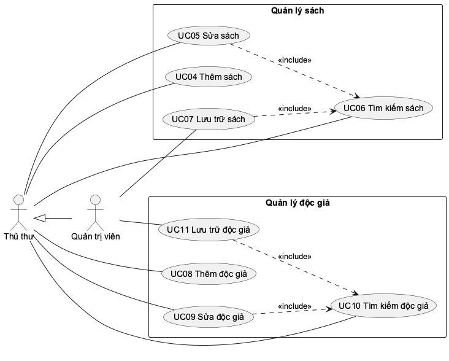

Sửa và lưu trữ đều bắt đầu bằng việc tìm đúng bản ghi nên có quan hệ «include» tới use case tìm kiếm tương ứng.

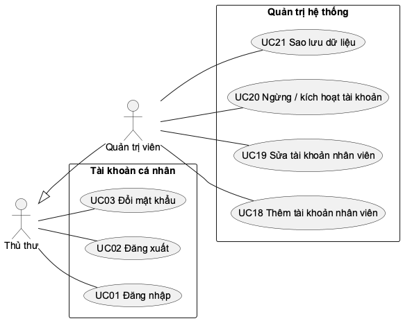

Đăng nhập là tiền điều kiện của mọi use case khác, không phải bước được thực hiện lại trong từng use case, vì vậy sơ đồ không gắn «include» Đăng nhập vào mọi chức năng.

Bảng 9. Danh sách use case

| Mã | Tên use case | Tác nhân | Yêu cầu |
| --- | --- | --- | --- |
| UC01 | Đăng nhập | Thủ thư, Quản trị viên | FR01 |
| UC02 | Đăng xuất | Thủ thư, Quản trị viên | FR02 |
| UC03 | Đổi mật khẩu | Thủ thư, Quản trị viên | FR03 |
| UC04 | Thêm sách | Thủ thư | FR04 |
| UC05 | Sửa sách | Thủ thư | FR05 |
| UC06 | Tìm kiếm sách | Thủ thư | FR06 |
| UC07 | Lưu trữ sách | Quản trị viên | FR07 |
| UC08 | Thêm độc giả | Thủ thư | FR08 |
| UC09 | Sửa độc giả | Thủ thư | FR09 |
| UC10 | Tìm kiếm độc giả | Thủ thư | FR10 |
| UC11 | Lưu trữ độc giả | Quản trị viên | FR11 |
| UC12 | Lập phiếu mượn | Thủ thư | FR12 |
| UC13 | Trả sách | Thủ thư | FR13 |
| UC14 | Gia hạn phiếu mượn | Thủ thư | FR14 |
| UC15 | Tra cứu phiếu mượn | Thủ thư | FR15 |
| UC16 | Xem tổng quan thư viện | Thủ thư | FR16 |
| UC17 | Tải danh sách về máy | Thủ thư | FR17 |
| UC18 | Thêm tài khoản nhân viên | Quản trị viên | FR18 |
| UC19 | Sửa tài khoản nhân viên | Quản trị viên | FR19 |
| UC20 | Ngừng / kích hoạt tài khoản | Quản trị viên | FR20 |
| UC21 | Sao lưu dữ liệu | Quản trị viên | FR21 |
| UC22 | In phiếu mượn | Thủ thư | FR22 |

"Thủ thư" trong cột tác nhân bao gồm cả quản trị viên do quan hệ kế thừa.

### 1. UC01 Đăng nhập

Bảng 10. Đặc tả UC01 Đăng nhập

| Thuộc tính | Mô tả |
| --- | --- |
| Tác nhân | Thủ thư, Quản trị viên |
| Mô tả | Nhân viên xác minh danh tính để bắt đầu phiên làm việc. |
| Tiền điều kiện | Nhân viên đã được cấp tài khoản đang hoạt động. |
| Hậu điều kiện | Thành công: có phiên làm việc 8 giờ, menu hiển thị theo vai trò. Thất bại: không có phiên mới. |

**Luồng sự kiện chính.** (1) Nhân viên mở trang đăng nhập, nhập tên đăng nhập và mật khẩu, bấm Đăng nhập. (2) Hệ thống tìm tài khoản đang hoạt động và so khớp mật khẩu. (3) Hệ thống tạo phiên làm việc. (4) Hệ thống hiển thị trang Tổng quan, họ tên và vai trò của người dùng ở góc trái.

**Ngoại lệ.** E1. Sai tên đăng nhập, sai mật khẩu hoặc tài khoản đã ngừng: hiển thị một thông báo chung "Tên đăng nhập hoặc mật khẩu không đúng" để không lộ tài khoản nào có thật. E2. Sai 5 lần trong 15 phút: hiển thị "Sai mật khẩu quá nhiều lần, thử lại sau 15 phút". E3. Bỏ trống ô: trình duyệt yêu cầu nhập. E4. Phiên hết hạn trong lúc làm việc: hệ thống đưa về trang đăng nhập.

Đối chiếu: TC01, TC02, TC17, TC24, UI01, UI02.

### 2. UC02 Đăng xuất

Bảng 11. Đặc tả UC02 Đăng xuất

| Thuộc tính | Mô tả |
| --- | --- |
| Tác nhân | Thủ thư, Quản trị viên |
| Mô tả | Nhân viên kết thúc phiên làm việc trên máy đang dùng. |
| Tiền điều kiện | Đang đăng nhập. |
| Hậu điều kiện | Phiên trên máy này kết thúc; mọi thao tác sau đó yêu cầu đăng nhập lại. |

**Luồng sự kiện chính.** (1) Nhân viên bấm Đăng xuất ở góc trái dưới. (2) Hệ thống xóa phiên trên trình duyệt. (3) Hệ thống hiển thị trang đăng nhập.

Đối chiếu: TC01, UI07.

### 3. UC03 Đổi mật khẩu

Bảng 12. Đặc tả UC03 Đổi mật khẩu

| Thuộc tính | Mô tả |
| --- | --- |
| Tác nhân | Thủ thư, Quản trị viên |
| Mô tả | Nhân viên tự đổi mật khẩu của mình. |
| Tiền điều kiện | Đang đăng nhập. |
| Hậu điều kiện | Mật khẩu mới có hiệu lực; các máy khác đang đăng nhập bằng tài khoản này bị đăng xuất; máy hiện tại vẫn tiếp tục làm việc. |

**Luồng sự kiện chính.** (1) Nhân viên bấm Mật khẩu. (2) Nhập mật khẩu hiện tại, mật khẩu mới và nhập lại mật khẩu mới, bấm Lưu. (3) Hệ thống kiểm tra mật khẩu hiện tại đúng, mật khẩu mới đủ 8 ký tự. (4) Hệ thống lưu mật khẩu mới và hiển thị "Đã đổi mật khẩu".

**Ngoại lệ.** E1. Nhập lại không khớp: báo "Mật khẩu nhập lại không khớp", chưa gửi đi. E2. Mật khẩu hiện tại sai: báo "Mật khẩu hiện tại không đúng". E3. Mật khẩu mới ngắn hơn 8 ký tự: báo lỗi tại ô nhập.

Đối chiếu: TC27, UI07.

### 4. UC04 Thêm sách

Bảng 13. Đặc tả UC04 Thêm sách

| Thuộc tính | Mô tả |
| --- | --- |
| Tác nhân | Thủ thư |
| Mô tả | Thêm một đầu sách mới vào danh mục. |
| Tiền điều kiện | Đã đăng nhập. |
| Hậu điều kiện | Thành công: đầu sách mới xuất hiện trong Kho sách với số bản có sẵn bằng tổng số bản. Thất bại: danh mục không đổi. |

**Luồng sự kiện chính.** (1) Thủ thư mở Kho sách, bấm "+ Thêm sách". (2) Nhập mã sách, mã ISBN (không bắt buộc), tên sách, tác giả, thể loại, tổng số bản. (3) Bấm Lưu thông tin. (4) Hệ thống kiểm tra trường bắt buộc, độ dài (mã ≤ 30, tên ≤ 200, tác giả ≤ 100, thể loại ≤ 60 ký tự) và tổng số bản 0–999. (5) Hệ thống lưu sách, đóng hộp thoại, tải lại danh sách và hiển thị "Đã lưu".

**Ngoại lệ.** E1. Mã sách hoặc mã ISBN đã có: báo "Mã đã tồn tại", giữ nguyên dữ liệu đang nhập để sửa. E2. Thiếu trường bắt buộc, tổng số bản âm, lẻ hoặc lớn hơn 999: báo lỗi từng trường. E3. Bấm Hủy: đóng hộp thoại, không lưu.

Đối chiếu: TC03, TC04, TC37, B02, B03, B05, B06, UI05.

### 5. UC05 Sửa sách

Bảng 14. Đặc tả UC05 Sửa sách

| Thuộc tính | Mô tả |
| --- | --- |
| Tác nhân | Thủ thư |
| Mô tả | Sửa thông tin của một đầu sách đang sử dụng. |
| Tiền điều kiện | Đã đăng nhập; đã tìm thấy sách (include UC06). |
| Hậu điều kiện | Thành công: thông tin sách được cập nhật; các phiếu cũ vẫn gắn đúng đầu sách. Thất bại: dữ liệu cũ giữ nguyên. |

**Luồng sự kiện chính.** (1) Thủ thư tìm sách (UC06), bấm Sửa trên dòng sách. (2) Hệ thống mở hộp thoại với thông tin hiện tại. (3) Thủ thư sửa thông tin, bấm Lưu thông tin. (4) Hệ thống kiểm tra như khi thêm và kiểm tra tổng số bản mới không ít hơn số bản đang cho mượn. (5) Hệ thống cập nhật và hiển thị "Đã lưu" cùng dòng sách mới.

**Ngoại lệ.** E1. Tổng số bản mới thấp hơn số đang cho mượn: báo "Tổng số bản không được nhỏ hơn số đang mượn". E2. Mã trùng với sách khác: báo "Mã đã tồn tại". E3. Sách vừa bị lưu trữ bởi người khác: báo "Không tìm thấy bản ghi".

Đối chiếu: TC03, TC13, TC21, UI05.

### 6. UC06 Tìm kiếm sách

Bảng 15. Đặc tả UC06 Tìm kiếm sách

| Thuộc tính | Mô tả |
| --- | --- |
| Tác nhân | Thủ thư |
| Mô tả | Tìm đầu sách đang sử dụng và xem số bản có sẵn. |
| Tiền điều kiện | Đã đăng nhập. |
| Hậu điều kiện | Danh sách hiển thị các sách khớp từ khóa, chia trang. |

**Luồng sự kiện chính.** (1) Thủ thư nhập từ khóa vào ô tìm kiếm của Kho sách. (2) Bấm Tìm kiếm hoặc Enter. (3) Hệ thống lọc sách đang sử dụng có mã, ISBN, tên, tác giả hoặc thể loại chứa từ khóa, không phân biệt chữ hoa, chữ thường. (4) Hệ thống hiển thị kết quả kèm tổng số bản, số bản có sẵn và thanh chia trang.

**Luồng thay thế.** A1. Để trống từ khóa: hiển thị toàn bộ sách đang sử dụng. A2. Đổi số dòng mỗi trang (5/10/20/50) hoặc chuyển trang: danh sách hiển thị lại tương ứng. **Ngoại lệ.** E1. Không có sách khớp: hiển thị "Không tìm thấy sách".

Đối chiếu: TC03, TC15, UI04, UI05.

### 7. UC07 Lưu trữ sách

Bảng 16. Đặc tả UC07 Lưu trữ sách

| Thuộc tính | Mô tả |
| --- | --- |
| Tác nhân | Quản trị viên |
| Mô tả | Đưa đầu sách không còn dùng ra khỏi danh sách nhưng giữ lịch sử mượn. |
| Tiền điều kiện | Đã đăng nhập với vai trò quản trị viên; đã tìm thấy sách (include UC06). |
| Hậu điều kiện | Thành công: sách không còn trong Kho sách và không chọn được khi lập phiếu; phiếu cũ vẫn hiển thị tên sách. Thất bại: không đổi. |

**Luồng sự kiện chính.** (1) Quản trị viên bấm Lưu trữ trên dòng sách. (2) Hệ thống hỏi xác nhận. (3) Quản trị viên đồng ý. (4) Hệ thống kiểm tra sách không còn bản nào đang cho mượn. (5) Hệ thống lưu trữ sách và hiển thị "Đã lưu trữ, lịch sử mượn trả vẫn được giữ".

**Ngoại lệ.** E1. Còn bản đang cho mượn: báo "Còn sách chưa trả, không thể lưu trữ". E2. Quản trị viên hủy xác nhận: không làm gì. E3. Thủ thư không thấy nút Lưu trữ; gọi thẳng tới máy chủ cũng bị từ chối.

Đối chiếu: TC03, TC11, TC12, TC22, TC42, UI08.

### 8. UC08 Thêm độc giả

Bảng 17. Đặc tả UC08 Thêm độc giả

| Thuộc tính | Mô tả |
| --- | --- |
| Tác nhân | Thủ thư |
| Mô tả | Lập hồ sơ cho độc giả mới. |
| Tiền điều kiện | Đã đăng nhập. |
| Hậu điều kiện | Thành công: độc giả mới xuất hiện trong danh sách và chọn được khi lập phiếu. |

**Luồng sự kiện chính.** (1) Thủ thư mở Độc giả, bấm "+ Thêm độc giả". (2) Nhập mã độc giả, họ tên và điện thoại (có thể bỏ trống). (3) Bấm Lưu thông tin. (4) Hệ thống bỏ khoảng trắng thừa, kiểm tra mã 1–30 ký tự, họ tên 1–100 ký tự, điện thoại tối đa 20 ký tự chỉ gồm chữ số, dấu cách, + ( ) -. (5) Hệ thống lưu và hiển thị "Đã lưu" cùng độc giả mới.

**Ngoại lệ.** E1. Mã độc giả đã có: báo "Mã đã tồn tại". E2. Thiếu mã, họ tên hoặc điện thoại có ký tự lạ: báo lỗi từng trường.

Đối chiếu: TC05, TC18.

### 9. UC09 Sửa độc giả

Bảng 18. Đặc tả UC09 Sửa độc giả

| Thuộc tính | Mô tả |
| --- | --- |
| Tác nhân | Thủ thư |
| Mô tả | Sửa hồ sơ độc giả đang sử dụng. |
| Tiền điều kiện | Đã đăng nhập; đã tìm thấy độc giả (include UC10). |
| Hậu điều kiện | Hồ sơ được cập nhật; các phiếu cũ vẫn gắn đúng độc giả dù đổi mã. |

**Luồng sự kiện chính.** (1) Thủ thư tìm độc giả, bấm Sửa. (2) Hệ thống mở hộp thoại với thông tin hiện tại. (3) Thủ thư sửa và bấm Lưu thông tin. (4) Hệ thống kiểm tra như khi thêm, cập nhật hồ sơ và hiển thị "Đã lưu".

**Ngoại lệ.** E1. Mã trùng độc giả khác: báo "Mã đã tồn tại". E2. Độc giả vừa bị lưu trữ: báo "Không tìm thấy bản ghi".

Đối chiếu: TC05.

### 10. UC10 Tìm kiếm độc giả

Bảng 19. Đặc tả UC10 Tìm kiếm độc giả

| Thuộc tính | Mô tả |
| --- | --- |
| Tác nhân | Thủ thư |
| Mô tả | Tìm độc giả đang sử dụng theo mã, họ tên hoặc điện thoại. |
| Tiền điều kiện | Đã đăng nhập. |
| Hậu điều kiện | Danh sách hiển thị các độc giả khớp từ khóa, chia trang. |

**Luồng sự kiện chính.** (1) Thủ thư nhập từ khóa vào ô tìm kiếm của màn hình Độc giả, bấm Tìm kiếm. (2) Hệ thống lọc độc giả đang sử dụng khớp từ khóa. (3) Hệ thống hiển thị kết quả và thanh chia trang; điện thoại trống hiển thị dấu gạch ngang.

**Ngoại lệ.** E1. Không có kết quả: hiển thị "Không tìm thấy độc giả".

Đối chiếu: TC05, TC32.

### 11. UC11 Lưu trữ độc giả

Bảng 20. Đặc tả UC11 Lưu trữ độc giả

| Thuộc tính | Mô tả |
| --- | --- |
| Tác nhân | Quản trị viên |
| Mô tả | Đưa độc giả không còn sinh hoạt ra khỏi danh sách nhưng giữ lịch sử. |
| Tiền điều kiện | Đăng nhập quản trị viên; đã tìm thấy độc giả (include UC10). |
| Hậu điều kiện | Thành công: độc giả không còn trong danh sách và không lập phiếu mới được; lịch sử phiếu giữ nguyên. |

**Luồng sự kiện chính.** (1) Quản trị viên bấm Lưu trữ trên dòng độc giả. (2) Hệ thống hỏi xác nhận; quản trị viên đồng ý. (3) Hệ thống kiểm tra độc giả không còn giữ cuốn nào. (4) Hệ thống lưu trữ và hiển thị "Đã lưu trữ, lịch sử mượn trả vẫn được giữ".

**Ngoại lệ.** E1. Độc giả còn giữ sách: báo "Còn sách chưa trả, không thể lưu trữ". E2. Hủy xác nhận: không làm gì.

Đối chiếu: TC05, TC11, TC14.

### 12. UC12 Lập phiếu mượn

Bảng 21. Đặc tả UC12 Lập phiếu mượn

| Thuộc tính | Mô tả |
| --- | --- |
| Tác nhân | Thủ thư |
| Mô tả | Ghi nhận một lần mượn: một phiếu cho một độc giả, gồm 1–5 cuốn. |
| Tiền điều kiện | Đã đăng nhập; có độc giả đang sử dụng và sách còn bản. |
| Hậu điều kiện | Thành công: có đúng một phiếu mới với một dòng chi tiết cho mỗi cuốn; số bản có sẵn của mỗi đầu sách giảm một. Thất bại: không có phiếu hay dòng chi tiết nào được ghi. |

**Luồng sự kiện chính.** (1) Thủ thư bấm "+ Lập phiếu mượn". (2) Hệ thống hiển thị danh sách độc giả đang sử dụng và danh sách sách còn bản (có ô lọc theo mã, tên). (3) Thủ thư chọn độc giả, đánh dấu các cuốn độc giả mượn, nhập số ngày mượn (mặc định 14), bấm Lập phiếu. (4) Hệ thống kiểm tra lại: độc giả và sách còn sử dụng, không chọn trùng, số cuốn đang giữ cộng số cuốn mượn thêm không quá 5, mỗi cuốn còn bản trên giá. (5) Hệ thống lập phiếu với ngày mượn hôm nay, hạn trả = hôm nay + số ngày, ghi chi tiết từng cuốn. (6) Hệ thống hiển thị "Đã lập phiếu mượn #n gồm k cuốn" và cập nhật danh sách.

**Ngoại lệ.** E1. Chưa chọn cuốn nào: báo "Chọn ít nhất một cuốn sách". E2. Độc giả hoặc sách đã bị lưu trữ: báo "… không tồn tại hoặc đã được lưu trữ". E3. Vượt giới hạn: báo "Độc giả đang giữ n cuốn, chỉ được mượn thêm m cuốn". E4. Một cuốn đã hết bản: báo "Sách "…" đã hết bản có thể mượn", không lập phiếu cho cả lần đó. E5. Số ngày ngoài 1–30: báo lỗi tại ô nhập. E6. Hai thủ thư cùng cho mượn bản cuối: chỉ yêu cầu đến trước thành công. A1. Độc giả đang có phiếu quá hạn vẫn mượn được nếu chưa đủ 5 cuốn (BR06).

Đối chiếu: TC06, TC07, TC09, TC14, TC22, TC40, TC41, B01, B04, I01, I02, UI06.

### 13. UC13 Trả sách

Bảng 22. Đặc tả UC13 Trả sách

| Thuộc tính | Mô tả |
| --- | --- |
| Tác nhân | Thủ thư |
| Mô tả | Nhận lại toàn bộ hoặc một phần các cuốn trên một phiếu. |
| Tiền điều kiện | Đã đăng nhập; đã tìm thấy phiếu còn cuốn chưa trả (include UC15); đã nhận sách từ độc giả. |
| Hậu điều kiện | Các cuốn được chọn có ngày trả và người nhận; số bản có sẵn tăng tương ứng; phiếu chuyển "Đã trả" khi đủ. |

**Luồng sự kiện chính.** (1) Thủ thư bấm Trả sách trên phiếu. (2) Hệ thống hiển thị độc giả, hạn trả, số ngày quá hạn (nếu có) và các cuốn chưa trả, mặc định chọn tất cả. (3) Thủ thư bỏ chọn những cuốn độc giả chưa mang tới, bấm "Xác nhận đã nhận sách". (4) Hệ thống kiểm tra các cuốn được chọn thuộc phiếu và chưa trả. (5) Hệ thống ghi ngày trả là hôm nay và người nhận là nhân viên đang đăng nhập cho từng cuốn. (6) Hệ thống hiển thị "Đã nhận trả k cuốn của phiếu #n, phiếu còn m cuốn chưa trả" hoặc "…, phiếu đã trả đủ".

**Ngoại lệ.** E1. Bỏ chọn hết: báo "Chọn ít nhất một cuốn sách". E2. Cuốn đã được trả trước đó hoặc không thuộc phiếu (ví dụ hai máy cùng thao tác): báo "Có cuốn đã trả hoặc không thuộc phiếu này", không ghi gì. E3. Phiếu đã trả đủ: báo "Phiếu này đã trả hết sách". A1. Trả quá hạn vẫn được nhận; thông báo kèm số ngày trễ, chưa tính tiền phạt.

Đối chiếu: TC06, TC08, TC09, TC16, TC40, TC41, U01, U02, UI06.

### 14. UC14 Gia hạn phiếu mượn

Bảng 23. Đặc tả UC14 Gia hạn phiếu mượn

| Thuộc tính | Mô tả |
| --- | --- |
| Tác nhân | Thủ thư |
| Mô tả | Lùi hạn trả của một phiếu còn trong hạn. |
| Tiền điều kiện | Đã đăng nhập; phiếu còn cuốn chưa trả, chưa quá hạn, chưa gia hạn (include UC15). |
| Hậu điều kiện | Hạn trả lùi đúng số ngày; phiếu mang nhãn "Đã gia hạn" và không gia hạn được lần hai. |

**Luồng sự kiện chính.** (1) Thủ thư bấm Gia hạn trên phiếu. (2) Nhập số ngày thêm (mặc định 7), bấm Gia hạn. (3) Hệ thống kiểm tra ba điều kiện. (4) Hệ thống cập nhật hạn trả và hiển thị "Đã gia hạn phiếu #n đến ngày …".

**Ngoại lệ.** E1. Phiếu đã trả hết: báo "Phiếu này đã trả hết sách". E2. Phiếu đã quá hạn: báo "Phiếu đã quá hạn, cần trả sách trước". E3. Đã gia hạn: báo "Mỗi phiếu chỉ được gia hạn một lần". E4. Số ngày ngoài 1–30: báo lỗi tại ô nhập.

Đối chiếu: TC28.

### 15. UC15 Tra cứu phiếu mượn

Bảng 24. Đặc tả UC15 Tra cứu phiếu mượn

| Thuộc tính | Mô tả |
| --- | --- |
| Tác nhân | Thủ thư |
| Mô tả | Xem danh sách phiếu theo trạng thái để trả sách, gia hạn hoặc nhắc độc giả. |
| Tiền điều kiện | Đã đăng nhập. |
| Hậu điều kiện | Danh sách phiếu hiển thị theo bộ lọc, mới nhất trước. |

**Luồng sự kiện chính.** (1) Thủ thư mở Mượn & trả. (2) Chọn trạng thái: tất cả, đang mượn trong hạn, quá hạn hoặc đã trả. (3) Hệ thống hiển thị mỗi phiếu với số phiếu, người lập, danh sách cuốn (cuốn đã trả ghi ngày trả), độc giả, ngày mượn, hạn trả, trạng thái và các nút thao tác phù hợp.

**Luồng thay thế.** A1. Mở thẳng địa chỉ /loans/overdue hoặc bấm "Phiếu quá hạn" ở Tổng quan: hiển thị ngay danh sách quá hạn kèm số ngày trễ. A2. Tải lại trang: giữ nguyên bộ lọc đang chọn.

Đối chiếu: TC10, TC23, TC32, UI03.

### 16. UC16 Xem tổng quan thư viện

Bảng 25. Đặc tả UC16 Xem tổng quan thư viện

| Thuộc tính | Mô tả |
| --- | --- |
| Tác nhân | Thủ thư |
| Mô tả | Xem nhanh tình hình thư viện. |
| Tiền điều kiện | Đã đăng nhập. |
| Hậu điều kiện | Màn hình hiển thị số liệu tại thời điểm xem. |

**Luồng sự kiện chính.** (1) Thủ thư mở Tổng quan (trang mặc định sau đăng nhập). (2) Hệ thống tính và hiển thị số đầu sách, tổng số bản, số bản có sẵn, số độc giả, số bản đang cho mượn, số phiếu đã trả, số phiếu quá hạn, các phiếu quá hạn cần nhắc và 5 đầu sách được mượn nhiều nhất.

Đối chiếu: TC20, UI01.

### 17. UC17 Tải danh sách về máy

Bảng 26. Đặc tả UC17 Tải danh sách về máy

| Thuộc tính | Mô tả |
| --- | --- |
| Tác nhân | Thủ thư |
| Mô tả | Tải danh sách sách, độc giả hoặc phiếu mượn thành tệp bảng tính để mở bằng Excel. |
| Tiền điều kiện | Đã đăng nhập. |
| Hậu điều kiện | Trình duyệt lưu một tệp có tên kèm ngày, mở bằng Excel hiển thị đúng tiếng Việt. |

**Luồng sự kiện chính.** (1) Thủ thư bấm "Tải danh sách (Excel)" ở Kho sách, Độc giả hoặc Mượn & trả. (2) Hệ thống lấy toàn bộ danh sách đang sử dụng (với phiếu mượn: mỗi cuốn một dòng, kèm trạng thái bằng chữ). (3) Trình duyệt tải tệp về máy.

Đối chiếu: TC29, TC37.

### 18. UC18 Thêm tài khoản nhân viên

Bảng 27. Đặc tả UC18 Thêm tài khoản nhân viên

| Thuộc tính | Mô tả |
| --- | --- |
| Tác nhân | Quản trị viên |
| Mô tả | Cấp tài khoản cho nhân viên mới kèm thông tin cơ bản. |
| Tiền điều kiện | Đăng nhập quản trị viên. |
| Hậu điều kiện | Tài khoản mới đăng nhập được với vai trò đã chọn. |

**Luồng sự kiện chính.** (1) Quản trị viên mở Tài khoản, bấm "+ Thêm tài khoản". (2) Nhập tên đăng nhập, họ tên, email, điện thoại, vai trò và mật khẩu. (3) Bấm Lưu thông tin. (4) Hệ thống kiểm tra tên đăng nhập 3–50 ký tự hợp lệ, có họ tên, email đúng dạng (nếu nhập), mật khẩu ít nhất 8 ký tự. (5) Hệ thống mã hóa mật khẩu, lưu tài khoản và hiển thị "Đã tạo tài khoản".

**Ngoại lệ.** E1. Tên đăng nhập đã có: báo "Mã đã tồn tại". E2. Dữ liệu sai dạng: báo lỗi từng trường. E3. Thủ thư không thấy màn hình này; gọi thẳng tới máy chủ bị từ chối.

Đối chiếu: TC25, TC26.

### 19. UC19 Sửa tài khoản nhân viên

Bảng 28. Đặc tả UC19 Sửa tài khoản nhân viên

| Thuộc tính | Mô tả |
| --- | --- |
| Tác nhân | Quản trị viên |
| Mô tả | Sửa họ tên, email, điện thoại, vai trò hoặc đặt lại mật khẩu cho nhân viên. |
| Tiền điều kiện | Đăng nhập quản trị viên. |
| Hậu điều kiện | Thông tin được cập nhật; nếu đặt lại mật khẩu, người đó bị đăng xuất khỏi mọi máy. |

**Luồng sự kiện chính.** (1) Quản trị viên bấm Sửa trên dòng tài khoản. (2) Sửa thông tin, đổi vai trò, nhập mật khẩu mới nếu cần (để trống nếu không đổi). (3) Bấm Lưu thông tin. (4) Hệ thống kiểm tra dữ liệu và ràng buộc vai trò, cập nhật, hiển thị "Đã cập nhật tài khoản".

**Ngoại lệ.** E1. Tự hạ quyền của chính mình hoặc hạ quyền quản trị viên hoạt động cuối cùng: từ chối và nêu lý do. E2. Dữ liệu sai dạng: báo lỗi từng trường.

Đối chiếu: TC25.

### 20. UC20 Ngừng / kích hoạt tài khoản

Bảng 29. Đặc tả UC20 Ngừng / kích hoạt tài khoản

| Thuộc tính | Mô tả |
| --- | --- |
| Tác nhân | Quản trị viên |
| Mô tả | Khóa tài khoản của nhân viên nghỉ việc hoặc mở lại khi cần. |
| Tiền điều kiện | Đăng nhập quản trị viên. |
| Hậu điều kiện | Tài khoản bị ngừng không đăng nhập được và bị đăng xuất ngay; tài khoản được kích hoạt đăng nhập lại được. |

**Luồng sự kiện chính.** (1) Quản trị viên bấm Ngừng (hoặc Kích hoạt) trên dòng tài khoản. (2) Hệ thống hỏi xác nhận; quản trị viên đồng ý. (3) Hệ thống cập nhật trạng thái và hiển thị "Đã cập nhật tài khoản" cùng nhãn trạng thái mới.

**Ngoại lệ.** E1. Ngừng chính mình hoặc quản trị viên hoạt động cuối cùng: từ chối và nêu lý do. E2. Hủy xác nhận: không làm gì.

Đối chiếu: TC25, UI08.

### 21. UC21 Sao lưu dữ liệu

Bảng 30. Đặc tả UC21 Sao lưu dữ liệu

| Thuộc tính | Mô tả |
| --- | --- |
| Tác nhân | Quản trị viên |
| Mô tả | Tạo một bản sao toàn bộ dữ liệu để phòng sự cố. |
| Tiền điều kiện | Đăng nhập quản trị viên. |
| Hậu điều kiện | Có tệp sao lưu mới trong thư mục data/backups; chỉ giữ 10 bản mới nhất. |

**Luồng sự kiện chính.** (1) Quản trị viên bấm "Sao lưu dữ liệu" ở Tổng quan. (2) Hệ thống chép dữ liệu sang tệp đặt tên theo ngày giờ, xóa bớt bản cũ. (3) Hệ thống hiển thị "Đã sao lưu · tên tệp".

**Luồng thay thế.** A1. Mỗi lần máy chủ khởi động, hệ thống tự sao lưu theo cùng cách.

Đối chiếu: TC26, TC30.

### 22. UC22 In phiếu mượn

Bảng 31. Đặc tả UC22 In phiếu mượn

| Thuộc tính | Mô tả |
| --- | --- |
| Tác nhân | Thủ thư |
| Mô tả | In phiếu mượn ra giấy để độc giả và thủ thư ký nhận. Mở rộng («extend») UC12: có thể in ngay sau khi lập phiếu. |
| Tiền điều kiện | Đã đăng nhập; phiếu vừa được lập (UC12) hoặc đã tìm thấy trong danh sách phiếu (UC15). |
| Hậu điều kiện | Hộp thoại in của trình duyệt mở với đúng một trang phiếu; dữ liệu không thay đổi. |

**Luồng sự kiện chính.** (1) Thủ thư bấm "In phiếu" trên dòng phiếu. (2) Hệ thống đọc phiếu: số phiếu, độc giả và điện thoại, ngày mượn, hạn trả (ghi chú nếu đã gia hạn), người lập, danh sách cuốn kèm mã sách, tác giả, ngày trả (nếu đã trả). (3) Hệ thống dựng phiếu in gồm tiêu đề "PHIẾU MƯỢN SÁCH", bảng sách, tổng số cuốn, lời nhắc trả đúng hạn, hai ô ký và thời điểm in. (4) Hệ thống mở hộp thoại in; chỉ phiếu được in, các phần khác của giao diện bị ẩn. (5) Thủ thư chọn máy in hoặc lưu PDF.

**Luồng thay thế.** A1. Trong hộp thoại Lập phiếu mượn, ô "In phiếu ngay sau khi lập" được chọn sẵn: lập phiếu thành công thì hệ thống tự thực hiện bước (2)–(4). A2. In lại phiếu đã trả một phần hoặc trả đủ: cột Ngày trả ghi ngày đã nhận từng cuốn. **Ngoại lệ.** E1. Phiếu không tồn tại: báo "Không tìm thấy phiếu mượn". E2. Thủ thư hủy hộp thoại in: không có gì thay đổi.

Đối chiếu: TC40, UI10.

## II. Sơ đồ hoạt động

Mỗi sơ đồ chia hai làn: người dùng (thủ thư hoặc quản trị viên) và hệ thống. Mọi luồng, kể cả nhánh bị từ chối, đều kết thúc bằng một bước hệ thống hiển thị kết quả để người dùng biết thao tác đã thành công hay vì sao bị từ chối. Các use case chỉ gồm một bước hiển thị (UC02 Đăng xuất, UC10 Tìm kiếm độc giả tương tự UC06, UC15–UC17) không vẽ riêng.

### 1. Hoạt động đăng nhập

Người dùng có thể nhập lại nhiều lần; vòng lặp dừng khi đăng nhập đúng hoặc khi bị khóa tạm.

### 2. Hoạt động đổi mật khẩu

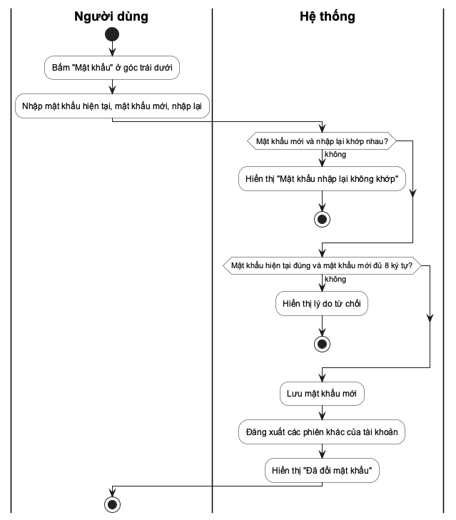

### 3. Hoạt động thêm sách

### 4. Hoạt động sửa sách

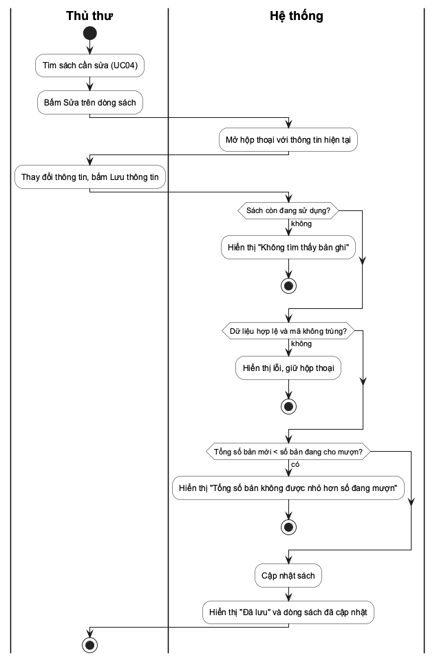

Điều kiện riêng của sửa so với thêm là tổng số bản mới không được thấp hơn số bản đang cho mượn.

### 5. Hoạt động tìm kiếm sách

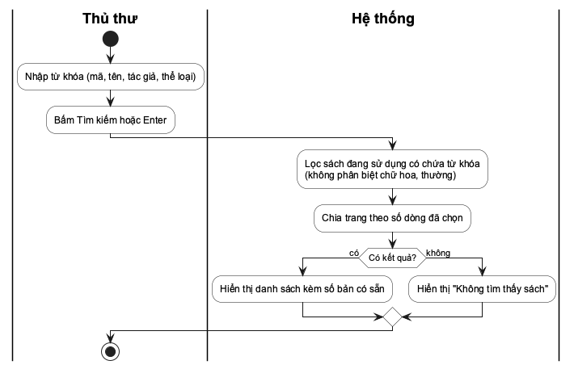

### 6. Hoạt động lưu trữ sách

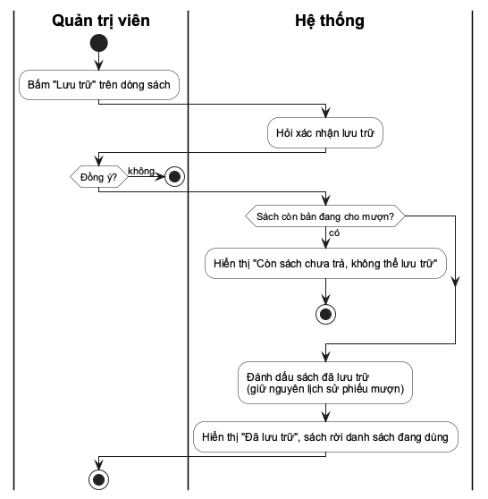

### 7. Hoạt động thêm độc giả

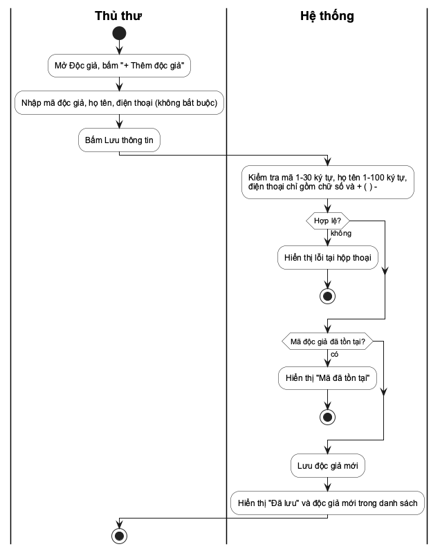

### 8. Hoạt động sửa độc giả

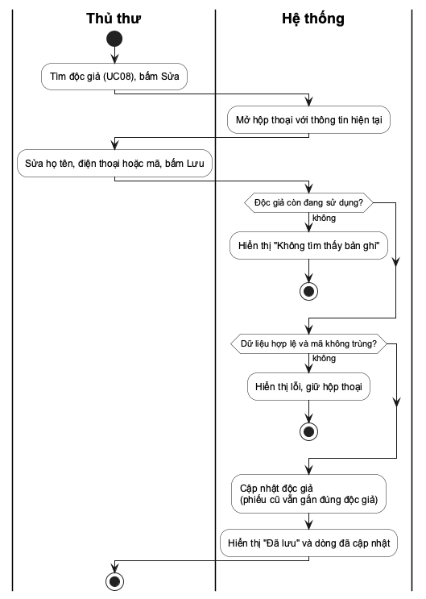

### 9. Hoạt động lưu trữ độc giả

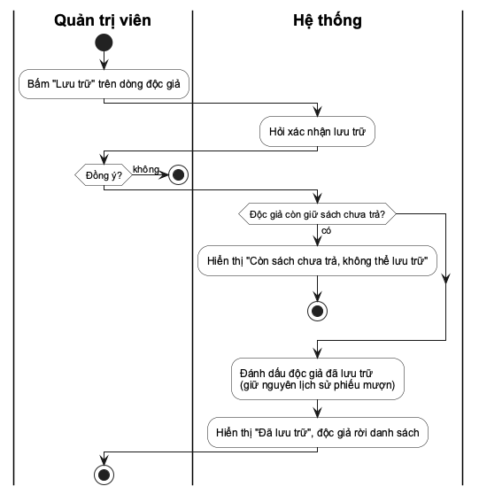

### 10. Hoạt động lập phiếu mượn

Bốn điều kiện được kiểm tra theo thứ tự; chỉ khi đạt cả bốn hệ thống mới lập phiếu và ghi chi tiết cho tất cả các cuốn cùng lúc, nên không có trường hợp phiếu chỉ ghi được một phần số cuốn.

### 11. Hoạt động trả sách

Kết quả hiển thị khác nhau tùy phiếu đã trả đủ hay còn thiếu cuốn, giúp thủ thư biết có cần nhắc độc giả mang nốt sách tới không.

### 12. Hoạt động gia hạn phiếu

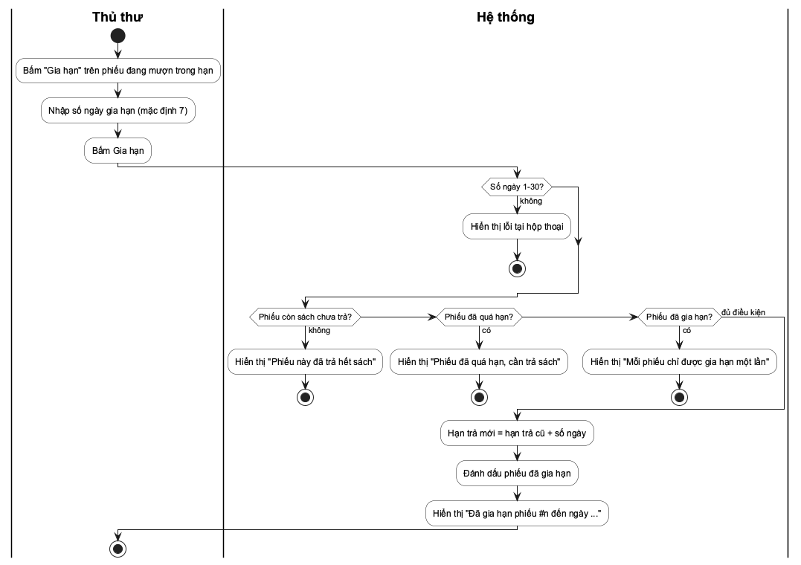

### 13. Hoạt động thêm tài khoản

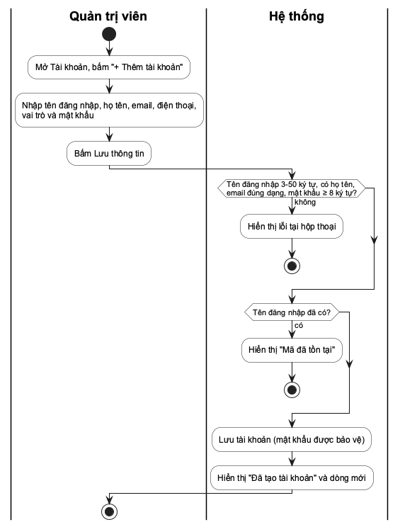

### 14. Hoạt động sửa tài khoản

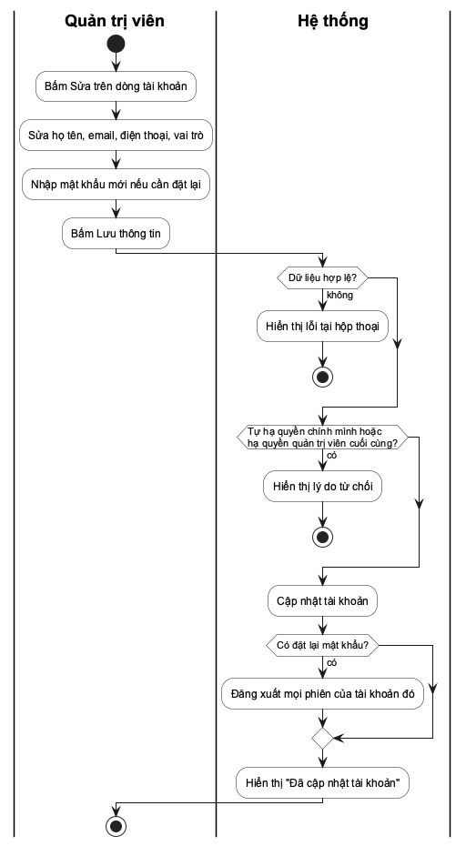

### 15. Hoạt động ngừng, kích hoạt tài khoản

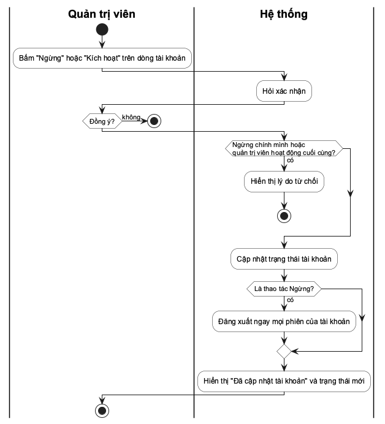

### 16. Hoạt động sao lưu dữ liệu

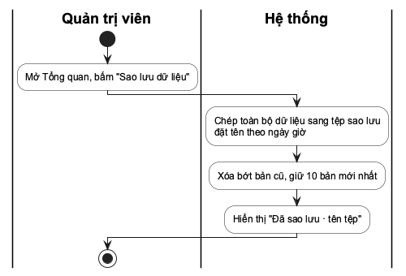

### 17. Hoạt động in phiếu mượn

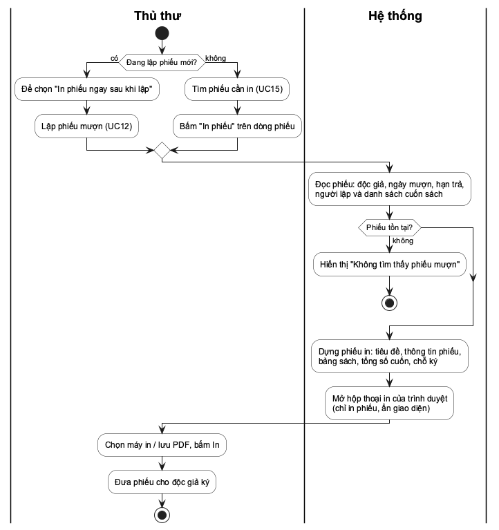

Hai lối vào (in ngay khi lập, in lại từ danh sách) cùng dẫn tới một bước dựng phiếu, nên phiếu in ra luôn cùng một mẫu.

## III. Thiết kế cơ sở dữ liệu

### 1. Mô hình ERD

Mô hình có năm tập thực thể. NGƯỜI DÙNG, ĐỘC GIẢ, SÁCH, PHIẾU MƯỢN là thực thể mạnh, mỗi thực thể có khóa riêng (gạch chân). CHI TIẾT PHIẾU MƯỢN là thực thể yếu: một dòng chi tiết chỉ tồn tại trong một phiếu và được định danh qua phiếu đó cùng cuốn sách (liên kết định danh CÓ, viền đôi). SoBanCoSan của SÁCH là thuộc tính dẫn xuất (nét đứt), tính bằng TongSoBan trừ số chi tiết chưa có NgayTra.

Bảng 32. Các mối liên kết trong ERD

| Liên kết | Thực thể tham gia | Bản số | Ý nghĩa |
| --- | --- | --- | --- |
| MƯỢN | ĐỘC GIẢ – PHIẾU MƯỢN | 1 – N | Một độc giả có nhiều phiếu; mỗi phiếu thuộc đúng một độc giả (tham gia toàn phần phía phiếu). |
| LẬP | NGƯỜI DÙNG – PHIẾU MƯỢN | 1 – N | Mỗi phiếu do đúng một nhân viên lập. |
| CÓ | PHIẾU MƯỢN – CHI TIẾT PHIẾU MƯỢN | 1 – N | Mỗi phiếu có ít nhất một dòng chi tiết; mỗi dòng thuộc đúng một phiếu (cả hai phía toàn phần). |
| LÀ BẢN CỦA | CHI TIẾT PHIẾU MƯỢN – SÁCH | N – 1 | Mỗi dòng chi tiết là một bản của đúng một đầu sách; một đầu sách xuất hiện ở nhiều dòng theo thời gian. |
| NHẬN TRẢ | NGƯỜI DÙNG – CHI TIẾT PHIẾU MƯỢN | 1 – N | Nhân viên nhận lại cuốn sách; dòng chưa trả thì chưa có người nhận (tham gia không bắt buộc). |

Liên kết giữa PHIẾU MƯỢN và SÁCH về bản chất là nhiều – nhiều (một phiếu nhiều sách, một sách nằm trên nhiều phiếu) và mang thuộc tính riêng NgayTra; vì vậy nó được biểu diễn bằng thực thể yếu CHI TIẾT PHIẾU MƯỢN.

### 2. Lược đồ quan hệ

Áp dụng quy tắc chuyển đổi: mỗi thực thể mạnh thành một bảng với khóa chính là cột id số nguyên tự tăng, mã nghiệp vụ (MaSach, MaDocGia, TenDangNhap) thành cột UNIQUE; liên kết 1–N MƯỢN và LẬP thành khóa ngoại reader_id, created_by trong loans; thực thể yếu thành bảng loan_items có khóa ngoại loan_id tới chủ và book_id tới SÁCH, cặp (loan_id, book_id) duy nhất; liên kết NHẬN TRẢ thành khóa ngoại returned_by cho phép rỗng. Thuộc tính dẫn xuất SoBanCoSan và trạng thái phiếu không lưu thành cột.

Lược đồ dạng văn bản:

- users(**id**, username, password_hash, full_name, email, phone, role, active)
- readers(**id**, code, name, phone, active)
- books(**id**, code, barcode, title, author, category, total, active)
- loans(**id**, *reader_id*, *created_by*, borrowed_on, due_on, extensions)
- loan_items(**id**, *loan_id*, *book_id*, returned_on, *returned_by*)

(khóa chính in đậm, khóa ngoại in nghiêng). Tất cả các bảng đạt dạng chuẩn 3: mọi thuộc tính không khóa phụ thuộc trực tiếp vào khóa, không có phụ thuộc bắc cầu.

### 3. Sơ đồ lớp

Bảng 33. Thực thể nghiệp vụ và trách nhiệm

| Lớp | Trách nhiệm nghiệp vụ |
| --- | --- |
| Sách | Mô tả đầu sách, tổng số bản, trạng thái sử dụng; số bản có sẵn là giá trị suy ra. |
| Độc giả | Thông tin người mượn, mã duy nhất, trạng thái sử dụng. |
| Phiếu mượn | Một lần mượn của một độc giả: ngày mượn, hạn trả chung, đã gia hạn hay chưa; trạng thái và số ngày quá hạn suy ra từ chi tiết. |
| Chi tiết phiếu mượn | Một cuốn trên phiếu; ghi ngày trả và người nhận khi độc giả mang trả. |
| Người dùng | Tài khoản nhân viên với họ tên, email, điện thoại, vai trò và trạng thái; lập phiếu, nhận trả sách. |

Phiếu mượn và chi tiết là quan hệ hợp thành: chi tiết không tồn tại ngoài phiếu, mỗi phiếu có 1 đến 5 chi tiết. Phiên đăng nhập là chi tiết kỹ thuật (token ký trong cookie), không phải thực thể nghiệp vụ nên không xuất hiện ở đây.

Lớp trình bày gồm khung HTML chung, khung riêng của từng màn hình và các ES module đảm nhiệm gắn sự kiện, định tuyến, gọi API, sinh HTML an toàn, giữ trạng thái và điền dữ liệu. Lớp máy chủ có bốn phần: phần tiếp nhận HTTP dùng DTO Pydantic (Borrow nhận danh sách book_ids 1–5 phần tử, Return nhận danh sách item_ids) để kiểm tra đầu vào và kiểm tra phiên; phần an toàn thông tin; lớp LoanService nắm lập phiếu, nhận trả, gia hạn; phần dữ liệu cung cấp kết nối, giao dịch, chuyển đổi CSDL cũ và sao lưu. Các hộp «module» là gói chức năng, không phải class được cài đặt.

### 4. Cấu trúc các bảng

Bảng 34. Từ điển dữ liệu bảng users

| Cột | Kiểu / ràng buộc | Ý nghĩa |
| --- | --- | --- |
| id | INTEGER PRIMARY KEY | Định danh người dùng |
| username | TEXT NOT NULL UNIQUE | Tên đăng nhập, 3–50 ký tự chữ/số/._- |
| password_hash | TEXT NOT NULL | Salt và chuỗi băm PBKDF2 |
| full_name | TEXT NOT NULL | Họ và tên nhân viên, 1–100 ký tự |
| email | TEXT NOT NULL DEFAULT rỗng | Email liên hệ, không bắt buộc, ≤ 100 ký tự |
| phone | TEXT NOT NULL DEFAULT rỗng | Điện thoại, không bắt buộc, ≤ 20 ký tự |
| role | TEXT CHECK admin/librarian | Vai trò: quản trị viên / thủ thư |
| active | INTEGER CHECK 0/1 | 0 = đã ngừng, không đăng nhập được |

Bảng 35. Từ điển dữ liệu bảng books và readers

| Cột | Kiểu / ràng buộc | Ý nghĩa |
| --- | --- | --- |
| books.id | INTEGER PRIMARY KEY | Định danh đầu sách |
| books.code | TEXT NOT NULL UNIQUE | Mã sách, 1–30 ký tự |
| books.barcode | TEXT NOT NULL DEFAULT rỗng, UNIQUE khi khác rỗng | Mã ISBN, 0–20 ký tự chữ số, chữ cái, gạch nối |
| books.title | TEXT NOT NULL | Tên sách, 1–200 ký tự |
| books.author | TEXT NOT NULL | Tác giả, 1–100 ký tự |
| books.category | TEXT NOT NULL | Thể loại, 1–60 ký tự |
| books.total | INTEGER CHECK 0..999 | Tổng số bản, không dưới số đang cho mượn |
| books.active | INTEGER CHECK 0/1 | 1 = đang sử dụng, 0 = đã lưu trữ |
| readers.id | INTEGER PRIMARY KEY | Định danh độc giả |
| readers.code | TEXT NOT NULL UNIQUE | Mã độc giả, 1–30 ký tự |
| readers.name | TEXT NOT NULL | Họ tên, 1–100 ký tự |
| readers.phone | TEXT NOT NULL DEFAULT rỗng | Điện thoại, 0–20 ký tự |
| readers.active | INTEGER CHECK 0/1 | 1 = đang sử dụng, 0 = đã lưu trữ |

Bảng 36. Từ điển dữ liệu bảng loans (phiếu mượn)

| Cột | Kiểu / ràng buộc | Ý nghĩa |
| --- | --- | --- |
| id | INTEGER PRIMARY KEY | Số phiếu |
| reader_id | INTEGER NOT NULL FK → readers | Độc giả mượn |
| created_by | INTEGER NOT NULL FK → users | Nhân viên lập phiếu |
| borrowed_on | TEXT NOT NULL | Ngày mượn (YYYY-MM-DD) |
| due_on | TEXT NOT NULL, CHECK ≥ borrowed_on | Hạn trả chung cho cả phiếu |
| extensions | INTEGER CHECK 0..1 | Số lần đã gia hạn |

Bảng 37. Từ điển dữ liệu bảng loan_items (chi tiết phiếu mượn)

| Cột | Kiểu / ràng buộc | Ý nghĩa |
| --- | --- | --- |
| id | INTEGER PRIMARY KEY | Định danh dòng chi tiết |
| loan_id | INTEGER NOT NULL FK → loans | Phiếu chứa dòng này |
| book_id | INTEGER NOT NULL FK → books | Đầu sách, một bản |
| returned_on | TEXT, cho phép rỗng | Ngày trả cuốn này; rỗng = chưa trả |
| returned_by | INTEGER FK → users, cho phép rỗng | Nhân viên nhận lại sách |
| (loan_id, book_id) | UNIQUE | Mỗi đầu sách một lần trên phiếu |

Độ dài và mẫu chuỗi được kiểm tra tại API; SQLite bảo vệ NOT NULL, UNIQUE, CHECK và khóa ngoại (PRAGMA foreign_keys=ON trên mỗi kết nối). Chỉ mục: ix_loan_items_book(book_id, returned_on) để tính số bản có sẵn, ix_loan_items_loan(loan_id, returned_on), ix_loans_reader(reader_id), ix_loans_due(due_on) và ux_books_barcode. Số bản có sẵn = total − số dòng loan_items chưa trả của đầu sách; trạng thái phiếu suy ra từ việc còn dòng chưa trả và so sánh due_on với ngày hiện tại. Khi mở CSDL của bản trước (mỗi dòng loans là một bản sách), bước khởi tạo tự chuyển dữ liệu sang hai bảng loans và loan_items, giữ nguyên số phiếu và ngày trả.

## IV. Thiết kế giao diện

Toàn bộ ứng dụng dùng chung một khung màn hình: cột điều hướng bên trái gồm Tổng quan, Kho sách, Độc giả, Mượn & trả và Tài khoản (chỉ quản trị viên thấy); họ tên và vai trò người dùng ở góc trái dưới. Vùng nội dung bên phải chia ba tầng: tiêu đề, thanh thao tác, khối nội dung. Ngay dưới tiêu đề là dòng thông báo kết quả: sau mỗi thao tác, nội dung trả về của hệ thống (ví dụ "Đã lập phiếu mượn #201 gồm 2 cuốn") được hiển thị tại đây. Ba màn hình danh sách dùng chung một mẫu: ô tìm kiếm hoặc bộ lọc, nút "Tải danh sách (Excel)", nút thêm mới, bảng và thanh chia trang. Mọi biểu mẫu đặt trong hộp thoại, lỗi hiển thị ngay trong hộp thoại.

### 1. Giao diện Đăng nhập

Màn hình chia hai phần: khối nhận diện bên trái và biểu mẫu bên phải, không có cột điều hướng vì người dùng chưa có phiên. Vùng thông báo lỗi đặt ngay dưới nút, dùng chung một câu cho mọi trường hợp sai.

### 2. Giao diện Quản lý sách

Ô tìm kiếm bên trái, nút "Tải danh sách (Excel)" ở giữa, nút thêm mới ngoài cùng bên phải. Hai cột Tổng bản và Có sẵn đặt cạnh nhau để đối chiếu. Mỗi dòng có nút Sửa; nút Lưu trữ chỉ hiện với quản trị viên. Thêm và sửa dùng chung một hộp thoại với nhãn ghi rõ trường bắt buộc và khoảng giá trị.

### 3. Giao diện Quản lý độc giả

Dùng lại nguyên mẫu danh sách của Kho sách để người dùng chỉ phải học một bố cục; khác biệt nằm ở bộ cột và phạm vi tìm kiếm.

### 4. Giao diện Lập phiếu mượn

Hộp thoại có ba phần: chọn độc giả, danh sách ô đánh dấu các sách còn bản (có ô lọc và bộ đếm số cuốn đã chọn), số ngày mượn. Một lần bấm "Lập phiếu" tạo một phiếu cho tất cả các cuốn đã chọn. Vùng lỗi phía dưới dành cho các trường hợp bị từ chối như vượt 5 cuốn hoặc sách hết bản.

### 5. Giao diện Trả sách

Mỗi phiếu hiển thị danh sách các cuốn trong phiếu. Bấm Trả sách mở hộp thoại liệt kê các cuốn chưa trả, mặc định chọn tất cả; thủ thư bỏ chọn cuốn chưa nhận được. Hộp thoại thay cho hộp xác nhận "có/không" của bản trước, vì trả sách giờ cần chọn cuốn.

### 6. Giao diện Gia hạn phiếu

Hộp thoại gia hạn chỉ có một trường số ngày, mặc định 7, hợp lệ 1–30, kèm dòng nhắc điều kiện gia hạn. Phiếu không đủ điều kiện thì không hiện nút Gia hạn.

### 7. Giao diện Quản lý tài khoản

Bảng tài khoản có thêm cột Họ và tên, Email/Điện thoại bên cạnh vai trò và trạng thái. Nút Sửa và Ngừng/Kích hoạt nằm cùng hàng với từng tài khoản. Nút Sao lưu dữ liệu đặt ở Tổng quan, tách khỏi nhóm thao tác tài khoản.

### 8. Mẫu phiếu mượn in

Phiếu in trên khổ A4 hoặc A5 theo thứ tự từ trên xuống: tên thư viện và số phiếu ở hai góc; tiêu đề "PHIẾU MƯỢN SÁCH" căn giữa; khối thông tin hai cột (độc giả, điện thoại, ngày mượn, hạn trả in đậm, người lập); bảng sách có kẻ ô gồm STT, mã sách, tên sách, tác giả, ngày trả (để trống, thủ thư ghi tay khi nhận lại hoặc in sẵn nếu in lại); dòng tổng số cuốn và lời nhắc; hai ô ký Độc giả và Thủ thư; thời điểm in ở cuối. Phiếu dùng chữ đen trên nền trắng, không màu, để in được trên máy in đen trắng. Trên màn hình, mỗi dòng phiếu có thêm nút "In phiếu"; hộp thoại Lập phiếu mượn có thêm ô "In phiếu ngay sau khi lập".

## V. Thiết kế xử lý

### 1. Xử lý lập phiếu mượn

Kiểm tra giới hạn 5 cuốn và số bản còn của từng cuốn diễn ra trước khi lưu. Nhánh không hợp lệ trả lý do từ chối ở bước 7', bỏ qua bước lưu. Số bản trên màn hình có thể đã cũ khi hai thủ thư cùng thao tác, vì vậy hệ thống luôn kiểm tra lại tại nơi xử lý nghiệp vụ.

Phần tiếp nhận HTTP kiểm tra phiên và DTO Borrow (1–5 sách) trước khi chuyển sang LoanService.borrow. Các bước đếm và hai lệnh INSERT (một vào loans, k vào loan_items) nằm trong cùng giao dịch BEGIN IMMEDIATE; điều kiện không đạt thì rollback nên không có phiếu rỗng hay phiếu thiếu cuốn. Giao diện hiển thị nguyên văn message trả về.

### 2. Xử lý trả sách

Giao diện đọc chi tiết phiếu qua GET /api/loans/{id} để dựng hộp thoại, rồi gửi POST /api/loans/{id}/return với danh sách item_ids. Không gửi danh sách thì hệ thống nhận trả toàn bộ cuốn còn lại. LoanService.return_books đọc các dòng chưa trả trong giao dịch, từ chối nếu có cuốn đã trả hoặc không thuộc phiếu, rồi cập nhật returned_on, returned_by cho từng dòng. Kết quả gồm số cuốn vừa nhận, số cuốn còn lại và số ngày trễ.

### 3. Xử lý thêm và sửa sách

Giao diện thu nhận dữ liệu, lớp xử lý kiểm tra đầu vào, CSDL bảo đảm mã duy nhất. Khi sửa, lớp xử lý kiểm tra thêm tổng số bản mới không thấp hơn số dòng loan_items chưa trả của đầu sách.

### 4. Xử lý giao dịch và tính nhất quán

**Lập phiếu.** BEGIN IMMEDIATE → đọc độc giả và từng sách đang sử dụng → đếm số cuốn độc giả đang giữ và số bản đang cho mượn của từng sách → kiểm tra giới hạn → INSERT loans, INSERT loan_items → COMMIT. Bất kỳ bước nào lỗi thì rollback. SQLite chỉ cho một giao dịch ghi tại một thời điểm, nên yêu cầu sau luôn thấy dữ liệu yêu cầu trước đã ghi [3].

**Trả, gia hạn và lưu trữ.** Trả: đọc các dòng chưa trả của phiếu trong giao dịch, từ chối nếu có dòng không hợp lệ, cập nhật rồi commit. Gia hạn: từ chối nếu phiếu không còn dòng chưa trả, đã quá hạn hoặc extensions ≥ 1, rồi cập nhật due_on và extensions cùng một lệnh. Lưu trữ và sửa tổng bản cũng kiểm tra dòng chưa trả trong cùng giao dịch ghi.

### 5. Xử lý in phiếu mượn

In phiếu không cần API riêng: giao diện gọi GET /api/loans/{id} (kết quả đã gồm điện thoại độc giả, họ tên người lập và tác giả từng cuốn), dựng phiếu vào vùng #print-area rồi gọi window.print(). Quy tắc CSS @media print ẩn mọi phần khác của trang và chỉ hiện vùng phiếu, nên không cần mở cửa sổ mới (tránh bị trình duyệt chặn popup) và người dùng có thể chọn "Lưu dưới dạng PDF". Khi in ngay sau khi lập phiếu, lệnh in được hoãn tới khi hộp thoại lập phiếu đã đóng để bản in không lẫn hộp thoại.

### 6. Xử lý phiên đăng nhập và bảo vệ đầu vào

**Vòng đời phiên.** Đăng nhập thành công tạo token dạng user_id.hạn.dấu_vết.chữ_ký: hạn sau 8 giờ, dấu vết là 16 ký tự SHA-256 của password_hash, chữ ký HMAC-SHA256 bằng khóa LIBRARY_SECRET. Cookie session đặt HttpOnly, SameSite=strict. Mỗi yêu cầu, server kiểm tra chữ ký, hạn, tài khoản còn hoạt động và dấu vết mật khẩu còn khớp; vì vậy đổi/đặt lại mật khẩu hoặc ngừng tài khoản làm token cũ mất hiệu lực ngay.

**Bảo vệ đầu vào.** Mật khẩu dùng PBKDF2-HMAC-SHA256 260.000 vòng với salt riêng, so sánh hằng thời gian. Bộ đếm đăng nhập sai theo cặp tài khoản–địa chỉ, 5 lần trong 15 phút thì khóa 15 phút. Các yêu cầu ghi cần header X-Library-Request: 1; ứng dụng không mở CORS cho origin khác.

**Giới hạn.** Chưa tự cấu hình HTTPS khi chạy tại máy (trên Vercel đã có HTTPS do nền tảng cấp). Bộ đếm đăng nhập sai nằm trong bộ nhớ nên khởi động lại là xóa.

# CHƯƠNG IV. PHÁT TRIỂN/THỰC THI

Phần này trình bày các màn hình của ứng dụng theo nhóm use case ở Chương III. Ảnh chụp lấy từ ứng dụng chạy thật với bộ dữ liệu demo do seed.py sinh, đăng nhập bằng tài khoản quản trị viên. Mỗi thao tác ghi dữ liệu đều kết thúc bằng dòng thông báo kết quả phía trên nội dung. Bản demo công khai đặt tại thu-vien-mini.vercel.app.

## I. Màn hình Đăng nhập (UC01–UC03)

Đây là màn hình duy nhất truy cập được khi chưa có phiên. Sai thông tin thì nhận cùng một thông báo lỗi; sau 5 lần sai trong 15 phút, hệ thống khóa tạm 15 phút. Đăng nhập thành công thì chuyển tới màn hình tương ứng địa chỉ đang mở; góc trái dưới hiển thị họ tên, vai trò cùng hai nút Mật khẩu (UC03) và Đăng xuất (UC02).

## II. Màn hình Tổng quan (UC16, UC21)

Bốn ô số liệu cho biết số đầu sách và tổng bản, số bản có sẵn và số độc giả, số bản đang cho mượn và số phiếu đã trả, số phiếu quá hạn. Bên dưới là các phiếu quá hạn (liệt kê tên các cuốn chưa trả, có nút Trả sách) và năm đầu sách được mượn nhiều nhất. Nút Sao lưu dữ liệu chỉ hiện với quản trị viên; bấm xong, dòng thông báo hiển thị tên tệp sao lưu vừa tạo.

## III. Màn hình Kho sách (UC04–UC07)

Màn hình liệt kê sách đang sử dụng kèm mã ISBN, tổng số bản và số bản có sẵn. Ô tìm kiếm khớp theo mã, ISBN, tên, tác giả hoặc thể loại; thanh chia trang cho chọn 5/10/20/50 dòng. Nút "Tải danh sách (Excel)" tải toàn bộ danh mục về máy. Quản trị viên thấy thêm nút Lưu trữ trên mỗi dòng.

Thêm và sửa dùng chung một hộp thoại. Mã trùng hoặc tổng số bản thấp hơn số đang cho mượn bị từ chối, lý do hiển thị ngay trong hộp thoại và dữ liệu đang nhập được giữ nguyên.

## IV. Màn hình Độc giả (UC08–UC11)

Cùng bố cục với Kho sách: ô tìm kiếm theo mã, họ tên hoặc điện thoại, nút "Tải danh sách (Excel)" và nút Thêm độc giả. Nút Lưu trữ chỉ quản trị viên dùng được và bị chặn khi độc giả còn giữ sách.

## V. Màn hình Lập phiếu mượn (UC12)

Thủ thư chọn độc giả, đánh dấu các cuốn được mượn trong lần này (bộ đếm "đã chọn k" cập nhật ngay, ô lọc giúp tìm nhanh trong danh sách dài) và nhập số ngày mượn. Danh sách chỉ gồm sách còn bản. Bấm Lập phiếu, hệ thống kiểm tra lại giới hạn rồi lập một phiếu cho tất cả các cuốn.

Kết quả hiển thị ngay: dòng thông báo "Đã lập phiếu mượn #201 gồm 2 cuốn" và phiếu #201 đứng đầu danh sách với hai cuốn sách, hạn trả chung và ba nút In phiếu, Trả sách, Gia hạn.

## VI. Phiếu mượn in (UC22)

Hộp thoại Lập phiếu mượn có ô "In phiếu ngay sau khi lập" chọn sẵn, nên ngay khi lập phiếu #201, trình duyệt mở hộp thoại in với phiếu trên. Phiếu gồm thông tin độc giả, ngày mượn, hạn trả in đậm, người lập, bảng hai cuốn sách và hai ô ký. Bất kỳ phiếu nào cũng in lại được bằng nút "In phiếu" trên danh sách phiếu; phiếu đã trả có ngày trả từng cuốn ở cột cuối.

## VII. Màn hình Trả sách (UC13, UC15)

Hộp thoại liệt kê các cuốn chưa trả của phiếu, mặc định chọn tất cả. Ở ví dụ, độc giả chỉ mang trả một cuốn nên thủ thư bỏ chọn cuốn còn lại.

Dòng thông báo "Đã nhận trả 1 cuốn của phiếu #201, phiếu còn 1 cuốn chưa trả"; trên danh sách, cuốn đã trả chuyển màu nhạt kèm ngày trả, phiếu vẫn ở trạng thái Đang mượn cho tới khi trả đủ.

Bộ lọc Tất cả phiếu giữ lại cả phiếu đã trả nên tra cứu được ai từng mượn cuốn nào và ngày trả từng cuốn. Trả sách không xóa phiếu mà chỉ bổ sung ngày trả và người nhận.

## VIII. Màn hình Gia hạn và phiếu quá hạn (UC14, UC15)

Phiếu còn trong hạn và chưa gia hạn mới có nút Gia hạn. Gia hạn thành công thì dòng thông báo ghi hạn trả mới, phiếu mang nhãn Đã gia hạn và nút Gia hạn biến mất.

Bộ lọc quá hạn có địa chỉ riêng /loans/overdue nên mở thẳng được và giữ nguyên sau khi tải lại trang. Mỗi phiếu hiển thị số ngày trễ; các phiếu này không còn nút Gia hạn.

## IX. Màn hình Tài khoản (UC18–UC20)

Chỉ quản trị viên thấy màn hình này. Bảng hiển thị tên đăng nhập, họ và tên, email và điện thoại, vai trò, trạng thái. Hệ thống chặn tự hạ quyền, tự ngừng và thao tác làm mất quản trị viên hoạt động cuối cùng. Thủ thư mở /users bị đưa về Tổng quan.

Hộp thoại sửa cho đổi họ tên, email, điện thoại, vai trò và đặt lại mật khẩu (để trống nếu không đổi). Hộp thoại thêm tài khoản có thêm ô tên đăng nhập và bắt buộc nhập mật khẩu.

## X. Danh mục API

Bảng 38. Danh mục API

| Phương thức và đường dẫn | Chức năng | UC |
| --- | --- | --- |
| POST /api/login; POST /api/logout | Tạo / hủy phiên | UC01, UC02 |
| GET /api/me; POST /api/password | Người dùng hiện tại; đổi mật khẩu | UC01, UC03 |
| GET, POST /api/users; PUT /api/users/{id} | Danh sách, thêm, sửa, ngừng/kích hoạt tài khoản (chỉ quản trị) | UC18–UC20 |
| GET /api/books, /api/readers | Danh sách, tìm kiếm (q, page, size) | UC06, UC10 |
| POST /api/books, /api/readers | Thêm sách, độc giả | UC04, UC08 |
| PUT /api/books/{id}, /api/readers/{id} | Sửa sách, độc giả | UC05, UC09 |
| DELETE /api/books/{id}, /api/readers/{id} | Lưu trữ sách, độc giả (chỉ quản trị) | UC07, UC11 |
| GET /api/loans; GET /api/loans/{id} | Tra cứu phiếu (status, page, size); chi tiết một phiếu (dùng cho trả sách và in phiếu) | UC15, UC22 |
| POST /api/loans | Lập phiếu {reader_id, book_ids[], days} | UC12 |
| POST /api/loans/{id}/return | Nhận trả {item_ids[]} (bỏ trống = trả hết) | UC13 |
| POST /api/loans/{id}/extend | Gia hạn {days} | UC14 |
| GET /api/stats | Số liệu tổng quan | UC16 |
| GET /api/export/{books,readers,loans}.csv | Tải danh sách về máy | UC17 |
| POST /api/backup | Sao lưu dữ liệu (chỉ quản trị) | UC21 |

Mã 200/201 biểu thị thành công; 401 chưa đăng nhập, 403 không được phép, 404 không có đối tượng, 409 vi phạm quy tắc nghiệp vụ, 422 dữ liệu nhập không hợp lệ, 429 khóa tạm do sai mật khẩu nhiều lần. Mọi phản hồi đều có trường message hoặc detail bằng tiếng Việt để giao diện hiển thị cho người dùng.

# CHƯƠNG V. TRIỂN KHAI

## I. Cài đặt

Cài Python 3.11+ từ python.org (đã kiểm thử với 3.12 và 3.14). Giải nén bộ nộp và mở start.bat trong thư mục ThuVienMini (macOS/Linux: ./start.sh). Lần đầu cần Internet để tải thư viện miễn phí. Khi Uvicorn báo đang chạy, mở http://127.0.0.1:8000 và giữ cửa sổ máy chủ mở. Bản demo trên Vercel triển khai theo README (không lưu dữ liệu lâu dài, cần biến LIBRARY_SECRET).

Mỗi lần khởi động, ứng dụng tạo bảng còn thiếu, bổ sung cột mới (ví dụ họ tên, email, điện thoại của users) và tự chuyển CSDL của bản trước sang mô hình phiếu + chi tiết phiếu, sau đó sao lưu vào data/backups. Ứng dụng không tự xóa dữ liệu khi khởi động.

CSDL cung cấp sẵn là bộ demo do seed.py sinh với hạt giống cố định: 4 tài khoản có đủ họ tên, email; 63 đầu sách; 60 độc giả; 200 phiếu với 328 cuốn trong 180 ngày, gồm phiếu một cuốn và nhiều cuốn, trả đủ, trả một phần, trả muộn, đang mượn, quá hạn và đã gia hạn; mọi quy tắc nghiệp vụ được tuân thủ khi sinh. Bộ mẫu nhỏ (8 đầu sách / 29 bản, 4 độc giả, 5 phiếu / 6 cuốn) chỉ dùng cho test tự động.

Bảng 39. Tình trạng cài đặt các chức năng

| STT | Yêu cầu | Mức độ hoàn thành | Ghi chú |
| --- | --- | --- | --- |
| 1 | FR01–FR03 Đăng nhập, đăng xuất, đổi mật khẩu | 100% | Khóa tạm sau 5 lần sai |
| 2 | FR04–FR07 Thêm, sửa, tìm kiếm, lưu trữ sách | 100% | Chia trang 5/10/20/50 dòng |
| 3 | FR08–FR11 Thêm, sửa, tìm kiếm, lưu trữ độc giả | 100% | |
| 4 | FR12 Lập phiếu mượn | 100% | Một phiếu 1–5 cuốn, kiểm tra trong một giao dịch |
| 5 | FR13 Trả sách | 100% | Trả từng cuốn, chặn trả lặp |
| 6 | FR14 Gia hạn phiếu | 100% | Tối đa một lần |
| 7 | FR15 Tra cứu phiếu | 100% | Địa chỉ lọc riêng /loans/overdue |
| 8 | FR16 Tổng quan | 100% | |
| 9 | FR17 Tải danh sách về máy | 100% | Mở được bằng Excel |
| 10 | FR18–FR20 Quản lý tài khoản | 100% | Có họ tên, email, điện thoại; luôn giữ ít nhất một quản trị viên |
| 11 | FR21 Sao lưu | 100% | Giữ 10 bản mới nhất; phục hồi phải làm thủ công |
| 12 | FR22 In phiếu mượn | 100% | In ngay khi lập hoặc in lại; lưu được thành PDF |

## II. Thử nghiệm

### 1. Tài khoản dùng để thử nghiệm

Bảng 40. Tài khoản dùng để thử nghiệm

| Vai trò | Tên đăng nhập | Họ tên (demo) | Mật khẩu mẫu |
| --- | --- | --- | --- |
| Quản trị viên | admin | Nguyễn Văn Quản | Admin@123 |
| Thủ thư | thuthu, thuthu2 | Trần Thị Thư, Lê Minh Thư | ThuThu@123 |
| Thủ thư đã ngừng | cu_nhan_vien | Phạm Văn Cũ | ThuThu@123 (không đăng nhập được) |

### 2. Test case chức năng chính

Tiền điều kiện chung: mỗi test có CSDL tạm được seed mới và phiên quản trị viên hợp lệ, trừ khi test chủ động thay đổi. Mã test trùng tên hàm trong tests/test_library.py.

Bảng 41. Test case TC01–TC11

| Mã | Bước và dữ liệu | Kết quả mong đợi | Kết quả |
| --- | --- | --- | --- |
| TC01 | Đăng nhập admin rồi đăng xuất, xem danh sách sách | 200 rồi 401 | Đạt |
| TC02 | Đăng nhập admin với mật khẩu sai | 401, không cấp phiên | Đạt |
| TC03 | Thêm NEW, sửa tên, tìm, lưu trữ | Bản ghi được cập nhật rồi rời danh sách | Đạt |
| TC04 | Thêm hai sách cùng mã NEW | Lần hai bị từ chối 409 | Đạt |
| TC05 | Thêm, sửa, tìm, lưu trữ độc giả mới | Dữ liệu đúng ở mỗi bước | Đạt |
| TC06 | Lập phiếu sách S008 rồi trả | Số có sẵn giảm 1 rồi tăng 1 | Đạt |
| TC07 | Lập phiếu với đầu sách tổng 0 bản | 409, không có phiếu | Đạt |
| TC08 | Trả phiếu 1 hai lần | 200 rồi 409 | Đạt |
| TC09 | Mượn sách 9999 / trả phiếu 9999 | 404 | Đạt |
| TC10 | Lọc quá hạn trên dữ liệu mẫu | Chỉ phiếu 1, trễ 6 ngày, cuốn S001 | Đạt |
| TC11 | Lưu trữ sách/độc giả còn sách chưa trả | 409, dữ liệu giữ nguyên | Đạt |

Bảng 42. Test case TC12–TC22

| Mã | Bước và dữ liệu | Kết quả mong đợi | Kết quả |
| --- | --- | --- | --- |
| TC12 | Thủ thư thêm sách rồi gọi lưu trữ | 201 rồi 403 | Đạt |
| TC13 | Đổi tổng bản của sách đang mượn thành 0 | 409 | Đạt |
| TC14 | Lưu trữ độc giả 4 rồi lập phiếu cho người đó | 200 rồi 404 | Đạt |
| TC15 | Tìm bằng chuỗi SQL injection mẫu | Không khớp, dữ liệu không đổi | Đạt |
| TC16 | Trả sách thiếu header bảo vệ | 403 | Đạt |
| TC17 | Phiên hết hạn / chữ ký sai | 401 | Đạt |
| TC18 | Thêm hai độc giả cùng mã | Lần hai 409 | Đạt |
| TC19 | Mở trang chủ và tệp main.js | 200, trang tiếng Việt | Đạt |
| TC20 | Đọc tổng quan trên dữ liệu mẫu | 8 đầu / 29 bản / 25 có sẵn / 4 độc giả / 4 bản đang mượn / 1 quá hạn / 2 đã trả | Đạt |
| TC21 | Sửa sách không tồn tại | 404 | Đạt |
| TC22 | Lưu trữ sách 8 rồi lập phiếu sách đó | 200 rồi 404 | Đạt |

### 3. Test case chức năng bổ sung và giao diện

Bảng 43. Test case bổ sung và giao diện

| Mã | Bước và dữ liệu | Kết quả mong đợi | Kết quả |
| --- | --- | --- | --- |
| TC23 | Khung HTML bộ lọc phiếu | Đúng 4 lựa chọn | Đạt |
| TC24 | Sai mật khẩu 5 lần rồi nhập đúng | 401×5 rồi 429; hết khóa thì 200 | Đạt |
| TC25 | Thêm tài khoản có họ tên, email; trùng; mật khẩu ngắn; thiếu họ tên; email sai; sửa họ tên; ngừng; tự hạ quyền | 201; 409; 422; 422; 422; 200; tài khoản ngừng không đăng nhập được; 409 | Đạt |
| TC26 | Thủ thư gọi API tài khoản, sao lưu | 403 | Đạt |
| TC27 | Đổi mật khẩu khi có phiên thứ hai | Phiên khác bị đăng xuất, phiên đang dùng vẫn làm việc | Đạt |
| TC28 | Gia hạn phiếu 2; lặp; phiếu quá hạn; đã trả; 31 ngày | 200 hạn +7; 409; 409; 409; 422 | Đạt |
| TC29 | Tải danh sách phiếu, sách; tài nguyên lạ | Tệp bảng tính, mỗi cuốn một dòng (7 dòng); 404 | Đạt |
| TC30 | Sao lưu dữ liệu | Tệp sao lưu mở được, đủ 8 sách | Đạt |
| TC31 | Mở CSDL cũ thiếu cột | Tự thêm cột active, extensions, full_name | Đạt |
| TC31b | Mở CSDL bản trước (mỗi dòng loans một cuốn) | Chuyển sang loans + loan_items, giữ số phiếu, ngày trả, gia hạn; chạy lại không đổi | Đạt |
| TC32 | 29 độc giả, 10 dòng/trang | 3 trang, trang 99 về trang 3, size 101 bị từ chối | Đạt |
| TC33 | Header cache của trang và js | Cache-Control: no-cache | Đạt |
| TC34 | Mở /books, /loans/overdue, /users, /nope | 200 cho trang hợp lệ; 404 | Đạt |
| TC35 | Đường dẫn lạ trên trình duyệt | Trang 404 riêng; API vẫn trả JSON | Đạt |
| TC36 | Sinh dữ liệu demo; chạy lại; --force | ≥ 60 sách, 60 độc giả, > 150 phiếu, số cuốn > số phiếu; không ai giữ > 5 cuốn; không vượt tổng bản | Đạt |
| TC37 | Sách có ISBN; trùng; rỗng; sai dạng; tìm theo ISBN | 201; 409; 201; 422; tìm ra đúng sách | Đạt |
| TC38 | Chế độ Vercel | CSDL chép ra thư mục tạm, ghi được, không sao lưu | Đạt |
| TC39 | Thiếu khóa bí mật trên serverless | Khóa suy từ deployment, giống nhau mọi instance | Đạt |
| TC40 | Lập một phiếu 3 cuốn; đọc chi tiết; trả 1 cuốn; trả lại cuốn đó; trả phần còn lại | Phiếu 3 dòng, có điện thoại độc giả, họ tên người lập, tác giả để in; còn 2; 409; phiếu chuyển Đã trả với ngày trả hôm nay | Đạt |
| TC41 | Phiếu trùng sách; phiếu rỗng; 6 cuốn; độc giả giữ 2 mượn thêm 4; mượn thêm 3; trả cuốn của phiếu khác | 422; 422; 422; 409; 201; 409 | Đạt |
| TC42 | Lưu trữ sách rảnh; sách còn đang mượn | Thông báo "Đã lưu trữ…"; "…không thể lưu trữ" | Đạt |
| UI01 | Đăng nhập admin trên trình duyệt | Tổng quan 4 ô số liệu, góc trái hiện họ tên | Đạt |
| UI02 | Sai mật khẩu | Thông báo lỗi, không vào ứng dụng | Đạt |
| UI03 | Menu, bộ lọc, tải lại, Back, /khong-co | Địa chỉ đổi theo, giữ bộ lọc, trang 404 | Đạt |
| UI04 | Chọn 5 dòng/trang, sang trang 2 | Trang 1/2 rồi 2/2, đúng số dòng | Đạt |
| UI05 | Thêm sách có tiêu đề chứa thẻ HTML; tìm theo ISBN; sửa | Hiển thị nguyên văn, không chạy mã; tìm ra; sửa được | Đạt |
| UI06 | Lập phiếu 2 cuốn qua ô lọc; trả 1 cuốn; trả cuốn còn lại | "…gồm 2 cuốn"; "còn 1 cuốn chưa trả"; "phiếu đã trả đủ" | Đạt |
| UI07 | Đổi mật khẩu (nhập lại sai rồi đúng), đăng xuất, đăng nhập lại | Báo không khớp; vào được bằng mật khẩu mới | Đạt |
| UI08 | Thủ thư mở /users | Về Tổng quan; không thấy menu Tài khoản, nút Sao lưu, nút Lưu trữ | Đạt |
| UI09 | Tải lại trang khi đang ở Kho sách | Không nháy màn hình đăng nhập, giữ nguyên trang | Đạt |
| UI10 | Lập phiếu với ô in phiếu được chọn; in lại phiếu 3 từ danh sách | Hộp thoại in được gọi; phiếu in có tiêu đề, độc giả, đúng 1 rồi 2 cuốn; khi in chỉ còn phiếu, giao diện bị ẩn | Đạt |

Các ca UI chạy trên Chromium headless bằng Playwright với máy chủ thật và CSDL tạm; máy chưa cài Playwright thì tự bỏ qua, không ảnh hưởng phần API.

### 4. Kiểm thử biên, unit test và tích hợp

Bảng 44. Dữ liệu biên và unit test

| Nhóm | Giá trị / thao tác | Mong đợi | Kết quả |
| --- | --- | --- | --- |
| B01 | Số ngày mượn 0, 1, 2, 29, 30, 31 | 0/31 bị từ chối; còn lại lập được phiếu | Đạt |
| B02 | Tổng bản −1, 0, 1, 998, 999, 1000 | −1/1000 bị từ chối; 0..999 hợp lệ | Đạt |
| B03 | Tên sách dài 0, 1, 199, 200, 201 ký tự | 0/201 bị từ chối; 1..200 hợp lệ | Đạt |
| B04 | Lập 5 phiếu một cuốn rồi phiếu thứ 6 | 5 phiếu đầu thành công; thứ 6 bị từ chối | Đạt |
| B05 | Tên chỉ gồm khoảng trắng | Bị từ chối | Đạt |
| B06 | Tổng bản 1.5 | Bị từ chối do phải là số nguyên | Đạt |
| U01 | Ngày trước hạn, đúng hạn, sau hạn 1 ngày | Số ngày quá hạn 0, 0, 1 | Đạt |
| U02 | Hạn 10/9, trả 12/9, xem 1/10 | Độ trễ giữ nguyên 2 ngày | Đạt |
| U03 | Mật khẩu đúng/sai; băm cùng mật khẩu 2 lần | Đúng được xác minh; sai bị từ chối; salt khác nhau | Đạt |

**Tích hợp giao dịch.** I01 tạo đầu sách đúng một bản và cho hai độc giả cùng lập phiếu từ hai luồng song song: một yêu cầu thành công, một bị từ chối và chỉ có đúng một dòng chi tiết được ghi. I02 lập phiếu gồm một cuốn còn bản và một cuốn hết bản: bị từ chối, số phiếu và số dòng chi tiết không đổi. Cả hai đạt.

**Tổng hợp kết quả.** Bộ kiểm thử gồm 80 lần chạy (70 ở mức hàm, dịch vụ và API, 10 trên giao diện trình duyệt), tất cả đạt trên Python 3.14 ngày 05/10/2026. Kiểm tra tĩnh giao diện (Prettier, ESLint, TypeScript) chạy sạch.

### 5. Trình tự demo chức năng chính

1. Thêm sách BV001 (1 bản) và BV002 (2 bản); tìm lại và sửa tên. Thử trùng mã để thấy thông báo lỗi.
2. Thêm độc giả BV001; tìm lại và sửa số điện thoại.
3. Lập một phiếu cho độc giả BV001 gồm cả BV001 và BV002 (để chọn ô in phiếu); xem thông báo "gồm 2 cuốn", phiếu in mở ra (chọn Lưu PDF), số có sẵn của mỗi sách giảm một.
4. Thử lưu trữ sách BV001 đang mượn, quan sát hệ thống chặn.
5. Trả sách: bỏ chọn BV002, chỉ trả BV001; xem thông báo "phiếu còn 1 cuốn chưa trả". Trả nốt BV002, phiếu chuyển Đã trả.
6. Lưu trữ sách BV001 sau khi trả; mở lịch sử phiếu để thấy phiếu vẫn còn.
7. Gia hạn một phiếu trong hạn (hạn lùi 7 ngày, nhãn Đã gia hạn), thử gia hạn lần hai để thấy bị chặn.
8. Chọn 5 dòng/trang để thấy chia trang, bấm "Tải danh sách (Excel)" và mở tệp bằng Excel.
9. Trang Tài khoản: thêm thủ thư mới có họ tên, email; đăng nhập bằng tài khoản đó ở tab khác; ngừng tài khoản và thấy tab kia bị đăng xuất. Bấm Sao lưu dữ liệu.
10. Mở /loans/overdue để xem phiếu quá hạn, đăng nhập vai trò thủ thư và trình bày bảng kết quả kiểm thử.

Chi tiết lệnh cài, chạy, sao lưu và tạo dữ liệu demo có trong README.md. KICH_BAN_BAO_VE.md có phân chia trình bày và câu hỏi dự kiến.

# CHƯƠNG VI. KẾT LUẬN

## I. Kết quả đã thực hiện

Sản phẩm thực hiện đầy đủ quản lý sách, quản lý độc giả, mượn và trả ở quy mô thư viện nhỏ theo đúng nghiệp vụ: mỗi lần mượn lập và in một phiếu gồm nhiều cuốn, trả được từng cuốn, gia hạn, theo dõi quá hạn; bổ sung quản lý tài khoản nhân viên có thông tin cơ bản, tải danh sách về máy, sao lưu, chia trang và bản demo trực tuyến. Yêu cầu được thu thập bằng lời người dùng, tách thành từng yêu cầu chức năng và ánh xạ một – một sang 22 use case; mỗi use case có đặc tả, các use case ghi dữ liệu có sơ đồ hoạt động với bước hiển thị kết quả; ERD vẽ theo ký pháp Chen rồi chuyển sang lược đồ quan hệ. Kiểm thử tự động xác minh luồng chuẩn, ngoại lệ, biên, tranh chấp bản sách cuối và các luồng giao diện trên trình duyệt thật.

Bảng 45. Phân chia nội dung trình bày

| Thành viên | Nội dung |
| --- | --- |
| Phạm Tuấn Anh | Nghiệp vụ, thu thập yêu cầu, use case |
| Phạm Phước Hòa | Sơ đồ hoạt động, ERD, lược đồ quan hệ, sơ đồ lớp |
| Lê Ngọc Khôi | Kiến trúc, mã nguồn và demo các chức năng chính |
| Lê Bá Quảng | Kiểm thử, kết quả và hướng phát triển |

Bảng trên là gợi ý phân chia buổi bảo vệ, không xác nhận khối lượng đóng góp thực tế.

## II. Ưu khuyết điểm

**Ưu điểm.** Mô hình dữ liệu phản ánh đúng chứng từ thực tế (phiếu mượn và chi tiết phiếu), số bản có sẵn luôn suy ra từ chi tiết chưa trả nên không lệch với lịch sử. Mọi thao tác hiển thị kết quả cụ thể cho người dùng. Bộ test xác minh quy tắc ở lớp hàm, dịch vụ và API với CSDL tạm; 10 ca Playwright điều khiển Chromium thật. Phiếu mượn in được ngay từ trình duyệt, không cần phần mềm in riêng. Ảnh chụp trong báo cáo lấy từ ứng dụng chạy thật. Ứng dụng không phụ thuộc dịch vụ trả phí, không có bước build nên cài đặt và chấm điểm đơn giản.

**Khuyết điểm và giới hạn.** Chưa kiểm thử tải lớn, kiểm toán an toàn thông tin, phục hồi từ bản sao lưu bằng giao diện, nhiều trình duyệt (UI chỉ chạy Chromium) hoặc chạy liên tục 24/7. Hệ thống chưa quản lý riêng từng bản sách vật lý, chưa tính tiền phạt, chưa có cổng cho độc giả và chưa tự cấu hình HTTPS khi chạy tại máy. Hồ sơ đã lưu trữ chưa xem lại hoặc khôi phục được trên giao diện.

## III. Hướng mở rộng trong tương lai

Quản lý từng bản vật lý (bảng bản sách, mỗi bản một mã), xem và khôi phục hồ sơ đã lưu trữ, phục hồi sao lưu bằng giao diện, tính tiền phạt, đặt trước, gửi nhắc hạn, cổng tra cứu cho độc giả. Khi mở rộng người dùng thật cần thử tải, cấu hình HTTPS và chuyển CSDL sang dịch vụ lưu trữ bền nếu tiếp tục dùng nền tảng serverless.

# TÀI LIỆU THAM KHẢO

[1] Học viện Công nghệ Bưu chính Viễn thông, Bài giảng học phần Nhập môn Công nghệ phần mềm.

[2] FastAPI, Testing. https://fastapi.tiangolo.com/tutorial/testing/

[3] SQLite, Transaction. https://www.sqlite.org/lang_transaction.html

[4] SQLite, Online Backup API. https://www.sqlite.org/backup.html

[5] Playwright for Python. https://playwright.dev/python/

[6] Vercel, Python runtime. https://vercel.com/docs/functions/runtimes/python

[7] PlantUML, Chen's ERD notation. https://plantuml.com/er-diagram

Tài liệu trực tuyến được đối chiếu ngày 05/10/2026. Thông tin bốn thành viên lấy từ danh sách nhóm cung cấp. Các sơ đồ và nội dung triển khai thuộc bộ bài tập này.
