<!-- cover -->

BỘ KHOA HỌC VÀ CÔNG NGHỆ

HỌC VIỆN CÔNG NGHỆ BƯU CHÍNH VIỄN THÔNG

---

# BÁO CÁO ĐỒ ÁN MÔN HỌC

MÔN HỌC: NHẬP MÔN CÔNG NGHỆ PHẦN MỀM

ĐỀ TÀI: QUẢN LÝ THƯ VIỆN

**Giảng viên hướng dẫn:** Nguyễn Thị Bích Nguyên

**Thực hiện bởi nhóm sinh viên, bao gồm:**

| STT | Họ và tên       | MSSV       | Lớp SV     | Vai trò       |
| --- | ------------------ | ---------- | ----------- | -------------- |
| 1.  | Lê Ngọc Khôi    | B24DTCN061 | D24TXCN06-B | Trưởng nhóm |
| 2.  | Phạm Tuấn Anh    | B24DTCN057 | D24TXCN06-B | Thành viên   |
| 3.  | Phạm Phước Hòa | B24DTCN060 | D24TXCN06-B | Thành viên   |
| 4.  | Lê Bá Quảng     | K25DTCN499 | D25TXCN14-K | Thành viên   |

TP.HCM, tháng 10/2026

<!-- /cover -->

# MỤC LỤC

<!-- toc -->

- MỤC LỤC
- DANH SÁCH HÌNH, BẢNG
  - Danh sách hình
  - Danh sách bảng
- DANH MỤC TỪ VIẾT TẮT
- CHƯƠNG I. TỔNG QUAN
  - I. Giới thiệu đề tài
    - 1. Mục tiêu của đề tài
    - 2. Phạm vi áp dụng
    - 3. Nền tảng kỹ thuật
  - II. Cơ sở lý thuyết
    - 1. Nghiệp vụ quản lý thư viện
    - 2. Hiện trạng nghiệp vụ (AS-IS)
    - 3. Quy trình đề xuất (TO-BE)
    - 4. Phương pháp phân tích nghiệp vụ
- CHƯƠNG II. PHÂN TÍCH NỘI DUNG, YÊU CẦU
  - I. Giới thiệu quy trình mượn sách
    - 1. Diễn biến quy trình
    - 2. Điều kiện kiểm tra
    - 3. Kết quả
  - II. Giới thiệu quy trình trả sách
    - 1. Diễn biến quy trình
    - 2. Điều kiện kiểm tra
    - 3. Kết quả
  - III. Giới thiệu quy trình gia hạn phiếu mượn
    - 1. Diễn biến quy trình
    - 2. Điều kiện kiểm tra
    - 3. Kết quả
  - IV. Yêu cầu chức năng nghiệp vụ
    - 1. Chức năng của đối tượng Thủ thư
    - 2. Chức năng của đối tượng Quản trị viên
  - V. Yêu cầu chức năng hệ thống và yêu cầu chất lượng
    - 1. Yêu cầu chức năng hệ thống
    - 2. Yêu cầu chất lượng
- CHƯƠNG III. PHÂN TÍCH THIẾT KẾ
  - I. Sơ đồ use case
    - 1. UC01 Đăng nhập
    - 2. UC02 Thêm sách
    - 3. UC03 Sửa sách
    - 4. UC04 Tìm kiếm sách
    - 5. UC05 Lưu trữ sách
    - 6. UC06 Thêm độc giả
    - 7. UC07 Sửa độc giả
    - 8. UC08 Tìm kiếm độc giả
    - 9. UC09 Lưu trữ độc giả
    - 10. UC10 Lập phiếu mượn
    - 11. UC11 In phiếu mượn
    - 12. UC12 Trả sách
    - 13. UC13 Gia hạn phiếu mượn
  - II. Sơ đồ hoạt động
    - 1. Hoạt động đăng nhập
    - 2. Hoạt động thêm sách
    - 3. Hoạt động lập phiếu mượn
    - 4. Hoạt động trả sách
  - III. Thiết kế cơ sở dữ liệu
    - 1. Mô hình ERD
    - 2. Sơ đồ Diagram
    - 3. Cấu trúc các bảng
  - IV. Thiết kế giao diện
    - 1. Giao diện Đăng nhập
    - 2. Giao diện Quản lý sách
    - 3. Giao diện Quản lý độc giả
    - 4. Giao diện Lập phiếu mượn
    - 5. Giao diện Trả sách
    - 6. Giao diện Gia hạn phiếu
    - 7. Giao diện Quản lý tài khoản
    - 8. Mẫu phiếu mượn in
  - V. Thiết kế xử lý
    - 1. Xử lý lập phiếu mượn
    - 2. Xử lý trả sách
    - 3. Xử lý thêm và sửa sách
    - 4. Xử lý gia hạn phiếu mượn
    - 5. Xử lý in phiếu mượn
    - 6. Xử lý khi nhiều nhân viên thao tác cùng lúc
- CHƯƠNG IV. PHÁT TRIỂN/THỰC THI
  - I. Màn hình Đăng nhập
  - II. Màn hình Tổng quan
  - III. Màn hình Kho sách
  - IV. Màn hình Độc giả
  - V. Màn hình Lập phiếu mượn
  - VI. Màn hình In phiếu mượn
  - VII. Màn hình Trả sách
  - VIII. Màn hình Gia hạn và phiếu quá hạn
  - IX. Màn hình Tài khoản
- CHƯƠNG V. TRIỂN KHAI
  - I. Cài đặt
  - II. Thử nghiệm
- CHƯƠNG VI. KẾT LUẬN
  - I. Kết quả đã thực hiện
  - II. Ưu khuyết điểm
  - III. Hướng mở rộng trong tương lai
- TÀI LIỆU THAM KHẢO

<!-- /toc -->

# DANH SÁCH HÌNH, BẢNG

## Danh sách hình

| Hình | Tên hình |
| --- | --- |
| Hình 3.1 | Sơ đồ use case tổng quát |
| Hình 3.2 | Phân rã use case Quản lý sách |
| Hình 3.3 | Phân rã use case Quản lý độc giả |
| Hình 3.4 | Phân rã use case Mượn trả sách |
| Hình 3.5 | Sơ đồ hoạt động UC01 Đăng nhập |
| Hình 3.6 | Sơ đồ hoạt động UC02 Thêm sách |
| Hình 3.7 | Sơ đồ hoạt động UC10 Lập phiếu mượn |
| Hình 3.8 | Sơ đồ hoạt động UC12 Trả sách |
| Hình 3.9 | Mô hình ERD (ký pháp Chen) |
| Hình 3.10 | Sơ đồ các bảng dữ liệu và liên kết |
| Hình 3.11 | Wireframe màn hình Đăng nhập |
| Hình 3.12 | Wireframe màn hình Kho sách và hộp thoại thêm, sửa |
| Hình 3.13 | Wireframe màn hình Độc giả |
| Hình 3.14 | Wireframe hộp thoại Lập phiếu mượn |
| Hình 3.15 | Wireframe màn hình Mượn & trả và hộp thoại nhận trả |
| Hình 3.16 | Wireframe hộp thoại Gia hạn phiếu |
| Hình 3.17 | Wireframe màn hình Tài khoản |
| Hình 3.18 | Sơ đồ tuần tự lập phiếu mượn |
| Hình 3.19 | Sơ đồ tuần tự trả sách |
| Hình 3.20 | Sơ đồ tuần tự thêm sách |
| Hình 4.1 | Màn hình Đăng nhập |
| Hình 4.2 | Màn hình Tổng quan với nút Sao lưu dữ liệu |
| Hình 4.3 | Màn hình Kho sách |
| Hình 4.4 | Hộp thoại thêm và sửa sách |
| Hình 4.5 | Màn hình Độc giả |
| Hình 4.6 | Hộp thoại lập phiếu mượn nhiều cuốn |
| Hình 4.7 | Danh sách phiếu đang mượn ngay sau khi lập phiếu |
| Hình 4.8 | Phiếu mượn khi in (xem trước bản in) |
| Hình 4.9 | Hộp thoại nhận trả sách |
| Hình 4.10 | Kết quả sau khi trả một phần phiếu |
| Hình 4.11 | Lịch sử phiếu mượn và trả |
| Hình 4.12 | Hộp thoại gia hạn phiếu |
| Hình 4.13 | Danh sách phiếu quá hạn |
| Hình 4.14 | Màn hình Tài khoản nhân viên |
| Hình 4.15 | Hộp thoại sửa tài khoản nhân viên |

## Danh sách bảng

| Bảng | Tên bảng |
| --- | --- |
| Bảng 1.1 | Mục tiêu nghiệp vụ |
| Bảng 1.2 | Thuật ngữ nghiệp vụ |
| Bảng 1.3 | Vấn đề nghiệp vụ hiện tại |
| Bảng 1.4 | So sánh quy trình hiện tại và đề xuất |
| Bảng 2.1 | Đối tượng sử dụng và nhu cầu |
| Bảng 2.2 | Chức năng của đối tượng Thủ thư |
| Bảng 2.3 | Chức năng riêng của đối tượng Quản trị viên |
| Bảng 2.4 | Yêu cầu chất lượng |
| Bảng 3.1 | Danh sách use case |
| Bảng 3.2 | Đặc tả UC01 Đăng nhập |
| Bảng 3.3 | Đặc tả UC02 Thêm sách |
| Bảng 3.4 | Đặc tả UC03 Sửa sách |
| Bảng 3.5 | Đặc tả UC04 Tìm kiếm sách |
| Bảng 3.6 | Đặc tả UC05 Lưu trữ sách |
| Bảng 3.7 | Đặc tả UC06 Thêm độc giả |
| Bảng 3.8 | Đặc tả UC07 Sửa độc giả |
| Bảng 3.9 | Đặc tả UC08 Tìm kiếm độc giả |
| Bảng 3.10 | Đặc tả UC09 Lưu trữ độc giả |
| Bảng 3.11 | Đặc tả UC10 Lập phiếu mượn |
| Bảng 3.12 | Đặc tả UC11 In phiếu mượn |
| Bảng 3.13 | Đặc tả UC12 Trả sách |
| Bảng 3.14 | Đặc tả UC13 Gia hạn phiếu mượn |
| Bảng 3.15 | Các mối liên kết trong ERD |
| Bảng 3.16 | Bảng users (Người dùng) |
| Bảng 3.17 | Bảng readers (Độc giả) |
| Bảng 3.18 | Bảng books (Sách) |
| Bảng 3.19 | Bảng loans (Phiếu mượn) |
| Bảng 3.20 | Bảng loan_items (Chi tiết phiếu mượn) |
| Bảng 5.1 | Tình trạng cài đặt các chức năng |

# DANH MỤC TỪ VIẾT TẮT

| Từ viết tắt | Diễn giải |
| --- | --- |
| AS-IS / TO-BE | Quy trình hiện tại / quy trình đề xuất |
| BA | Business Analysis — phân tích nghiệp vụ |
| BO | Business Objective — mục tiêu nghiệp vụ |
| CSDL | Cơ sở dữ liệu |
| ERD | Entity Relationship Diagram — sơ đồ thực thể liên kết |
| ISBN | International Standard Book Number — mã số tiêu chuẩn quốc tế của sách |
| NFR | Non-Functional Requirement — yêu cầu chất lượng (phi chức năng) |
| UC | Use Case — ca sử dụng |
| UML | Unified Modeling Language — ngôn ngữ mô hình hóa thống nhất |

# CHƯƠNG I. TỔNG QUAN

## I. Giới thiệu đề tài

### 1. Mục tiêu của đề tài

**Bối cảnh.** Thư viện được khảo sát là một thư viện nhỏ với vài trăm đầu sách và vài trăm độc giả, do một người phụ trách và một đến hai thủ thư vận hành. Mọi việc hiện được ghi chép thủ công: danh mục sách trong một bảng tính, độc giả trong một cuốn sổ, mỗi lần mượn được ghi vào sổ mượn trả. Cách làm này khiến thư viện không biết chính xác sách còn trên giá, khó theo dõi sách quá hạn và dễ mất lịch sử mượn trả (chi tiết ở mục II.2).

**Mục tiêu nghiệp vụ.** Đề tài xây dựng phần mềm quản lý thư viện với ba nhóm nghiệp vụ chính theo đề bài: quản lý sách, quản lý độc giả và mượn/trả sách, nhằm đạt các mục tiêu sau.

Bảng 1.1. Mục tiêu nghiệp vụ

| Mã | Mục tiêu | Cách đo |
| --- | --- | --- |
| BO01 | Biết ngay số bản còn trên giá của mọi đầu sách | Số bản có sẵn hiện ngay khi tìm sách và luôn khớp với các phiếu chưa trả |
| BO02 | Mỗi lần mượn có một chứng từ duy nhất ghi đủ các cuốn và hạn trả | Mỗi lần mượn lập đúng một phiếu, in được để độc giả ký |
| BO03 | Theo dõi được sách quá hạn để nhắc độc giả | Danh sách phiếu quá hạn kèm số ngày trễ xem được bất kỳ lúc nào |
| BO04 | Giữ trọn lịch sử mượn trả | Không xóa phiếu; sách và độc giả không còn dùng chỉ được lưu trữ |
| BO05 | Phân định trách nhiệm nhân viên và bảo vệ dữ liệu | Mỗi nhân viên một tài khoản; phiếu ghi người lập, người nhận trả; dữ liệu được sao lưu |

**Tiêu chí hoàn thành.** Thủ thư làm trọn một vòng công việc trên phần mềm: thêm sách và độc giả → lập phiếu mượn nhiều cuốn → thấy số bản trên giá giảm → nhận trả từng cuốn → thấy số bản trên giá tăng lại → lưu trữ hồ sơ không còn sách đang mượn.

### 2. Phạm vi áp dụng

Phần mềm áp dụng cho một thư viện quy mô nhỏ (vài trăm đầu sách, vài trăm độc giả), một điểm phục vụ, giao diện tiếng Việt.

**Trong phạm vi.** Quản lý danh mục sách (đầu sách và số bản), quản lý hồ sơ độc giả, lập và in phiếu mượn, nhận trả sách, gia hạn phiếu, theo dõi phiếu quá hạn, xem tổng quan tình hình thư viện, tải danh sách về máy để mở bằng Excel, quản lý tài khoản nhân viên và sao lưu dữ liệu.

**Ngoài phạm vi.** Thu tiền phạt trả muộn, gửi tin nhắn nhắc hạn, thẻ từ, đặt trước sách, đánh mã riêng cho từng cuốn, cho độc giả tự tra cứu, quản lý nhiều chi nhánh.

**Giả định và ràng buộc.** Các nhân viên dùng chung một nguồn dữ liệu đặt tại thư viện. Các ngưỡng định lượng (5 cuốn, 30 ngày…) là đề xuất của nhóm, chờ thư viện xác nhận; đề bài gốc không quy định. Dữ liệu độc giả dùng để chạy thử là giả lập.

**Quy ước.** "Lưu trữ" sách hoặc độc giả nghĩa là đưa hồ sơ ra khỏi danh sách đang dùng nhưng không xóa, để lịch sử các phiếu mượn cũ vẫn tra cứu được.

### 3. Nền tảng kỹ thuật

Phần mềm là ứng dụng chạy trên trình duyệt web. Thư viện cài phần mềm một lần trên một máy tính thông thường (Windows, macOS hoặc Linux); nhân viên mở trình duyệt trên máy đó để làm việc. Dữ liệu được lưu tập trung trên chính máy này, không cần Internet khi sử dụng và không phát sinh chi phí bản quyền. Nhóm cũng cung cấp một bản chạy thử trực tuyến để xem trước, không dùng để lưu dữ liệu thật. Công cụ và cách cài đặt cụ thể trình bày ở Chương V.

## II. Cơ sở lý thuyết

### 1. Nghiệp vụ quản lý thư viện

Thư viện quản lý các *đầu sách*; mỗi đầu sách có thể có nhiều *bản* giống nhau. *Độc giả* được cấp mã để mượn sách. Mỗi lần mượn được ghi trên một *phiếu mượn*; mỗi cuốn trên phiếu là một dòng *chi tiết* có ngày trả riêng. Nhân viên thư viện gồm thủ thư và người phụ trách, mỗi người chịu trách nhiệm về những phiếu mình lập và những cuốn mình nhận lại.

Bảng 1.2. Thuật ngữ nghiệp vụ

| Thuật ngữ | Ý nghĩa |
| --- | --- |
| Đầu sách | Một tựa sách trong danh mục, có mã sách, tên, tác giả, thể loại, mã ISBN (nếu có) |
| Bản sách | Một cuốn vật lý thuộc một đầu sách; các bản cùng đầu sách coi như nhau |
| Số bản có sẵn | Tổng số bản trừ số bản đang được mượn |
| Độc giả | Người được thư viện cấp mã để mượn sách |
| Phiếu mượn | Chứng từ cho một lần mượn, ghi độc giả, người lập, ngày mượn, hạn trả |
| Chi tiết phiếu mượn | Một dòng trên phiếu ứng với một cuốn được mượn, ghi ngày trả và người nhận khi nhận lại |
| Gia hạn | Lùi hạn trả của phiếu thêm một số ngày, tối đa một lần |
| Quá hạn | Phiếu còn cuốn chưa trả và đã qua hạn trả |
| Lưu trữ | Đưa sách/độc giả ra khỏi danh sách đang dùng, giữ nguyên lịch sử |

### 2. Hiện trạng nghiệp vụ (AS-IS)

(1) Độc giả mang sách tới quầy. (2) Thủ thư mở sổ độc giả kiểm tra người đó có trong danh sách. (3) Thủ thư ghi vào sổ mượn trả mỗi cuốn một dòng: ngày, tên độc giả, tên sách, hạn trả. (4) Khi độc giả trả, thủ thư tìm dòng tương ứng và ghi ngày trả. (5) Cuối tuần thủ thư lật sổ tìm những dòng quá hạn để nhắc.

Bảng 1.3. Vấn đề nghiệp vụ hiện tại

| STT | Vấn đề | Hậu quả |
| --- | --- | --- |
| 1 | Không biết chính xác một đầu sách còn bao nhiêu bản trên giá | Độc giả hỏi phải ra giá tìm; có lúc hứa cho mượn rồi mới biết đã hết |
| 2 | Một lần mượn nhiều cuốn bị ghi thành nhiều dòng rời | Khó biết lần mượn nào còn thiếu cuốn nào; trả một phần dễ ghi nhầm |
| 3 | Không có danh sách sách quá hạn | Phải lật toàn bộ sổ mới biết ai cần nhắc trả |
| 4 | Hồ sơ độc giả nghỉ sinh hoạt bị gạch bỏ | Mất dấu vết những cuốn người đó từng mượn |
| 5 | Không giới hạn số cuốn một người được giữ | Một số độc giả giữ quá nhiều sách |
| 6 | Không ghi ai là người cho mượn, ai nhận lại; sổ chỉ có một bản | Không phân định được trách nhiệm; mất sổ là mất toàn bộ lịch sử |

### 3. Quy trình đề xuất (TO-BE)

Phần mềm thay sổ tay bằng phiếu mượn điện tử: mỗi lần mượn lập một phiếu gồm mọi cuốn mượn trong lần đó, có kiểm tra giới hạn trước khi lập và in được để hai bên ký; trả sách được đánh dấu theo từng cuốn; phiếu quá hạn được liệt kê tự động; hồ sơ không còn dùng được lưu trữ thay vì xóa; mỗi thao tác ghi lại nhân viên thực hiện; dữ liệu được sao lưu. Chi tiết từng quy trình trình bày ở Chương II.

Bảng 1.4. So sánh quy trình hiện tại và đề xuất

| Khía cạnh | Hiện tại (AS-IS) | Đề xuất (TO-BE) |
| --- | --- | --- |
| Ghi nhận một lần mượn | Mỗi cuốn một dòng rời trong sổ | Một phiếu cho cả lần mượn, in được |
| Kiểm tra trước khi cho mượn | Không | Giới hạn 5 cuốn, số bản còn trên giá |
| Trả một phần | Dễ ghi nhầm dòng | Đánh dấu từng cuốn trên phiếu |
| Theo dõi quá hạn | Lật sổ thủ công | Danh sách tự động kèm số ngày trễ |
| Trách nhiệm nhân viên | Không ghi | Ghi người lập phiếu, người nhận trả |
| Bảo toàn dữ liệu | Một cuốn sổ | Sao lưu định kỳ, lưu trữ thay vì xóa |

### 4. Phương pháp phân tích nghiệp vụ

Nhóm áp dụng các bước phân tích nghiệp vụ theo nội dung học phần Nhập môn Công nghệ phần mềm của Học viện [1]: thu thập yêu cầu (phỏng vấn, quan sát, đọc đề bài) → ghi nhu cầu bằng lời người dùng → chuẩn hóa thành danh sách công việc của từng đối tượng kèm quy định liên quan → mô hình hóa bằng use case, sơ đồ hoạt động, mô hình dữ liệu và phác thảo màn hình. Các mô hình dùng ký pháp UML: sơ đồ use case cho người dùng và chức năng, sơ đồ hoạt động cho luồng công việc giữa người dùng và phần mềm, sơ đồ tuần tự cho trình tự trao đổi. Dữ liệu được mô hình hóa bằng ERD theo ký pháp Chen [2]: thực thể là hình chữ nhật (viền đôi nếu là thực thể yếu), mối liên kết là hình thoi, thuộc tính là hình elip (gạch chân nếu là thuộc tính định danh, nét đứt nếu là giá trị tính ra), số 1, N, M ghi bản số và nét đậm thể hiện bắt buộc tham gia.

# CHƯƠNG II. PHÂN TÍCH NỘI DUNG, YÊU CẦU

## I. Giới thiệu quy trình mượn sách

### 1. Diễn biến quy trình

Độc giả mang các cuốn muốn mượn tới quầy. Thủ thư mở chức năng Lập phiếu mượn, chọn độc giả, đánh dấu các cuốn độc giả mượn (tối đa 5) và nhập số ngày mượn (mặc định 14 ngày). Phần mềm kiểm tra các điều kiện rồi lập một phiếu duy nhất cho lần mượn đó, gồm một dòng chi tiết cho mỗi cuốn, và in phiếu để hai bên ký.

### 2. Điều kiện kiểm tra

Độc giả và các đầu sách phải đang được sử dụng (chưa lưu trữ). Mỗi đầu sách chỉ chọn một lần trên phiếu. Tổng số cuốn độc giả đang giữ cộng với số cuốn mượn thêm không vượt quá 5. Mỗi đầu sách được chọn phải còn ít nhất một bản trên giá. Số ngày mượn từ 1 đến 30.

### 3. Kết quả

Đủ điều kiện thì phiếu được lập với ngày mượn là hôm nay và hạn trả bằng hôm nay cộng số ngày mượn; phần mềm báo "Đã lập phiếu mượn #n gồm k cuốn", số bản có sẵn của từng đầu sách giảm một và phiếu được in nếu thủ thư chọn in. Chỉ cần một điều kiện không đạt thì không có phiếu nào được lập, phần mềm nêu lý do cụ thể (ví dụ độc giả đang giữ 4 cuốn nên chỉ được mượn thêm 1). Khi hai thủ thư cùng cho mượn bản cuối cùng, chỉ người thao tác trước thành công.

## II. Giới thiệu quy trình trả sách

### 1. Diễn biến quy trình

Độc giả mang sách tới trả. Thủ thư tìm phiếu của độc giả, chọn Trả sách; phần mềm hiện các cuốn chưa trả trên phiếu, mặc định chọn tất cả. Thủ thư bỏ chọn những cuốn độc giả chưa mang tới rồi xác nhận đã nhận sách. Phần mềm ghi ngày trả và người nhận cho từng cuốn được chọn.

### 2. Điều kiện kiểm tra

Phiếu phải còn cuốn chưa trả; các cuốn được chọn phải thuộc phiếu đó và chưa được trả trước đó, nhờ vậy một cuốn không bị tính trả hai lần. Trả muộn vẫn được nhận; phần mềm cho biết số ngày trễ, chưa tính tiền phạt.

### 3. Kết quả

Phần mềm cho biết số cuốn vừa nhận và số cuốn phiếu còn thiếu, hoặc báo phiếu đã trả đủ; số bản có sẵn tăng tương ứng. Trả sách không xóa phiếu mà bổ sung thông tin hoàn trả nên lịch sử mượn được giữ nguyên. Số ngày trễ của phiếu đã trả đủ tính đến ngày nhận cuốn cuối cùng nên không tiếp tục tăng khi xem lại về sau.

## III. Giới thiệu quy trình gia hạn phiếu mượn

### 1. Diễn biến quy trình

Độc giả xin mượn thêm thời gian khi phiếu chưa đến hạn. Thủ thư tìm phiếu, chọn Gia hạn và nhập số ngày thêm từ 1 đến 30 (mặc định 7).

### 2. Điều kiện kiểm tra

Phiếu còn cuốn chưa trả, chưa quá hạn và chưa từng được gia hạn. Phiếu đã quá hạn thì độc giả phải trả sách trước.

### 3. Kết quả

Hạn trả mới bằng hạn trả cũ cộng số ngày gia hạn, áp dụng cho mọi cuốn chưa trả trên phiếu; phiếu mang nhãn "Đã gia hạn" và không gia hạn được lần hai. Phần mềm báo "Đã gia hạn phiếu #n đến ngày …".

## IV. Yêu cầu chức năng nghiệp vụ

Phần mềm có hai nhóm người dùng trực tiếp, đều là nhân viên của thư viện; người phụ trách thư viện đồng thời là người đặt hàng và phê duyệt yêu cầu. Các yêu cầu được thu thập qua phỏng vấn người phụ trách, thủ thư và quan sát việc mượn trả tại quầy, ghi bằng lời người dùng, mỗi công việc một dòng.

Bảng 2.1. Đối tượng sử dụng và nhu cầu

| Đối tượng | Vai trò và nhu cầu |
| --- | --- |
| Thủ thư | Nhân viên phục vụ tại quầy. Đăng nhập, đổi mật khẩu; thêm, sửa, tìm kiếm sách và độc giả; lập và in phiếu mượn; nhận trả sách; gia hạn phiếu; theo dõi phiếu quá hạn; xem tổng quan; tải danh sách về máy. |
| Quản trị viên | Người phụ trách thư viện. Có mọi quyền của thủ thư, thêm vào đó được lưu trữ sách và độc giả, quản lý tài khoản nhân viên (thêm, sửa, ngừng, kích hoạt) và sao lưu dữ liệu. |

### 1. Chức năng của đối tượng Thủ thư

Bảng 2.2. Chức năng của đối tượng Thủ thư

| STT | Công việc | Loại công việc | Quy định/Công thức liên quan | Biểu mẫu liên quan | Ghi chú |
| --- | --- | --- | --- | --- | --- |
| 1 | Đăng nhập | Tra cứu | Tài khoản phải đang hoạt động; nhập sai 5 lần liên tiếp trong 15 phút thì bị khóa tạm 15 phút | Màn hình Đăng nhập | Phiên làm việc kéo dài 8 giờ |
| 2 | Đăng xuất | Tra cứu | Kết thúc phiên trên máy đang dùng | Nút Đăng xuất | |
| 3 | Đổi mật khẩu | Lưu trữ | Phải nhập đúng mật khẩu hiện tại; mật khẩu mới ít nhất 8 ký tự | Hộp thoại Đổi mật khẩu | Các máy khác đang dùng tài khoản này bị đăng xuất |
| 4 | Thêm sách | Lưu trữ | Mã sách không trùng; tên, tác giả, thể loại bắt buộc; tổng số bản từ 0 đến 999 | Hộp thoại Thêm sách | Mã ISBN không bắt buộc, không trùng nếu có |
| 5 | Sửa sách | Lưu trữ | Như khi thêm; tổng số bản mới không ít hơn số bản đang cho mượn | Hộp thoại Sửa sách | |
| 6 | Tìm kiếm sách | Tra cứu | Tìm theo mã, ISBN, tên, tác giả, thể loại; không phân biệt chữ hoa, chữ thường | Màn hình Kho sách | Kết quả chia trang 5/10/20/50 dòng |
| 7 | Thêm độc giả | Lưu trữ | Mã độc giả không trùng; họ tên bắt buộc; điện thoại không bắt buộc | Hộp thoại Thêm độc giả | |
| 8 | Sửa độc giả | Lưu trữ | Như khi thêm | Hộp thoại Sửa độc giả | Phiếu cũ vẫn gắn đúng độc giả |
| 9 | Tìm kiếm độc giả | Tra cứu | Tìm theo mã, họ tên hoặc điện thoại | Màn hình Độc giả | Kết quả chia trang |
| 10 | Lập phiếu mượn | Lưu trữ | Một phiếu cho mỗi lần mượn, 1–5 cuốn; độc giả giữ tối đa 5 cuốn; sách phải còn bản; hạn trả = ngày mượn + số ngày (1–30, mặc định 14) | Hộp thoại Lập phiếu mượn | Mỗi đầu sách một bản trên phiếu |
| 11 | Trả sách | Lưu trữ | Chỉ nhận cuốn chưa trả của phiếu; ghi ngày trả và người nhận | Hộp thoại Nhận trả sách | Trả được từng cuốn; trả muộn vẫn nhận |
| 12 | Gia hạn phiếu | Lưu trữ | Phiếu còn cuốn chưa trả, chưa quá hạn, chưa gia hạn; hạn mới = hạn cũ + số ngày (1–30) | Hộp thoại Gia hạn | Tối đa một lần cho mỗi phiếu |
| 13 | Tra cứu phiếu mượn | Tra cứu | Lọc theo trạng thái: tất cả, đang mượn trong hạn, quá hạn, đã trả; số ngày trễ = ngày hiện tại − hạn trả | Màn hình Mượn & trả | Ngày đến hạn vẫn tính là trong hạn |
| 14 | Xem tổng quan thư viện | Thống kê | Số đầu sách, tổng bản, bản có sẵn = tổng bản − bản đang mượn, số độc giả, phiếu đã trả, phiếu quá hạn, 5 sách được mượn nhiều nhất | Màn hình Tổng quan | Số liệu tại thời điểm xem |
| 15 | In phiếu mượn | Trích xuất | In phiếu gồm số phiếu, độc giả, ngày mượn, hạn trả, người lập, danh sách sách, tổng số cuốn và chỗ ký | Phiếu mượn in (khổ A4/A5) | In ngay sau khi lập hoặc in lại bất kỳ lúc nào |
| 16 | Tải danh sách về máy | Trích xuất | Tải toàn bộ danh sách sách, độc giả hoặc phiếu mượn | Nút "Tải danh sách (Excel)" | Mở trực tiếp bằng Excel, đúng tiếng Việt |

### 2. Chức năng của đối tượng Quản trị viên

Quản trị viên có mọi chức năng của thủ thư, thêm các chức năng riêng sau.

Bảng 2.3. Chức năng riêng của đối tượng Quản trị viên

| STT | Công việc | Loại công việc | Quy định/Công thức liên quan | Biểu mẫu liên quan | Ghi chú |
| --- | --- | --- | --- | --- | --- |
| 1 | Lưu trữ sách | Lưu trữ | Chỉ khi sách không còn bản nào đang cho mượn | Nút Lưu trữ kèm xác nhận | Lịch sử phiếu được giữ nguyên |
| 2 | Lưu trữ độc giả | Lưu trữ | Chỉ khi độc giả không còn giữ cuốn nào | Nút Lưu trữ kèm xác nhận | Lịch sử phiếu được giữ nguyên |
| 3 | Thêm tài khoản nhân viên | Lưu trữ | Tên đăng nhập 3–50 ký tự, không trùng; họ tên bắt buộc; email, điện thoại không bắt buộc; mật khẩu ít nhất 8 ký tự; vai trò Thủ thư hoặc Quản trị viên | Hộp thoại Thêm tài khoản | Không ai xem lại được mật khẩu, kể cả quản trị viên |
| 4 | Sửa tài khoản nhân viên | Lưu trữ | Sửa họ tên, email, điện thoại, vai trò, đặt lại mật khẩu; không tự hạ quyền của mình; luôn còn ít nhất một quản trị viên | Hộp thoại Sửa tài khoản | Đặt lại mật khẩu thì người đó bị đăng xuất |
| 5 | Ngừng / kích hoạt tài khoản | Lưu trữ | Không tự ngừng tài khoản đang dùng; luôn còn ít nhất một quản trị viên hoạt động | Nút Ngừng / Kích hoạt | Tài khoản bị ngừng bị đăng xuất ngay |
| 6 | Sao lưu dữ liệu | Lưu trữ | Mỗi bản sao lưu đặt tên theo ngày giờ; giữ 10 bản mới nhất | Nút Sao lưu dữ liệu | Cũng tự sao lưu mỗi lần khởi động |

## V. Yêu cầu chức năng hệ thống và yêu cầu chất lượng

### 1. Yêu cầu chức năng hệ thống

Ngoài các chức năng người dùng trực tiếp thao tác, phần mềm tự thực hiện các việc sau:

- Kiểm tra quyền ở mọi thao tác: thủ thư không thể thực hiện chức năng riêng của quản trị viên bằng bất kỳ cách nào.
- Tự khóa tạm đăng nhập 15 phút sau 5 lần nhập sai mật khẩu liên tiếp; tự kết thúc phiên sau 8 giờ.
- Tự ghi nhận nhân viên lập phiếu và nhân viên nhận trả cho từng cuốn, cùng ngày thực hiện.
- Tự tính số bản có sẵn, trạng thái phiếu (đang mượn, quá hạn, đã trả) và số ngày trễ tại thời điểm xem, không cần nhập tay.
- Tự sao lưu dữ liệu mỗi lần khởi động, giữ 10 bản gần nhất.
- Sau mỗi thao tác ghi dữ liệu, hiển thị thông báo kết quả cụ thể hoặc lý do bị từ chối.

### 2. Yêu cầu chất lượng

Bảng 2.4. Yêu cầu chất lượng

| Mã | Yêu cầu | Tiêu chí chấp nhận |
| --- | --- | --- |
| NFR01 | Số liệu luôn khớp | Số bản có sẵn không bao giờ âm; không cho mượn quá số bản; hai nhân viên thao tác cùng lúc không làm sai số liệu. |
| NFR02 | Chỉ nhân viên được phép mới dùng được | Phải đăng nhập; không ai đọc được mật khẩu; thủ thư không làm được thao tác của quản trị viên. |
| NFR03 | Dễ dùng với nhân viên không chuyên tin học | Giao diện tiếng Việt; trường bắt buộc và khoảng giá trị ghi ngay trên nhãn; mọi thao tác đều báo kết quả; hỏi xác nhận trước khi lưu trữ hoặc ngừng tài khoản. |
| NFR04 | Dễ cài đặt, không tốn phí | Cài trên máy tính thông thường; khởi động bằng một lần nhấp; không cần Internet khi sử dụng. |
| NFR05 | Đủ nhanh cho thư viện nhỏ | Tìm kiếm và chuyển trang với vài trăm đầu sách, vài trăm độc giả không phải chờ. |
| NFR06 | Không mất dữ liệu | Có sao lưu tự động và theo yêu cầu; không xóa lịch sử mượn trả. |

# CHƯƠNG III. PHÂN TÍCH THIẾT KẾ

## I. Sơ đồ use case

Hệ thống có hai tác nhân. Quản trị viên kế thừa toàn bộ use case của thủ thư và có thêm hai use case lưu trữ. Báo cáo trình bày các use case chính của đề tài theo ba nhóm nghiệp vụ: quản lý sách, quản lý độc giả và mượn trả sách; mỗi thao tác thêm, sửa, tìm kiếm, lưu trữ là một use case riêng. Các chức năng hỗ trợ (đổi mật khẩu, xem tổng quan, tải danh sách, quản lý tài khoản, sao lưu) đã được mô tả ở Chương II và không lập thành use case.

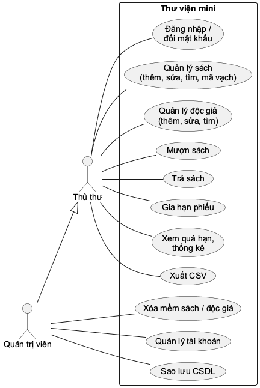

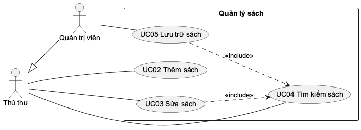

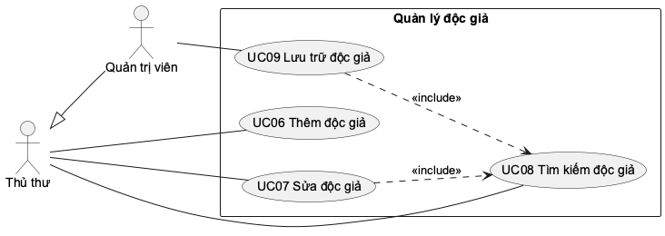

Sửa và lưu trữ đều bắt đầu bằng việc tìm đúng sách hoặc độc giả nên có quan hệ «include» tới use case tìm kiếm tương ứng.

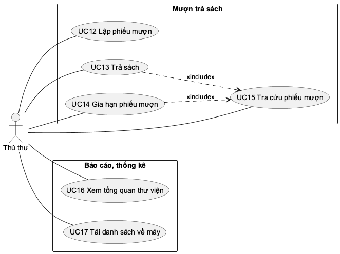

In phiếu mượn mở rộng («extend») Lập phiếu mượn vì có thể in ngay khi lập phiếu, đồng thời cũng thực hiện riêng được khi cần in lại. Đăng nhập là điều kiện trước của mọi use case khác nên không gắn «include» Đăng nhập vào từng chức năng.

Bảng 3.1. Danh sách use case

| Mã | Tên use case | Tác nhân |
| --- | --- | --- |
| UC01 | Đăng nhập | Thủ thư, Quản trị viên |
| UC02 | Thêm sách | Thủ thư |
| UC03 | Sửa sách | Thủ thư |
| UC04 | Tìm kiếm sách | Thủ thư |
| UC05 | Lưu trữ sách | Quản trị viên |
| UC06 | Thêm độc giả | Thủ thư |
| UC07 | Sửa độc giả | Thủ thư |
| UC08 | Tìm kiếm độc giả | Thủ thư |
| UC09 | Lưu trữ độc giả | Quản trị viên |
| UC10 | Lập phiếu mượn | Thủ thư |
| UC11 | In phiếu mượn | Thủ thư |
| UC12 | Trả sách | Thủ thư |
| UC13 | Gia hạn phiếu mượn | Thủ thư |

### 1. UC01 Đăng nhập

Bảng 3.2. Đặc tả UC01 Đăng nhập

| Thuộc tính | Mô tả |
| --- | --- |
| Tác nhân | Thủ thư, Quản trị viên |
| Mô tả | Nhân viên xác minh danh tính để bắt đầu phiên làm việc. |
| Tiền điều kiện | Nhân viên đã được cấp tài khoản đang hoạt động. |
| Hậu điều kiện | Thành công: có phiên làm việc 8 giờ, menu hiển thị theo vai trò. Thất bại: không có phiên mới. |

**Luồng sự kiện chính.** (1) Nhân viên mở trang đăng nhập, nhập tên đăng nhập và mật khẩu, bấm Đăng nhập. (2) Hệ thống tìm tài khoản đang hoạt động và so khớp mật khẩu. (3) Hệ thống tạo phiên làm việc. (4) Hệ thống hiển thị trang Tổng quan, họ tên và vai trò của người dùng ở góc trái.

**Ngoại lệ.** E1. Sai tên đăng nhập, sai mật khẩu hoặc tài khoản đã ngừng: hiển thị một thông báo chung "Tên đăng nhập hoặc mật khẩu không đúng" để không lộ tài khoản nào có thật. E2. Sai 5 lần trong 15 phút: hiển thị "Sai mật khẩu quá nhiều lần, thử lại sau 15 phút". E3. Bỏ trống ô: phần mềm yêu cầu nhập. E4. Phiên hết hạn trong lúc làm việc: hệ thống đưa về trang đăng nhập.

### 2. UC02 Thêm sách

Bảng 3.3. Đặc tả UC02 Thêm sách

| Thuộc tính | Mô tả |
| --- | --- |
| Tác nhân | Thủ thư |
| Mô tả | Thêm một đầu sách mới vào danh mục. |
| Tiền điều kiện | Đã đăng nhập. |
| Hậu điều kiện | Thành công: đầu sách mới xuất hiện trong Kho sách với số bản có sẵn bằng tổng số bản. Thất bại: danh mục không đổi. |

**Luồng sự kiện chính.** (1) Thủ thư mở Kho sách, bấm "+ Thêm sách". (2) Nhập mã sách, mã ISBN (không bắt buộc), tên sách, tác giả, thể loại, tổng số bản. (3) Bấm Lưu thông tin. (4) Hệ thống kiểm tra trường bắt buộc, độ dài (mã ≤ 30, tên ≤ 200, tác giả ≤ 100, thể loại ≤ 60 ký tự) và tổng số bản 0–999. (5) Hệ thống lưu sách, đóng hộp thoại, tải lại danh sách và hiển thị "Đã lưu".

**Ngoại lệ.** E1. Mã sách hoặc mã ISBN đã có: báo "Mã đã tồn tại", giữ nguyên dữ liệu đang nhập để sửa. E2. Thiếu trường bắt buộc, tổng số bản âm, lẻ hoặc lớn hơn 999: báo lỗi từng trường. E3. Bấm Hủy: đóng hộp thoại, không lưu.

### 3. UC03 Sửa sách

Bảng 3.4. Đặc tả UC03 Sửa sách

| Thuộc tính | Mô tả |
| --- | --- |
| Tác nhân | Thủ thư |
| Mô tả | Sửa thông tin của một đầu sách đang sử dụng. |
| Tiền điều kiện | Đã đăng nhập; đã tìm thấy sách (include UC04). |
| Hậu điều kiện | Thành công: thông tin sách được cập nhật; các phiếu cũ vẫn gắn đúng đầu sách. Thất bại: dữ liệu cũ giữ nguyên. |

**Luồng sự kiện chính.** (1) Thủ thư tìm sách (UC04), bấm Sửa trên dòng sách. (2) Hệ thống mở hộp thoại với thông tin hiện tại. (3) Thủ thư sửa thông tin, bấm Lưu thông tin. (4) Hệ thống kiểm tra như khi thêm và kiểm tra tổng số bản mới không ít hơn số bản đang cho mượn. (5) Hệ thống cập nhật và hiển thị "Đã lưu" cùng dòng sách mới.

**Ngoại lệ.** E1. Tổng số bản mới thấp hơn số đang cho mượn: báo "Tổng số bản không được nhỏ hơn số đang mượn". E2. Mã trùng với sách khác: báo "Mã đã tồn tại". E3. Sách vừa bị lưu trữ bởi người khác: báo "Không tìm thấy bản ghi".

### 4. UC04 Tìm kiếm sách

Bảng 3.5. Đặc tả UC04 Tìm kiếm sách

| Thuộc tính | Mô tả |
| --- | --- |
| Tác nhân | Thủ thư |
| Mô tả | Tìm đầu sách đang sử dụng và xem số bản có sẵn. |
| Tiền điều kiện | Đã đăng nhập. |
| Hậu điều kiện | Danh sách hiển thị các sách khớp từ khóa, chia trang. |

**Luồng sự kiện chính.** (1) Thủ thư nhập từ khóa vào ô tìm kiếm của Kho sách. (2) Bấm Tìm kiếm hoặc Enter. (3) Hệ thống lọc sách đang sử dụng có mã, ISBN, tên, tác giả hoặc thể loại chứa từ khóa, không phân biệt chữ hoa, chữ thường. (4) Hệ thống hiển thị kết quả kèm tổng số bản, số bản có sẵn và thanh chia trang.

**Luồng thay thế.** A1. Để trống từ khóa: hiển thị toàn bộ sách đang sử dụng. A2. Đổi số dòng mỗi trang (5/10/20/50) hoặc chuyển trang: danh sách hiển thị lại tương ứng. **Ngoại lệ.** E1. Không có sách khớp: hiển thị "Không tìm thấy sách".

### 5. UC05 Lưu trữ sách

Bảng 3.6. Đặc tả UC05 Lưu trữ sách

| Thuộc tính | Mô tả |
| --- | --- |
| Tác nhân | Quản trị viên |
| Mô tả | Đưa đầu sách không còn dùng ra khỏi danh sách nhưng giữ lịch sử mượn. |
| Tiền điều kiện | Đã đăng nhập với vai trò quản trị viên; đã tìm thấy sách (include UC04). |
| Hậu điều kiện | Thành công: sách không còn trong Kho sách và không chọn được khi lập phiếu; phiếu cũ vẫn hiển thị tên sách. Thất bại: không đổi. |

**Luồng sự kiện chính.** (1) Quản trị viên bấm Lưu trữ trên dòng sách. (2) Hệ thống hỏi xác nhận. (3) Quản trị viên đồng ý. (4) Hệ thống kiểm tra sách không còn bản nào đang cho mượn. (5) Hệ thống lưu trữ sách và hiển thị "Đã lưu trữ, lịch sử mượn trả vẫn được giữ".

**Ngoại lệ.** E1. Còn bản đang cho mượn: báo "Còn sách chưa trả, không thể lưu trữ". E2. Quản trị viên hủy xác nhận: không làm gì. E3. Thủ thư không thấy nút Lưu trữ và không thể thực hiện thao tác này.

### 6. UC06 Thêm độc giả

Bảng 3.7. Đặc tả UC06 Thêm độc giả

| Thuộc tính | Mô tả |
| --- | --- |
| Tác nhân | Thủ thư |
| Mô tả | Lập hồ sơ cho độc giả mới. |
| Tiền điều kiện | Đã đăng nhập. |
| Hậu điều kiện | Thành công: độc giả mới xuất hiện trong danh sách và chọn được khi lập phiếu. |

**Luồng sự kiện chính.** (1) Thủ thư mở Độc giả, bấm "+ Thêm độc giả". (2) Nhập mã độc giả, họ tên và điện thoại (có thể bỏ trống). (3) Bấm Lưu thông tin. (4) Hệ thống bỏ khoảng trắng thừa, kiểm tra mã 1–30 ký tự, họ tên 1–100 ký tự, điện thoại tối đa 20 ký tự chỉ gồm chữ số, dấu cách, + ( ) -. (5) Hệ thống lưu và hiển thị "Đã lưu" cùng độc giả mới.

**Ngoại lệ.** E1. Mã độc giả đã có: báo "Mã đã tồn tại". E2. Thiếu mã, họ tên hoặc điện thoại có ký tự lạ: báo lỗi từng trường.

### 7. UC07 Sửa độc giả

Bảng 3.8. Đặc tả UC07 Sửa độc giả

| Thuộc tính | Mô tả |
| --- | --- |
| Tác nhân | Thủ thư |
| Mô tả | Sửa hồ sơ độc giả đang sử dụng. |
| Tiền điều kiện | Đã đăng nhập; đã tìm thấy độc giả (include UC08). |
| Hậu điều kiện | Hồ sơ được cập nhật; các phiếu cũ vẫn gắn đúng độc giả dù đổi mã. |

**Luồng sự kiện chính.** (1) Thủ thư tìm độc giả, bấm Sửa. (2) Hệ thống mở hộp thoại với thông tin hiện tại. (3) Thủ thư sửa và bấm Lưu thông tin. (4) Hệ thống kiểm tra như khi thêm, cập nhật hồ sơ và hiển thị "Đã lưu".

**Ngoại lệ.** E1. Mã trùng độc giả khác: báo "Mã đã tồn tại". E2. Độc giả vừa bị lưu trữ: báo "Không tìm thấy bản ghi".

### 8. UC08 Tìm kiếm độc giả

Bảng 3.9. Đặc tả UC08 Tìm kiếm độc giả

| Thuộc tính | Mô tả |
| --- | --- |
| Tác nhân | Thủ thư |
| Mô tả | Tìm độc giả đang sử dụng theo mã, họ tên hoặc điện thoại. |
| Tiền điều kiện | Đã đăng nhập. |
| Hậu điều kiện | Danh sách hiển thị các độc giả khớp từ khóa, chia trang. |

**Luồng sự kiện chính.** (1) Thủ thư nhập từ khóa vào ô tìm kiếm của màn hình Độc giả, bấm Tìm kiếm. (2) Hệ thống lọc độc giả đang sử dụng khớp từ khóa. (3) Hệ thống hiển thị kết quả và thanh chia trang; điện thoại trống hiển thị dấu gạch ngang.

**Ngoại lệ.** E1. Không có kết quả: hiển thị "Không tìm thấy độc giả".

### 9. UC09 Lưu trữ độc giả

Bảng 3.10. Đặc tả UC09 Lưu trữ độc giả

| Thuộc tính | Mô tả |
| --- | --- |
| Tác nhân | Quản trị viên |
| Mô tả | Đưa độc giả không còn sinh hoạt ra khỏi danh sách nhưng giữ lịch sử. |
| Tiền điều kiện | Đăng nhập quản trị viên; đã tìm thấy độc giả (include UC08). |
| Hậu điều kiện | Thành công: độc giả không còn trong danh sách và không lập phiếu mới được; lịch sử phiếu giữ nguyên. |

**Luồng sự kiện chính.** (1) Quản trị viên bấm Lưu trữ trên dòng độc giả. (2) Hệ thống hỏi xác nhận; quản trị viên đồng ý. (3) Hệ thống kiểm tra độc giả không còn giữ cuốn nào. (4) Hệ thống lưu trữ và hiển thị "Đã lưu trữ, lịch sử mượn trả vẫn được giữ".

**Ngoại lệ.** E1. Độc giả còn giữ sách: báo "Còn sách chưa trả, không thể lưu trữ". E2. Hủy xác nhận: không làm gì.

### 10. UC10 Lập phiếu mượn

Bảng 3.11. Đặc tả UC10 Lập phiếu mượn

| Thuộc tính | Mô tả |
| --- | --- |
| Tác nhân | Thủ thư |
| Mô tả | Ghi nhận một lần mượn: một phiếu cho một độc giả, gồm 1–5 cuốn. |
| Tiền điều kiện | Đã đăng nhập; có độc giả đang sử dụng và sách còn bản. |
| Hậu điều kiện | Thành công: có đúng một phiếu mới với một dòng chi tiết cho mỗi cuốn; số bản có sẵn của mỗi đầu sách giảm một. Thất bại: không có phiếu hay dòng chi tiết nào được ghi. |

**Luồng sự kiện chính.** (1) Thủ thư bấm "+ Lập phiếu mượn". (2) Hệ thống hiển thị danh sách độc giả đang sử dụng và danh sách sách còn bản (có ô lọc theo mã, tên). (3) Thủ thư chọn độc giả, đánh dấu các cuốn độc giả mượn, nhập số ngày mượn (mặc định 14), bấm Lập phiếu. (4) Hệ thống kiểm tra lại: độc giả và sách còn sử dụng, không chọn trùng, số cuốn đang giữ cộng số cuốn mượn thêm không quá 5, mỗi cuốn còn bản trên giá. (5) Hệ thống lập phiếu với ngày mượn hôm nay, hạn trả = hôm nay + số ngày, ghi chi tiết từng cuốn. (6) Hệ thống hiển thị "Đã lập phiếu mượn #n gồm k cuốn" và cập nhật danh sách.

**Ngoại lệ.** E1. Chưa chọn cuốn nào: báo "Chọn ít nhất một cuốn sách". E2. Độc giả hoặc sách đã bị lưu trữ: báo "… không tồn tại hoặc đã được lưu trữ". E3. Vượt giới hạn: báo "Độc giả đang giữ n cuốn, chỉ được mượn thêm m cuốn". E4. Một cuốn đã hết bản: báo "Sách "…" đã hết bản có thể mượn", không lập phiếu cho cả lần đó. E5. Số ngày ngoài 1–30: báo lỗi tại ô nhập. E6. Hai thủ thư cùng cho mượn bản cuối: chỉ yêu cầu đến trước thành công. A1. Độc giả đang có phiếu quá hạn vẫn mượn được nếu chưa đủ 5 cuốn (thư viện chưa thu tiền phạt).

### 11. UC11 In phiếu mượn

Bảng 3.12. Đặc tả UC11 In phiếu mượn

| Thuộc tính | Mô tả |
| --- | --- |
| Tác nhân | Thủ thư |
| Mô tả | In phiếu mượn ra giấy để độc giả và thủ thư ký nhận. Mở rộng («extend») UC10: có thể in ngay sau khi lập phiếu. |
| Tiền điều kiện | Đã đăng nhập; phiếu vừa được lập (UC10) hoặc đã tìm thấy trong danh sách phiếu. |
| Hậu điều kiện | Hộp thoại in mở với đúng một trang phiếu; dữ liệu không thay đổi. |

**Luồng sự kiện chính.** (1) Thủ thư bấm "In phiếu" trên dòng phiếu. (2) Hệ thống đọc phiếu: số phiếu, độc giả và điện thoại, ngày mượn, hạn trả (ghi chú nếu đã gia hạn), người lập, danh sách cuốn kèm mã sách, tác giả, ngày trả (nếu đã trả). (3) Hệ thống dựng phiếu in gồm tiêu đề "PHIẾU MƯỢN SÁCH", bảng sách, tổng số cuốn, lời nhắc trả đúng hạn, hai ô ký và thời điểm in. (4) Hệ thống mở hộp thoại in; chỉ phiếu được in, các phần khác của giao diện bị ẩn. (5) Thủ thư chọn máy in hoặc lưu PDF.

**Luồng thay thế.** A1. Trong hộp thoại Lập phiếu mượn, ô "In phiếu ngay sau khi lập" được chọn sẵn: lập phiếu thành công thì hệ thống tự thực hiện bước (2)–(4). A2. In lại phiếu đã trả một phần hoặc trả đủ: cột Ngày trả ghi ngày đã nhận từng cuốn. **Ngoại lệ.** E1. Phiếu không tồn tại: báo "Không tìm thấy phiếu mượn". E2. Thủ thư hủy hộp thoại in: không có gì thay đổi.

### 12. UC12 Trả sách

Bảng 3.13. Đặc tả UC12 Trả sách

| Thuộc tính | Mô tả |
| --- | --- |
| Tác nhân | Thủ thư |
| Mô tả | Nhận lại toàn bộ hoặc một phần các cuốn trên một phiếu. |
| Tiền điều kiện | Đã đăng nhập; đã tìm thấy phiếu còn cuốn chưa trả trong danh sách phiếu; đã nhận sách từ độc giả. |
| Hậu điều kiện | Các cuốn được chọn có ngày trả và người nhận; số bản có sẵn tăng tương ứng; phiếu chuyển "Đã trả" khi đủ. |

**Luồng sự kiện chính.** (1) Thủ thư bấm Trả sách trên phiếu. (2) Hệ thống hiển thị độc giả, hạn trả, số ngày quá hạn (nếu có) và các cuốn chưa trả, mặc định chọn tất cả. (3) Thủ thư bỏ chọn những cuốn độc giả chưa mang tới, bấm "Xác nhận đã nhận sách". (4) Hệ thống kiểm tra các cuốn được chọn thuộc phiếu và chưa trả. (5) Hệ thống ghi ngày trả là hôm nay và người nhận là nhân viên đang đăng nhập cho từng cuốn. (6) Hệ thống hiển thị "Đã nhận trả k cuốn của phiếu #n, phiếu còn m cuốn chưa trả" hoặc "…, phiếu đã trả đủ".

**Ngoại lệ.** E1. Bỏ chọn hết: báo "Chọn ít nhất một cuốn sách". E2. Cuốn đã được trả trước đó hoặc không thuộc phiếu (ví dụ hai máy cùng thao tác): báo "Có cuốn đã trả hoặc không thuộc phiếu này", không ghi gì. E3. Phiếu đã trả đủ: báo "Phiếu này đã trả hết sách". A1. Trả quá hạn vẫn được nhận; thông báo kèm số ngày trễ, chưa tính tiền phạt.

### 13. UC13 Gia hạn phiếu mượn

Bảng 3.14. Đặc tả UC13 Gia hạn phiếu mượn

| Thuộc tính | Mô tả |
| --- | --- |
| Tác nhân | Thủ thư |
| Mô tả | Lùi hạn trả của một phiếu còn trong hạn. |
| Tiền điều kiện | Đã đăng nhập; phiếu còn cuốn chưa trả, chưa quá hạn, chưa gia hạn. |
| Hậu điều kiện | Hạn trả lùi đúng số ngày; phiếu mang nhãn "Đã gia hạn" và không gia hạn được lần hai. |

**Luồng sự kiện chính.** (1) Thủ thư bấm Gia hạn trên phiếu. (2) Nhập số ngày thêm (mặc định 7), bấm Gia hạn. (3) Hệ thống kiểm tra ba điều kiện. (4) Hệ thống cập nhật hạn trả và hiển thị "Đã gia hạn phiếu #n đến ngày …".

**Ngoại lệ.** E1. Phiếu đã trả hết: báo "Phiếu này đã trả hết sách". E2. Phiếu đã quá hạn: báo "Phiếu đã quá hạn, cần trả sách trước". E3. Đã gia hạn: báo "Mỗi phiếu chỉ được gia hạn một lần". E4. Số ngày ngoài 1–30: báo lỗi tại ô nhập.

## II. Sơ đồ hoạt động

Phần này trình bày sơ đồ hoạt động của các luồng tiêu biểu. Mỗi sơ đồ chia hai làn: người dùng và hệ thống; mọi luồng, kể cả nhánh bị từ chối, đều kết thúc bằng một bước hệ thống hiển thị kết quả. Thêm sách đại diện cho nhóm thêm, sửa, lưu trữ sách và độc giả, vì các luồng này cùng khuôn: nhập thông tin → hệ thống kiểm tra quy định → lưu → hiển thị kết quả hoặc lý do từ chối; điều kiện riêng của từng thao tác đã nêu trong đặc tả use case ở mục I. Lập phiếu mượn và Trả sách là hai nghiệp vụ cốt lõi của thư viện.

### 1. Hoạt động đăng nhập

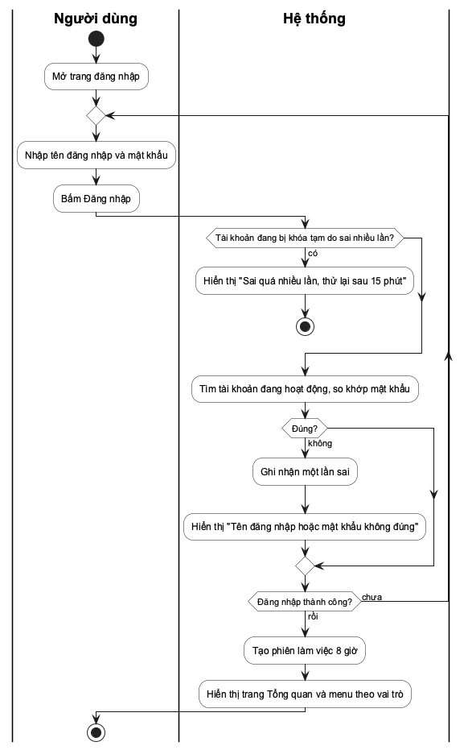

Người dùng có thể nhập lại nhiều lần; vòng lặp dừng khi đăng nhập đúng hoặc khi bị khóa tạm.

### 2. Hoạt động thêm sách

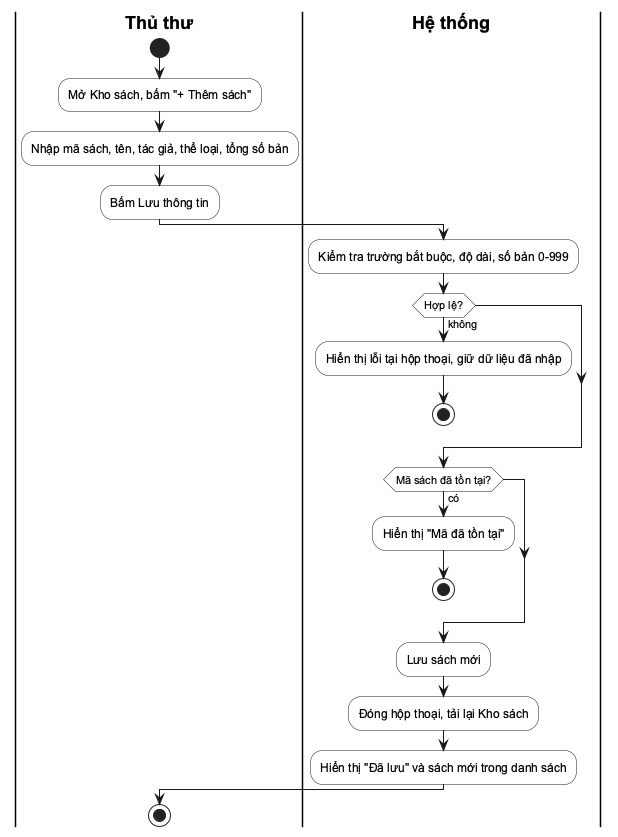

### 3. Hoạt động lập phiếu mượn

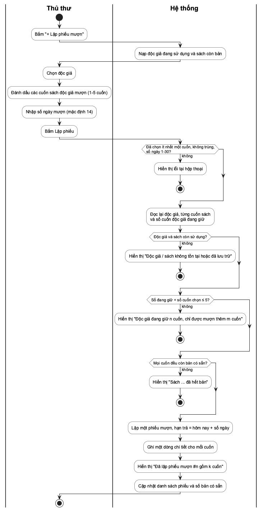

Bốn điều kiện được kiểm tra theo thứ tự; chỉ khi đạt cả bốn hệ thống mới lập phiếu và ghi chi tiết cho tất cả các cuốn cùng lúc, nên không có trường hợp phiếu chỉ ghi được một phần số cuốn.

### 4. Hoạt động trả sách

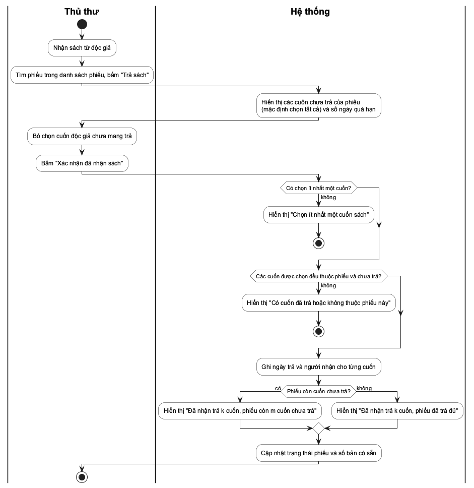

Kết quả hiển thị khác nhau tùy phiếu đã trả đủ hay còn thiếu cuốn, giúp thủ thư biết có cần nhắc độc giả mang nốt sách tới không.

## III. Thiết kế cơ sở dữ liệu

### 1. Mô hình ERD

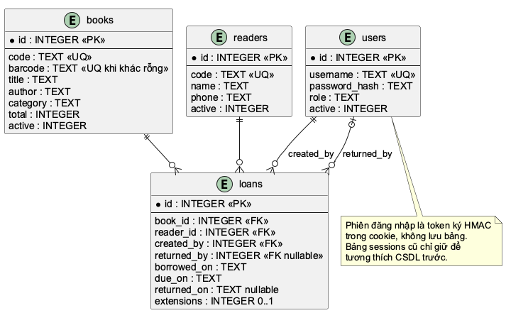

Dữ liệu của thư viện gồm năm nhóm thông tin. NGƯỜI DÙNG (nhân viên), ĐỘC GIẢ, SÁCH và PHIẾU MƯỢN là các thực thể độc lập, mỗi thực thể có một mã định danh riêng (gạch chân). CHI TIẾT PHIẾU MƯỢN là thực thể phụ thuộc: một dòng chi tiết chỉ có nghĩa khi nằm trong một phiếu, nên được vẽ viền đôi và gắn với phiếu bằng liên kết CÓ (viền đôi). Số bản có sẵn của sách là giá trị tính ra (nét đứt): tổng số bản trừ số dòng chi tiết chưa có ngày trả.

Bảng 3.15. Các mối liên kết trong ERD

| Liên kết | Thực thể tham gia | Bản số | Ý nghĩa nghiệp vụ |
| --- | --- | --- | --- |
| MƯỢN | ĐỘC GIẢ – PHIẾU MƯỢN | 1 – N | Một độc giả có nhiều phiếu theo thời gian; mỗi phiếu thuộc đúng một độc giả. |
| LẬP | NGƯỜI DÙNG – PHIẾU MƯỢN | 1 – N | Mỗi phiếu do đúng một nhân viên lập. |
| CÓ | PHIẾU MƯỢN – CHI TIẾT PHIẾU MƯỢN | 1 – N | Mỗi phiếu có ít nhất một cuốn; mỗi dòng chi tiết thuộc đúng một phiếu. |
| LÀ BẢN CỦA | CHI TIẾT PHIẾU MƯỢN – SÁCH | N – 1 | Mỗi dòng chi tiết là một bản của một đầu sách; một đầu sách xuất hiện trên nhiều phiếu theo thời gian. |
| NHẬN TRẢ | NGƯỜI DÙNG – CHI TIẾT PHIẾU MƯỢN | 1 – N | Nhân viên nhận lại từng cuốn; cuốn chưa trả thì chưa có người nhận. |

Phiếu mượn và sách có quan hệ nhiều – nhiều (một phiếu nhiều sách, một sách nằm trên nhiều phiếu) và quan hệ này có thông tin riêng là ngày trả của từng cuốn; vì vậy nó được tách thành CHI TIẾT PHIẾU MƯỢN.

### 2. Sơ đồ Diagram

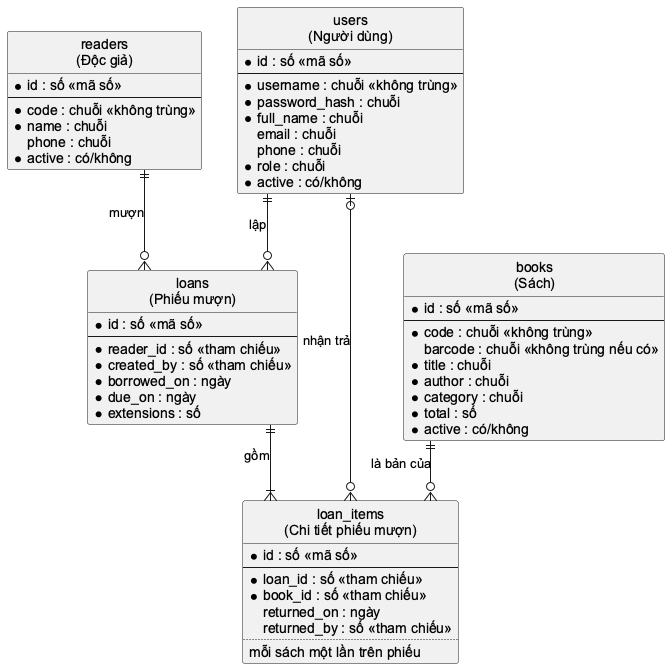

Mỗi thực thể trong ERD trở thành một bảng dữ liệu: users (người dùng), readers (độc giả), books (sách), loans (phiếu mượn) và loan_items (chi tiết phiếu mượn). Mỗi bảng có một cột mã số (id) do phần mềm tự cấp; mã nghiệp vụ như mã sách, mã độc giả, tên đăng nhập là duy nhất. Các liên kết được thể hiện bằng cột tham chiếu: phiếu mượn ghi mã độc giả và mã người lập; chi tiết phiếu ghi mã phiếu, mã sách và mã người nhận trả. Ký hiệu ở hai đầu đường nối cho biết "một" (gạch đứng) hay "nhiều" (chân chim), có bắt buộc (gạch) hay không (vòng tròn).

### 3. Cấu trúc các bảng

Bảng 3.16. Bảng users (Người dùng)

| Trường | Ý nghĩa | Kiểu dữ liệu | Bắt buộc | Ràng buộc nghiệp vụ |
| --- | --- | --- | --- | --- |
| id | Mã số người dùng | Số | Có | Tự cấp, không trùng |
| username | Tên đăng nhập | Chuỗi | Có | 3–50 ký tự chữ, số, dấu chấm, gạch dưới, gạch nối; không trùng |
| password_hash | Mật khẩu đã được bảo vệ | Chuỗi | Có | Mật khẩu gốc ít nhất 8 ký tự; không ai đọc lại được |
| full_name | Họ và tên | Chuỗi | Có | 1–100 ký tự |
| email | Email liên hệ | Chuỗi | Không | Đúng dạng email, tối đa 100 ký tự |
| phone | Điện thoại | Chuỗi | Không | Tối đa 20 ký tự gồm chữ số, dấu cách, + ( ) - |
| role | Vai trò | Chuỗi | Có | Quản trị viên hoặc Thủ thư |
| active | Trạng thái | Có/Không | Có | Không = đã ngừng, không đăng nhập được |

Bảng 3.17. Bảng readers (Độc giả)

| Trường | Ý nghĩa | Kiểu dữ liệu | Bắt buộc | Ràng buộc nghiệp vụ |
| --- | --- | --- | --- | --- |
| id | Mã số độc giả | Số | Có | Tự cấp, không trùng |
| code | Mã độc giả | Chuỗi | Có | 1–30 ký tự, không trùng |
| name | Họ và tên | Chuỗi | Có | 1–100 ký tự |
| phone | Điện thoại | Chuỗi | Không | Tối đa 20 ký tự |
| active | Đang sử dụng | Có/Không | Có | Không = đã lưu trữ |

Bảng 3.18. Bảng books (Sách)

| Trường | Ý nghĩa | Kiểu dữ liệu | Bắt buộc | Ràng buộc nghiệp vụ |
| --- | --- | --- | --- | --- |
| id | Mã số đầu sách | Số | Có | Tự cấp, không trùng |
| code | Mã sách | Chuỗi | Có | 1–30 ký tự, không trùng |
| barcode | Mã ISBN | Chuỗi | Không | Tối đa 20 ký tự chữ số, chữ cái, gạch nối; không trùng nếu có |
| title | Tên sách | Chuỗi | Có | 1–200 ký tự |
| author | Tác giả | Chuỗi | Có | 1–100 ký tự |
| category | Thể loại | Chuỗi | Có | 1–60 ký tự |
| total | Tổng số bản | Số | Có | 0–999, không ít hơn số bản đang cho mượn |
| active | Đang sử dụng | Có/Không | Có | Không = đã lưu trữ |

Bảng 3.19. Bảng loans (Phiếu mượn)

| Trường | Ý nghĩa | Kiểu dữ liệu | Bắt buộc | Ràng buộc nghiệp vụ |
| --- | --- | --- | --- | --- |
| id | Số phiếu | Số | Có | Tự cấp, không trùng |
| reader_id | Độc giả mượn | Số (tham chiếu readers) | Có | Độc giả đang sử dụng khi lập phiếu |
| created_by | Nhân viên lập phiếu | Số (tham chiếu users) | Có | Người đang đăng nhập |
| borrowed_on | Ngày mượn | Ngày | Có | Ngày lập phiếu |
| due_on | Hạn trả | Ngày | Có | Không trước ngày mượn; ngày mượn + 1–30 ngày |
| extensions | Số lần đã gia hạn | Số | Có | 0 hoặc 1 |

Bảng 3.20. Bảng loan_items (Chi tiết phiếu mượn)

| Trường | Ý nghĩa | Kiểu dữ liệu | Bắt buộc | Ràng buộc nghiệp vụ |
| --- | --- | --- | --- | --- |
| id | Mã số dòng chi tiết | Số | Có | Tự cấp, không trùng |
| loan_id | Phiếu chứa dòng này | Số (tham chiếu loans) | Có | Mỗi phiếu 1–5 dòng |
| book_id | Đầu sách được mượn | Số (tham chiếu books) | Có | Mỗi đầu sách một lần trên phiếu |
| returned_on | Ngày trả | Ngày | Không | Để trống khi chưa trả |
| returned_by | Nhân viên nhận lại sách | Số (tham chiếu users) | Không | Có khi đã trả |

Số bản có sẵn, trạng thái phiếu (đang mượn, quá hạn, đã trả) và số ngày trễ không lưu thành cột mà được tính lại mỗi lần xem, nên luôn khớp với dữ liệu gốc.

## IV. Thiết kế giao diện

Toàn bộ ứng dụng dùng chung một khung màn hình: cột điều hướng bên trái gồm Tổng quan, Kho sách, Độc giả, Mượn & trả và Tài khoản (chỉ quản trị viên thấy); họ tên và vai trò người dùng ở góc trái dưới. Vùng nội dung bên phải chia ba tầng: tiêu đề, thanh thao tác, khối nội dung. Ngay dưới tiêu đề là dòng thông báo kết quả: sau mỗi thao tác, nội dung trả về của hệ thống (ví dụ "Đã lập phiếu mượn #201 gồm 2 cuốn") được hiển thị tại đây. Ba màn hình danh sách dùng chung một mẫu: ô tìm kiếm hoặc bộ lọc, nút "Tải danh sách (Excel)", nút thêm mới, bảng và thanh chia trang. Mọi biểu mẫu đặt trong hộp thoại, lỗi hiển thị ngay trong hộp thoại.

### 1. Giao diện Đăng nhập

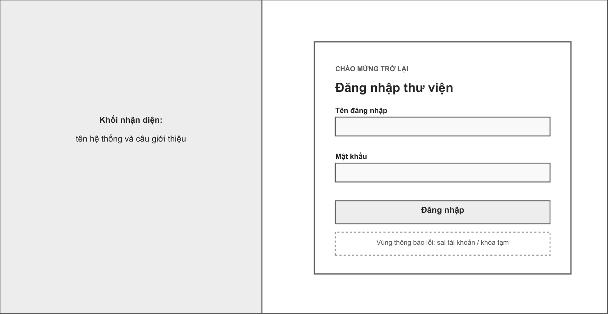

Màn hình chia hai phần: khối nhận diện bên trái và biểu mẫu bên phải, không có cột điều hướng vì người dùng chưa đăng nhập. Vùng thông báo lỗi đặt ngay dưới nút, dùng chung một câu cho mọi trường hợp sai.

### 2. Giao diện Quản lý sách

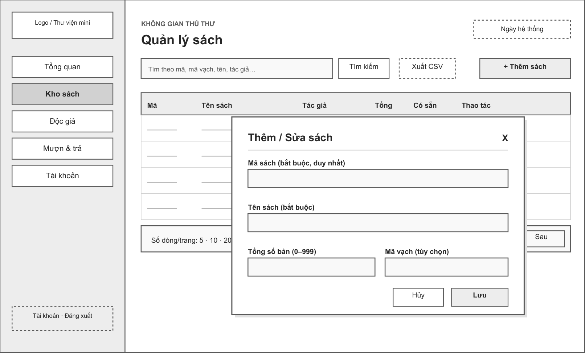

Ô tìm kiếm bên trái, nút "Tải danh sách (Excel)" ở giữa, nút thêm mới ngoài cùng bên phải. Hai cột Tổng bản và Có sẵn đặt cạnh nhau để đối chiếu. Mỗi dòng có nút Sửa; nút Lưu trữ chỉ hiện với quản trị viên. Thêm và sửa dùng chung một hộp thoại với nhãn ghi rõ trường bắt buộc và khoảng giá trị.

### 3. Giao diện Quản lý độc giả

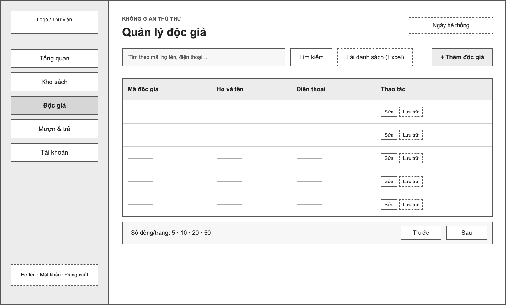

Dùng lại nguyên mẫu danh sách của Kho sách để người dùng chỉ phải học một bố cục; khác biệt nằm ở bộ cột và phạm vi tìm kiếm.

### 4. Giao diện Lập phiếu mượn

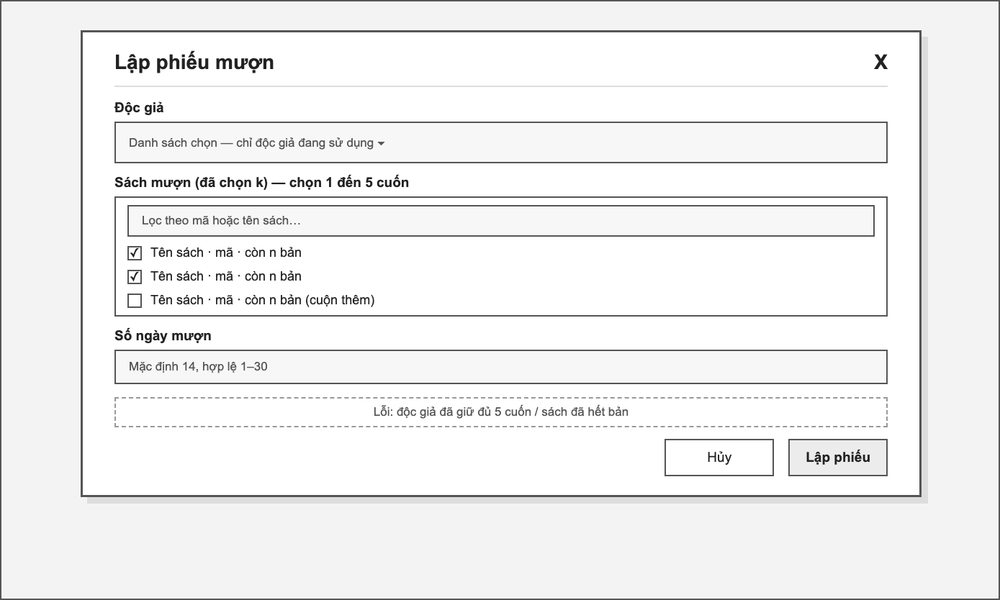

Hộp thoại có ba phần: chọn độc giả, danh sách ô đánh dấu các sách còn bản (có ô lọc và bộ đếm số cuốn đã chọn), số ngày mượn. Một lần bấm "Lập phiếu" tạo một phiếu cho tất cả các cuốn đã chọn. Vùng lỗi phía dưới dành cho các trường hợp bị từ chối như vượt 5 cuốn hoặc sách hết bản.

### 5. Giao diện Trả sách

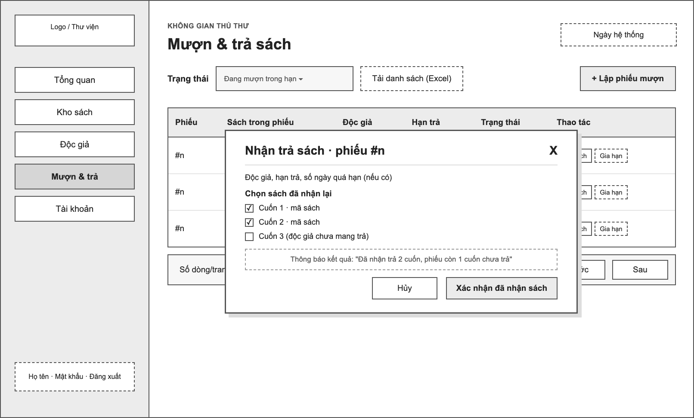

Mỗi phiếu hiển thị danh sách các cuốn trong phiếu. Bấm Trả sách mở hộp thoại liệt kê các cuốn chưa trả, mặc định chọn tất cả; thủ thư bỏ chọn cuốn chưa nhận được. Hộp thoại thay cho hộp xác nhận "có/không" của bản trước, vì trả sách giờ cần chọn cuốn.

### 6. Giao diện Gia hạn phiếu

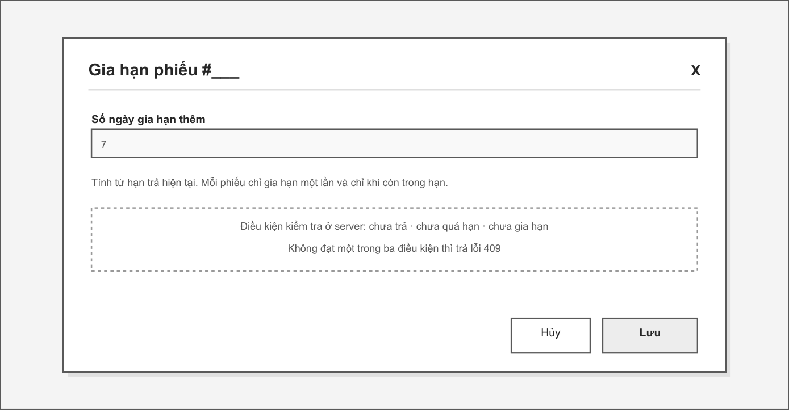

Hộp thoại gia hạn chỉ có một trường số ngày, mặc định 7, hợp lệ 1–30, kèm dòng nhắc điều kiện gia hạn. Phiếu không đủ điều kiện thì không hiện nút Gia hạn.

### 7. Giao diện Quản lý tài khoản

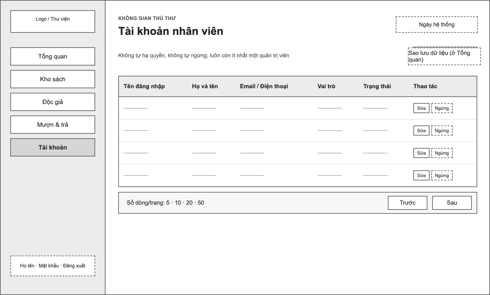

Bảng tài khoản có thêm cột Họ và tên, Email/Điện thoại bên cạnh vai trò và trạng thái. Nút Sửa và Ngừng/Kích hoạt nằm cùng hàng với từng tài khoản. Nút Sao lưu dữ liệu đặt ở Tổng quan, tách khỏi nhóm thao tác tài khoản.

### 8. Mẫu phiếu mượn in

Phiếu in trên khổ A4 hoặc A5 theo thứ tự từ trên xuống: tên thư viện và số phiếu ở hai góc; tiêu đề "PHIẾU MƯỢN SÁCH" căn giữa; khối thông tin hai cột (độc giả, điện thoại, ngày mượn, hạn trả in đậm, người lập); bảng sách có kẻ ô gồm STT, mã sách, tên sách, tác giả, ngày trả (để trống, thủ thư ghi tay khi nhận lại hoặc in sẵn nếu in lại); dòng tổng số cuốn và lời nhắc; hai ô ký Độc giả và Thủ thư; thời điểm in ở cuối. Phiếu dùng chữ đen trên nền trắng, không màu, để in được trên máy in đen trắng. Trên màn hình, mỗi dòng phiếu có thêm nút "In phiếu"; hộp thoại Lập phiếu mượn có thêm ô "In phiếu ngay sau khi lập".

## V. Thiết kế xử lý

### 1. Xử lý lập phiếu mượn

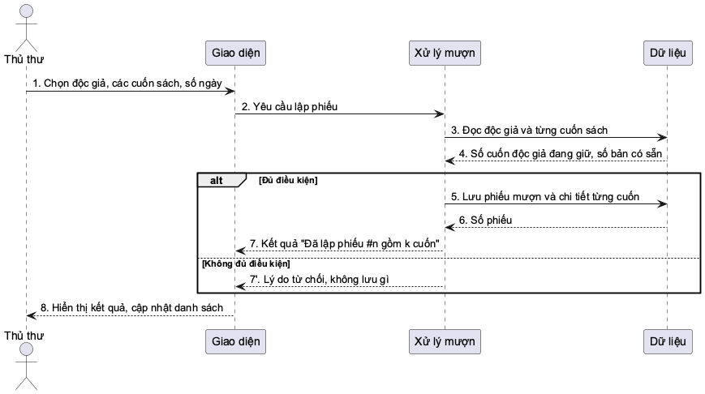

Thủ thư chọn độc giả, các cuốn sách và số ngày. Trước khi lưu, phần xử lý mượn đọc lại số cuốn độc giả đang giữ và số bản còn của từng cuốn, vì số liệu trên màn hình có thể đã cũ nếu một thủ thư khác vừa cho mượn. Đủ điều kiện thì lưu phiếu cùng toàn bộ chi tiết; không đủ thì trả lý do từ chối và không lưu gì. Kết quả luôn được hiển thị cho thủ thư.

### 2. Xử lý trả sách

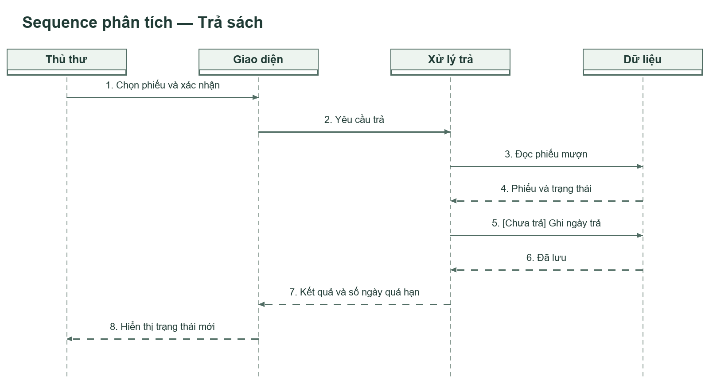

Giao diện đọc các cuốn chưa trả của phiếu để thủ thư chọn. Phần xử lý trả kiểm tra lại từng cuốn được chọn còn chưa trả và thuộc phiếu, rồi ghi ngày trả và người nhận cho từng cuốn. Kết quả gồm số cuốn vừa nhận, số cuốn còn thiếu và số ngày trễ nếu có.

### 3. Xử lý thêm và sửa sách

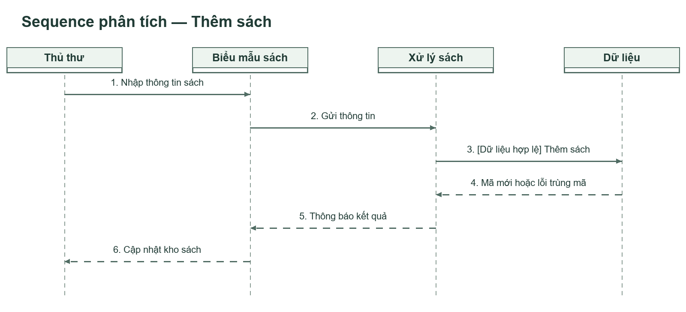

Phần xử lý kiểm tra trường bắt buộc, độ dài và số bản trước khi lưu; mã sách trùng thì báo lỗi và giữ nguyên dữ liệu đang nhập. Khi sửa, kiểm tra thêm tổng số bản mới không ít hơn số bản đang cho mượn.

### 4. Xử lý gia hạn phiếu mượn

Phần xử lý đọc phiếu và kiểm tra lần lượt: còn cuốn chưa trả, chưa quá hạn, chưa gia hạn. Đạt cả ba thì cộng số ngày vào hạn trả và đánh dấu phiếu đã gia hạn; không đạt thì nêu đúng điều kiện bị vi phạm.

### 5. Xử lý in phiếu mượn

Phần xử lý đọc đầy đủ thông tin phiếu (độc giả, điện thoại, ngày mượn, hạn trả, người lập, danh sách cuốn kèm tác giả và ngày trả), dựng phiếu theo mẫu ở mục IV.8 rồi mở hộp thoại in; khi in chỉ phiếu được in, phần còn lại của màn hình bị ẩn. Khi in ngay sau khi lập phiếu, việc in diễn ra sau khi hộp thoại lập phiếu đã đóng.

### 6. Xử lý khi nhiều nhân viên thao tác cùng lúc

Mọi thao tác làm thay đổi số bản trên giá (lập phiếu, trả sách, sửa tổng số bản, lưu trữ) được thực hiện trọn vẹn hoặc không thực hiện gì: bước kiểm tra và bước ghi diễn ra liền một mạch, không thao tác nào khác chen vào giữa. Nhờ vậy khi hai thủ thư cùng cho mượn bản cuối cùng, chỉ người thao tác trước thành công; một phiếu không bao giờ được lưu thiếu cuốn.

# CHƯƠNG IV. PHÁT TRIỂN/THỰC THI

Phần này trình bày các màn hình của ứng dụng theo nhóm chức năng ở Chương III. Ảnh chụp lấy từ ứng dụng chạy thật với bộ dữ liệu mẫu, đăng nhập bằng tài khoản quản trị viên. Mỗi thao tác ghi dữ liệu đều kết thúc bằng dòng thông báo kết quả phía trên nội dung. Bản demo công khai đặt tại thu-vien-mini.vercel.app.

## I. Màn hình Đăng nhập

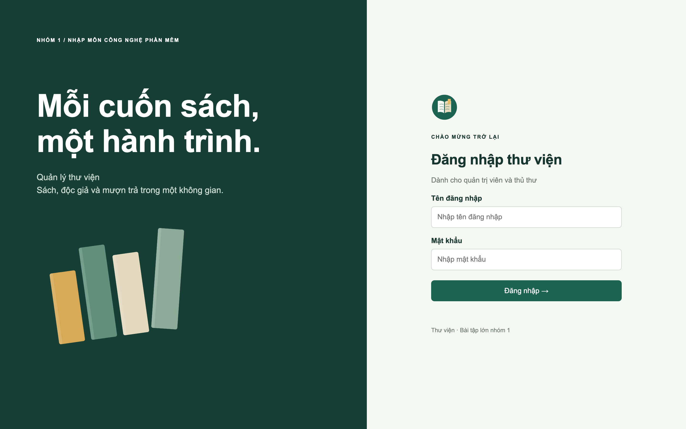

Đây là màn hình duy nhất truy cập được khi chưa có phiên. Sai thông tin thì nhận cùng một thông báo lỗi; sau 5 lần sai trong 15 phút, hệ thống khóa tạm 15 phút. Đăng nhập thành công thì chuyển tới màn hình tương ứng địa chỉ đang mở; góc trái dưới hiển thị họ tên, vai trò cùng hai nút Mật khẩu và Đăng xuất.

## II. Màn hình Tổng quan

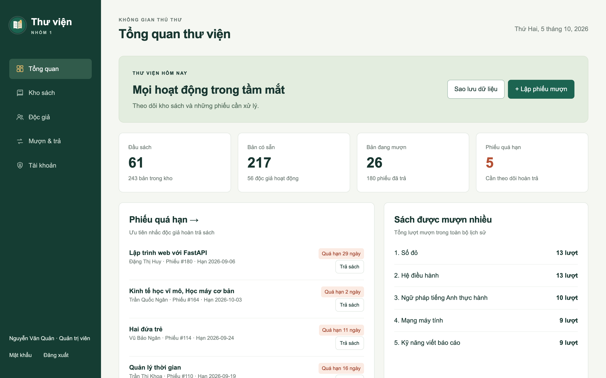

Bốn ô số liệu cho biết số đầu sách và tổng bản, số bản có sẵn và số độc giả, số bản đang cho mượn và số phiếu đã trả, số phiếu quá hạn. Bên dưới là các phiếu quá hạn (liệt kê tên các cuốn chưa trả, có nút Trả sách) và năm đầu sách được mượn nhiều nhất. Nút Sao lưu dữ liệu chỉ hiện với quản trị viên; bấm xong, dòng thông báo hiển thị tên tệp sao lưu vừa tạo.

## III. Màn hình Kho sách

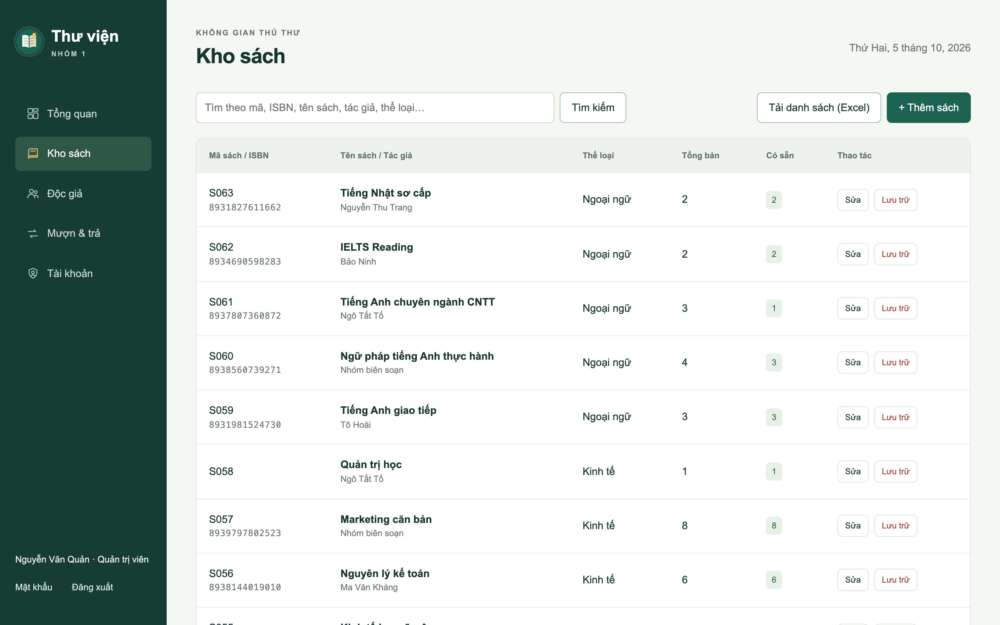

Màn hình liệt kê sách đang sử dụng kèm mã ISBN, tổng số bản và số bản có sẵn. Ô tìm kiếm khớp theo mã, ISBN, tên, tác giả hoặc thể loại; thanh chia trang cho chọn 5/10/20/50 dòng. Nút "Tải danh sách (Excel)" tải toàn bộ danh mục về máy. Quản trị viên thấy thêm nút Lưu trữ trên mỗi dòng.

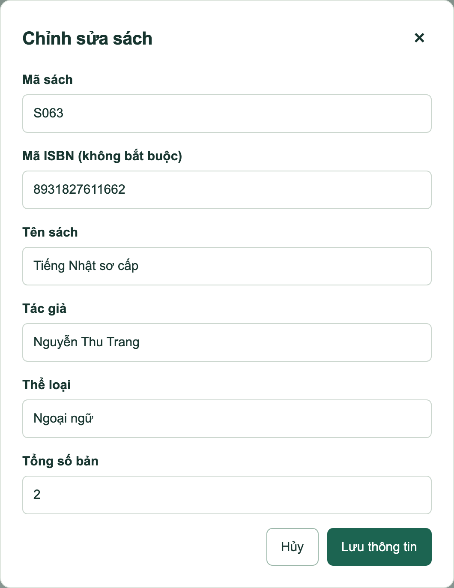

Thêm và sửa dùng chung một hộp thoại. Mã trùng hoặc tổng số bản thấp hơn số đang cho mượn bị từ chối, lý do hiển thị ngay trong hộp thoại và dữ liệu đang nhập được giữ nguyên.

## IV. Màn hình Độc giả

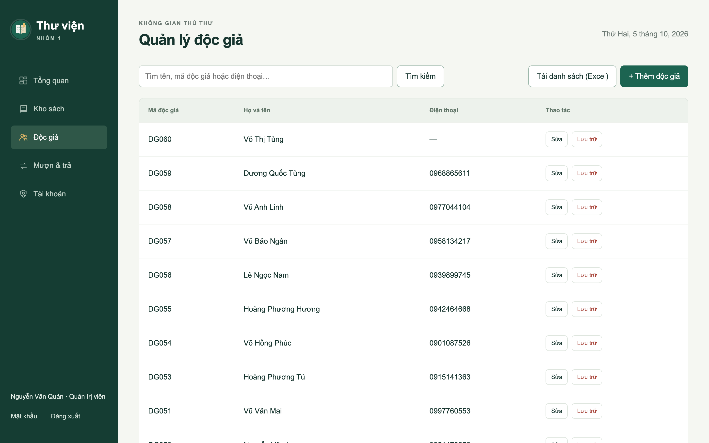

Cùng bố cục với Kho sách: ô tìm kiếm theo mã, họ tên hoặc điện thoại, nút "Tải danh sách (Excel)" và nút Thêm độc giả. Nút Lưu trữ chỉ quản trị viên dùng được và bị chặn khi độc giả còn giữ sách.

## V. Màn hình Lập phiếu mượn

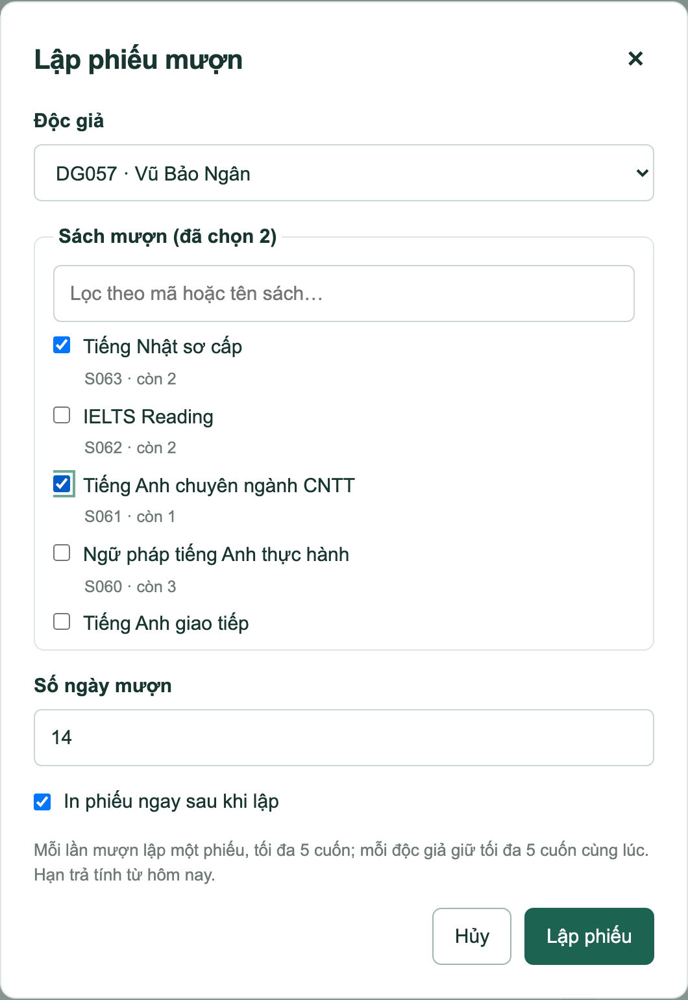

Thủ thư chọn độc giả, đánh dấu các cuốn được mượn trong lần này (bộ đếm "đã chọn k" cập nhật ngay, ô lọc giúp tìm nhanh trong danh sách dài) và nhập số ngày mượn. Danh sách chỉ gồm sách còn bản. Bấm Lập phiếu, hệ thống kiểm tra lại giới hạn rồi lập một phiếu cho tất cả các cuốn.

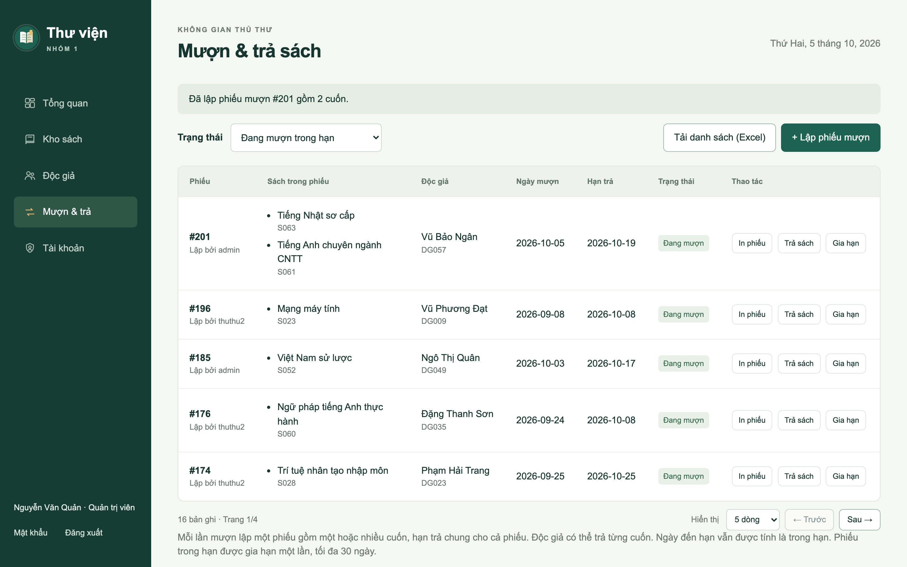

Kết quả hiển thị ngay: dòng thông báo "Đã lập phiếu mượn #201 gồm 2 cuốn" và phiếu #201 đứng đầu danh sách với hai cuốn sách, hạn trả chung và ba nút In phiếu, Trả sách, Gia hạn.

## VI. Màn hình In phiếu mượn

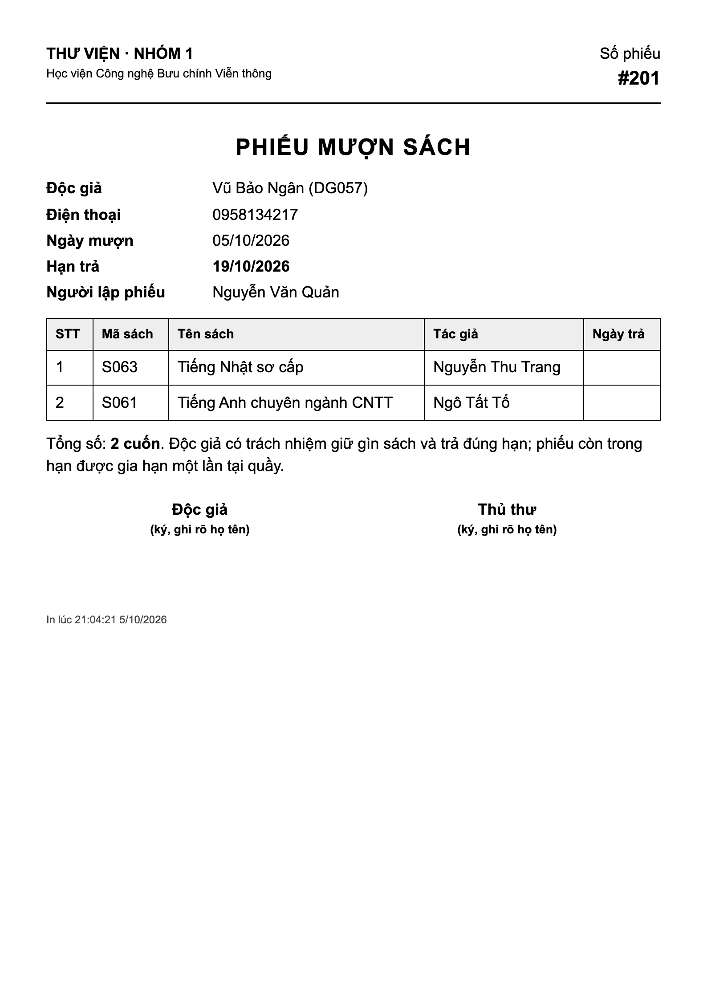

Hộp thoại Lập phiếu mượn có ô "In phiếu ngay sau khi lập" chọn sẵn, nên ngay khi lập phiếu #201, trình duyệt mở hộp thoại in với phiếu trên. Phiếu gồm thông tin độc giả, ngày mượn, hạn trả in đậm, người lập, bảng hai cuốn sách và hai ô ký. Bất kỳ phiếu nào cũng in lại được bằng nút "In phiếu" trên danh sách phiếu; phiếu đã trả có ngày trả từng cuốn ở cột cuối.

## VII. Màn hình Trả sách

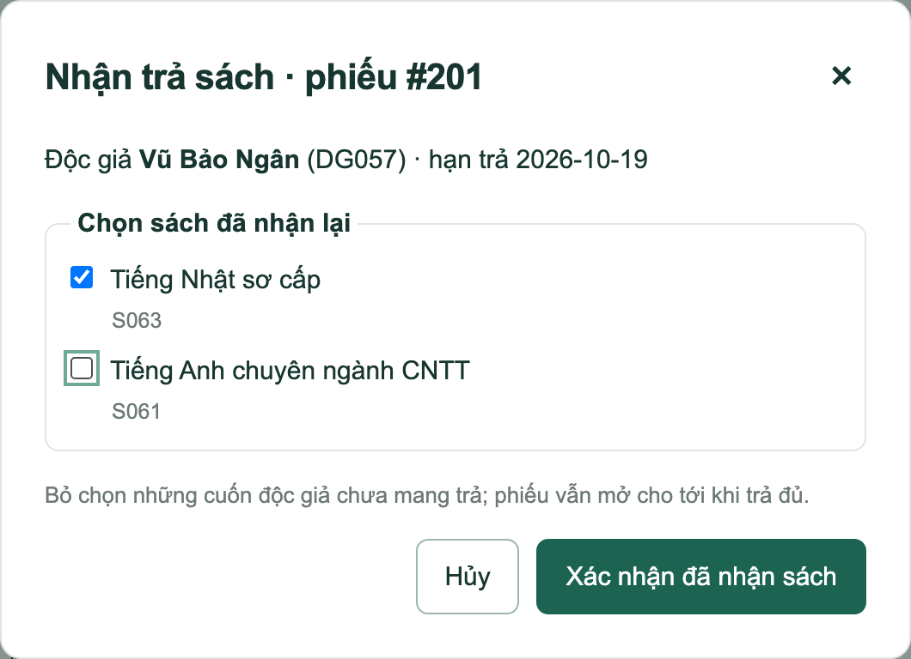

Hộp thoại liệt kê các cuốn chưa trả của phiếu, mặc định chọn tất cả. Ở ví dụ, độc giả chỉ mang trả một cuốn nên thủ thư bỏ chọn cuốn còn lại.

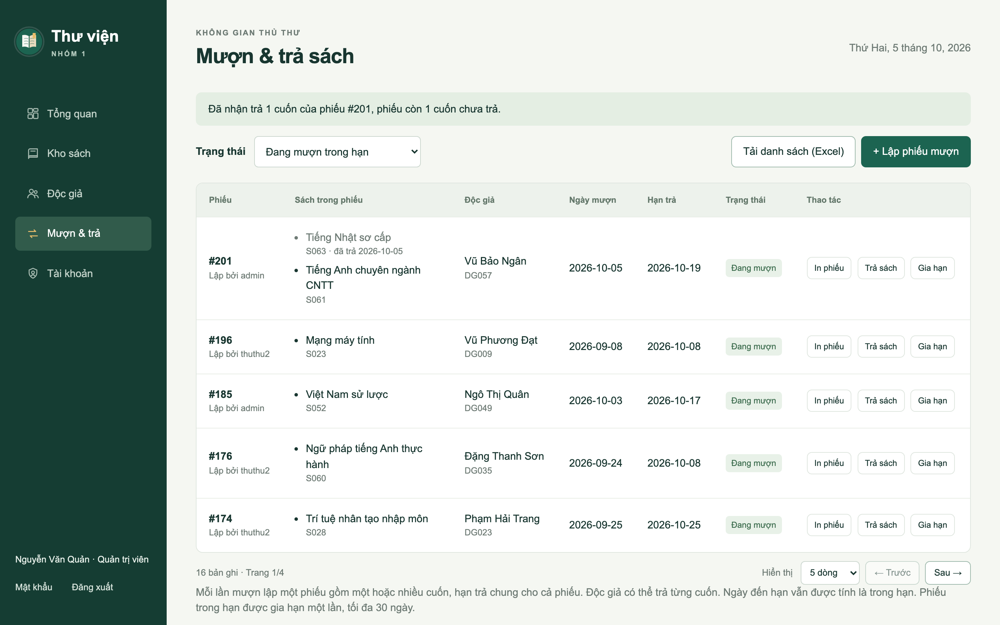

Dòng thông báo "Đã nhận trả 1 cuốn của phiếu #201, phiếu còn 1 cuốn chưa trả"; trên danh sách, cuốn đã trả chuyển màu nhạt kèm ngày trả, phiếu vẫn ở trạng thái Đang mượn cho tới khi trả đủ.

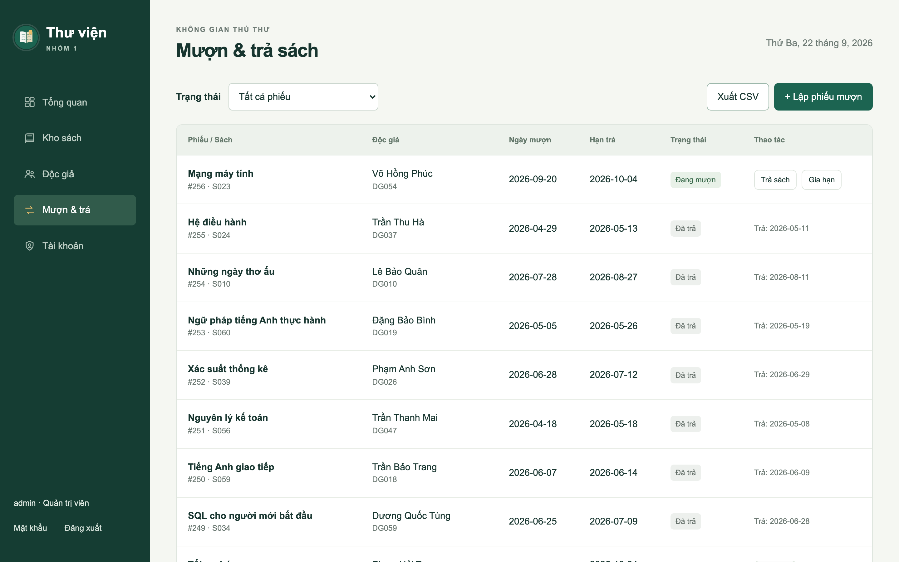

Bộ lọc Tất cả phiếu giữ lại cả phiếu đã trả nên tra cứu được ai từng mượn cuốn nào và ngày trả từng cuốn. Trả sách không xóa phiếu mà chỉ bổ sung ngày trả và người nhận.

## VIII. Màn hình Gia hạn và phiếu quá hạn

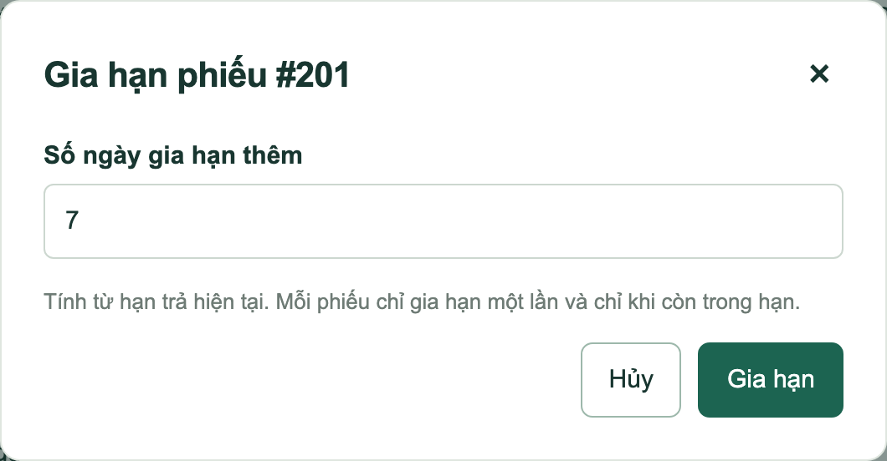

Phiếu còn trong hạn và chưa gia hạn mới có nút Gia hạn. Gia hạn thành công thì dòng thông báo ghi hạn trả mới, phiếu mang nhãn Đã gia hạn và nút Gia hạn biến mất.

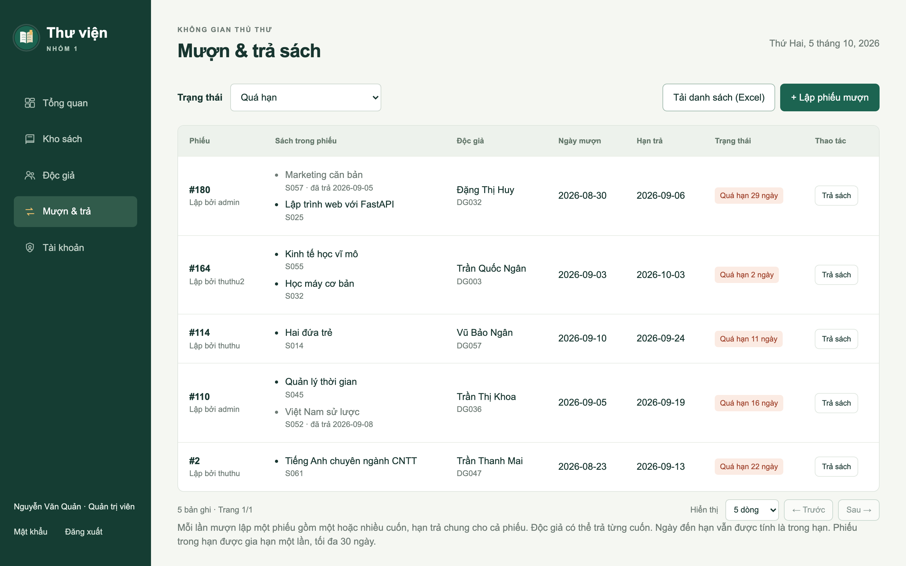

Bộ lọc quá hạn có địa chỉ riêng /loans/overdue nên mở thẳng được và giữ nguyên sau khi tải lại trang. Mỗi phiếu hiển thị số ngày trễ; các phiếu này không còn nút Gia hạn.

## IX. Màn hình Tài khoản

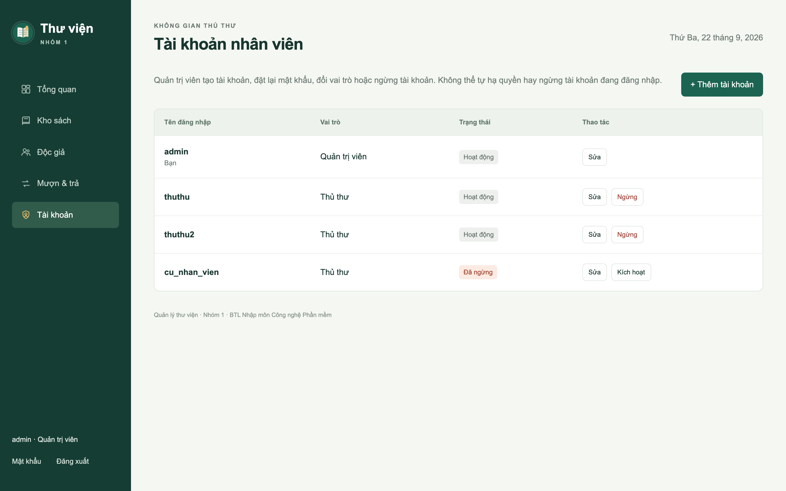

Chỉ quản trị viên thấy màn hình này. Bảng hiển thị tên đăng nhập, họ và tên, email và điện thoại, vai trò, trạng thái. Hệ thống chặn tự hạ quyền, tự ngừng và thao tác làm mất quản trị viên hoạt động cuối cùng. Thủ thư mở /users bị đưa về Tổng quan.

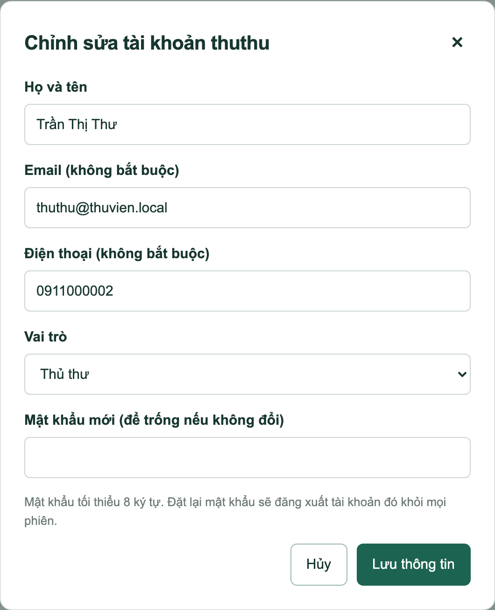

Hộp thoại sửa cho đổi họ tên, email, điện thoại, vai trò và đặt lại mật khẩu (để trống nếu không đổi). Hộp thoại thêm tài khoản có thêm ô tên đăng nhập và bắt buộc nhập mật khẩu.

# CHƯƠNG V. TRIỂN KHAI

## I. Cài đặt

Danh sách tình trạng cài đặt các chức năng (kèm mức độ hoàn thành):

Bảng 5.1. Tình trạng cài đặt các chức năng

| STT | Chức năng | Mức độ hoàn thành | Ghi chú |
| --- | --- | --- | --- |
| 1 | Đăng nhập, đăng xuất, đổi mật khẩu | 100% | Khóa tạm sau 5 lần nhập sai |
| 2 | Thêm, sửa, tìm kiếm sách | 100% | Chia trang 5/10/20/50 dòng |
| 3 | Lưu trữ sách | 100% | Chặn khi còn bản đang cho mượn |
| 4 | Thêm, sửa, tìm kiếm độc giả | 100% | |
| 5 | Lưu trữ độc giả | 100% | Chặn khi độc giả còn giữ sách |
| 6 | Lập phiếu mượn | 100% | Một phiếu 1–5 cuốn, kiểm tra giới hạn trước khi lập |
| 7 | In phiếu mượn | 100% | In ngay khi lập hoặc in lại; lưu được thành PDF |
| 8 | Trả sách | 100% | Trả từng cuốn, chặn trả lặp |
| 9 | Gia hạn phiếu | 100% | Tối đa một lần |
| 10 | Tra cứu phiếu mượn, theo dõi quá hạn | 100% | |
| 11 | Xem tổng quan thư viện | 100% | |
| 12 | Tải danh sách về máy | 100% | Mở được bằng Excel |
| 13 | Quản lý tài khoản nhân viên | 100% | Có họ tên, email, điện thoại; luôn giữ ít nhất một quản trị viên |
| 14 | Sao lưu dữ liệu | 100% | Giữ 10 bản mới nhất; phục hồi phải làm thủ công |

## II. Thử nghiệm

Tài khoản dùng để test các chức năng của Quản trị viên:

- Tài khoản: admin
- Mật khẩu: Admin@123

Tài khoản dùng để test các chức năng của Thủ thư:

- Tài khoản: thuthu (hoặc thuthu2)
- Mật khẩu: ThuThu@123

# CHƯƠNG VI. KẾT LUẬN

## I. Kết quả đã thực hiện

Sản phẩm thực hiện đầy đủ quản lý sách, quản lý độc giả, mượn và trả ở quy mô thư viện nhỏ theo đúng nghiệp vụ: mỗi lần mượn lập và in một phiếu gồm nhiều cuốn, trả được từng cuốn, gia hạn, theo dõi quá hạn; bổ sung quản lý tài khoản nhân viên có thông tin cơ bản, tải danh sách về máy, sao lưu, chia trang và bản demo trực tuyến. Nghiệp vụ được phân tích từ hiện trạng tới quy trình đề xuất; yêu cầu được ghi theo từng công việc của từng đối tượng và tách thành 13 use case chính có đặc tả, các luồng tiêu biểu có sơ đồ hoạt động với bước hiển thị kết quả; dữ liệu được mô hình hóa bằng ERD theo ký pháp Chen. Phần mềm được kiểm thử tự động cả ở các luồng nghiệp vụ lẫn trên giao diện.

## II. Ưu khuyết điểm

**Ưu điểm.** Mô hình dữ liệu phản ánh đúng chứng từ thực tế (phiếu mượn và chi tiết phiếu), số bản có sẵn luôn suy ra từ chi tiết chưa trả nên không lệch với lịch sử. Mọi thao tác hiển thị kết quả cụ thể cho người dùng. Các quy tắc nghiệp vụ và luồng giao diện được kiểm thử tự động. Phiếu mượn in được ngay từ trình duyệt, không cần phần mềm in riêng. Ảnh chụp trong báo cáo lấy từ ứng dụng chạy thật. Phần mềm không phát sinh chi phí và cài đặt đơn giản.

**Khuyết điểm và giới hạn.** Chưa kiểm thử tải lớn, kiểm toán an toàn thông tin, phục hồi từ bản sao lưu bằng giao diện, nhiều trình duyệt khác nhau hoặc chạy liên tục 24/7. Hệ thống chưa quản lý riêng từng bản sách vật lý, chưa tính tiền phạt, chưa có cổng cho độc giả và chưa mã hóa đường truyền khi dùng qua mạng nội bộ. Hồ sơ đã lưu trữ chưa xem lại hoặc khôi phục được trên giao diện.

## III. Hướng mở rộng trong tương lai

Quản lý từng bản vật lý (mỗi bản một mã), xem và khôi phục hồ sơ đã lưu trữ, phục hồi sao lưu bằng giao diện, tính tiền phạt, đặt trước, gửi nhắc hạn, cổng tra cứu cho độc giả. Khi mở rộng người dùng thật cần thử tải, cấu hình HTTPS và lưu dữ liệu trên máy chủ ổn định.

# TÀI LIỆU THAM KHẢO

[1] Học viện Công nghệ Bưu chính Viễn thông, Bài giảng học phần Nhập môn Công nghệ phần mềm.

[2] PlantUML, Chen's ERD notation. https://plantuml.com/er-diagram

Tài liệu trực tuyến được đối chiếu ngày 05/10/2026.
