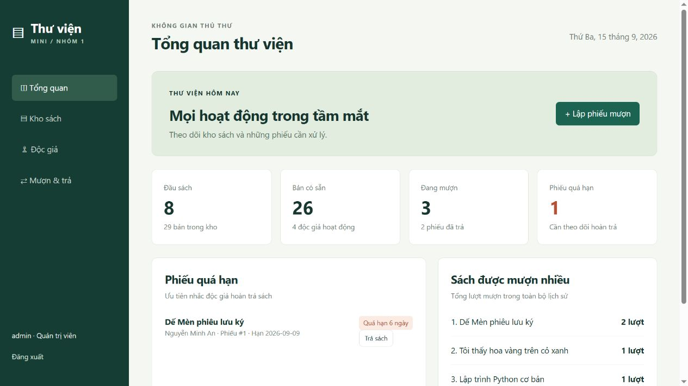
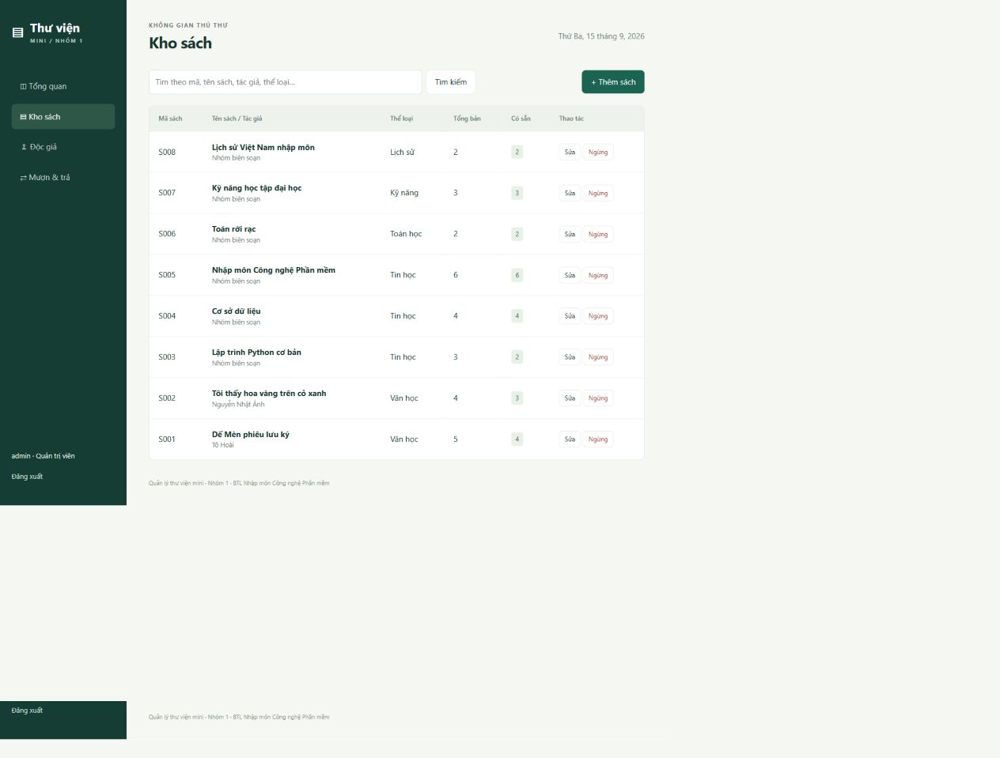

# Bài tập lớn Nhập môn Công nghệ Phần mềm

ĐỀ TÀI 1

## Quản lý thư viện mini

Báo cáo nhóm 1

| Mã sinh viên | Họ và tên | Lớp |
| --- | --- | --- |
| B24DTCN057 | Phạm Tuấn Anh | D24TXCN06-B |
| B24DTCN060 | Phạm Phước Hòa | D24TXCN06-B |
| B24DTCN061 | Lê Ngọc Khôi | D24TXCN06-B |
| K25DTCN499 | Lê Bá Quảng | D25TXCN14-K |

Học phần: Nhập môn Công nghệ Phần mềm — N04

Sản phẩm: Web application Python FastAPI, SQLite và HTML/CSS/JavaScript thuần.

Báo cáo bao gồm mô tả yêu cầu, phân tích, thiết kế, cài đặt và kiểm thử. Các chức năng trọng tâm là quản lý sách, quản lý độc giả và mượn/trả sách.

Tháng 9 năm 2026

# Phạm vi và cấu trúc báo cáo

Nhóm xây dựng một ứng dụng web cho thư viện quy mô nhỏ. Thủ thư theo dõi sách, độc giả và phiếu mượn trên một giao diện; quản trị viên có thêm quyền xóa mềm dữ liệu. Phần mềm lưu dữ liệu tại máy, có tài khoản và dữ liệu mẫu để chạy thử trên Windows.

Đề gốc “25 Đề Tài BTL – Nhập Môn Công Nghệ Phần Mềm – N04” ghi Đề tài 1 là Quản lý thư viện mini, chức năng chính gồm quản lý sách, độc giả, mượn/trả sách. Báo cáo bám năm giai đoạn A–E của tài liệu. Các quy tắc định lượng bổ sung được nêu là giả định của bản triển khai.

| Phần | Nội dung |
| --- | --- |
| A | Bài toán, người dùng, chức năng và phi chức năng |
| B | Use Case, 5 mô tả chi tiết, entity classes, lớp phân tích, 3 sequence |
| C | Lớp chi tiết, CSDL, 2 activity và 2 sequence thiết kế |
| D | Ứng dụng, giao diện, API và hướng dẫn Windows |
| E | Test case, dữ liệu biên, unit test, Pass/Fail và giới hạn kiểm chứng |

## Các tệp đi kèm

Source code và database nằm trong ThuVienMini. Thư mục docs/uml có 11 hình sơ đồ và 11 tệp PlantUML có thể chỉnh sửa. Bảng kết quả từng lần chạy nằm ở ket_qua_kiem_thu.csv; kết quả máy đọc được nằm ở test-results.xml. Slide và kịch bản bảo vệ đi cùng báo cáo.

Quy ước: “xóa” trong phạm vi này là xóa mềm bằng active=0, nút Ngừng trên giao diện. Một phiếu mượn đại diện cho một bản sách. Nhóm chưa quản lý riêng từng bản bằng mã vạch.

# A1 Mô tả bài toán và người sử dụng

## Bài toán

Thư viện nhỏ cần biết đang có những đầu sách nào, mỗi đầu sách còn bao nhiêu bản, độc giả nào đang giữ sách và thời điểm phải trả. Khi ghi chép rời rạc, việc đối chiếu số lượng và lịch sử dễ sai: cùng một cuốn bị cấp nhiều lần, phiếu trả bị ghi trùng hoặc dữ liệu độc giả bị xóa trong khi vẫn còn sách đang mượn.

Ứng dụng giải quyết bằng danh mục thống nhất và phiếu mượn có liên kết tới sách, độc giả, người lập. Khi nhận sách trả, hệ thống ghi ngày trả và người nhận. Số có sẵn được suy ra từ các phiếu chưa trả nên có thể đối chiếu trực tiếp với lịch sử.

| Đối tượng | Vai trò và nhu cầu |
| --- | --- |
| Thủ thư | Đăng nhập; thêm/sửa/tìm sách và độc giả; lập phiếu; nhận trả; xem quá hạn và thống kê. |
| Quản trị viên | Có mọi quyền của thủ thư và được xóa mềm sách/độc giả đủ điều kiện. |
| Độc giả | Đối tượng được quản lý và nhận dịch vụ mượn/trả; chưa đăng nhập trực tiếp trong phiên bản này. |

## Ranh giới hệ thống

Ứng dụng phục vụ một thư viện, một CSDL tại máy chủ. Không tích hợp thanh toán, SMS/email, thẻ từ hoặc tài khoản Google. Dữ liệu độc giả mẫu là giả lập. Giao diện dùng tiếng Việt, thao tác bằng trình duyệt trên Windows.

## Tiêu chí hoàn thành

Người dùng thực hiện được một vòng khép kín: tạo sách và độc giả → mượn một bản → kiểm tra tồn giảm → trả → kiểm tra tồn tăng → xóa mềm bản ghi không còn phiếu mở. Các luồng này phải xuất hiện trong phân tích, thiết kế và kiểm thử, không chỉ mô tả trên giấy.

# A2 Yêu cầu chức năng

| Mã | Chức năng | Điều kiện nghiệm thu |
| --- | --- | --- |
| FR01 | Đăng nhập và đăng xuất | Tài khoản hợp lệ nhận phiên; sai thông tin bị từ chối; đăng xuất hủy phiên. |
| FR02 | Quản lý sách | Thêm, sửa, xóa mềm; mã duy nhất; tên/tác giả/thể loại bắt buộc; không có tồn âm. |
| FR03 | Quản lý độc giả | Thêm, sửa, xóa mềm; mã duy nhất; họ tên bắt buộc; điện thoại không bắt buộc. |
| FR04 | Mượn sách | Chọn sách còn bản và độc giả hoạt động; kiểm tra giới hạn; lưu phiếu và hạn trả. |
| FR05 | Trả sách | Chọn phiếu chưa trả; xác nhận đã nhận; ghi ngày trả/người nhận; từ chối trả lặp. |
| FR06 | Tìm kiếm | Sách theo mã/tên/tác giả/thể loại; độc giả theo mã/tên/điện thoại. |
| FR07 | Theo dõi quá hạn | Lọc phiếu chưa trả đã qua hạn; hiển thị số ngày trễ. |
| FR08 | Thống kê cơ bản | Số đầu sách, tổng bản, bản có sẵn, độc giả, đang mượn, đã trả, quá hạn, top sách. |
| FR09 | Phân quyền | API kiểm tra phiên; chỉ admin được xóa mềm, kể cả khi gọi API trực tiếp. |

FR02–FR05 là các chức năng cốt lõi của đề tài. FR01 và FR09 hỗ trợ truy cập an toàn; FR06–FR08 giúp tìm thông tin và theo dõi vận hành. Bản ghi đã xóa mềm không xuất hiện trong danh sách đang hoạt động, nhưng phiếu lịch sử vẫn hiển thị.

Tìm kiếm dùng so khớp chuỗi con và casefold Unicode, không phân biệt chữ hoa/thường nhưng phân biệt dấu. Ví dụ “PYTHON” tìm được “Python”; “De Men” chưa thay thế cho “Dế Mèn”.

# A3 Quy tắc và yêu cầu phi chức năng

| Mã | Quy tắc nghiệp vụ của bản triển khai |
| --- | --- |
| BR01 | Một phiếu = một bản sách; mỗi độc giả tối đa 5 bản chưa trả. |
| BR02 | Số ngày mượn nguyên từ 1 đến 30, mặc định 14. |
| BR03 | Tổng số bản nguyên từ 0 đến 999, không thấp hơn số đang mượn. |
| BR04 | Đến hạn vẫn trong hạn; chỉ quá hạn khi ngày hiện tại lớn hơn hạn trả. |
| BR05 | Không xóa mềm sách/độc giả có phiếu chưa trả; mã xóa mềm không tái sử dụng. |
| BR06 | Cho phép mượn tiếp khi có quá hạn nếu chưa đạt giới hạn 5; chưa thu phạt. |
| BR07 | Ngày nghiệp vụ theo ngày máy chủ; phiếu đã trả giữ độ trễ đến ngày trả. |

| Yêu cầu | Cách thực hiện / giới hạn |
| --- | --- |
| Toàn vẹn | Khóa ngoại, UNIQUE/CHECK, giao dịch BEGIN IMMEDIATE; tính số có sẵn từ phiếu. |
| Bảo mật cơ bản | Băm mật khẩu với salt; cookie HttpOnly/SameSite; phiên 8 giờ; phân quyền server; SQL tham số hóa. |
| Dễ dùng | Tiếng Việt, trường bắt buộc, thông báo lỗi; xác nhận khi trả hoặc xóa mềm. |
| Dễ triển khai | Windows + Python 3.11+, SQLite file; không dịch vụ trả phí; giao diện chính không cần mạng sau cài. |
| Hiệu năng | Thiết kế cho thư viện nhỏ; có chỉ mục nhưng chưa có benchmark tải lớn hoặc SLA. |
| Bảo trì | Tách module đầu vào, xác thực, nghiệp vụ, CSDL và giao diện; bộ test chạy CSDL tạm. |

Các ngưỡng BR01–BR03 là giả định triển khai, không phải quy định định lượng trong đề gốc. Chưa kiểm toán bảo mật, thử tải lớn hoặc chứng minh vận hành liên tục 24/7.

# B1 Use Case Diagram

Quản trị viên kế thừa quyền thủ thư và có thêm xóa mềm sách/độc giả. Độc giả không là tác nhân tương tác trực tiếp với phần mềm trong phạm vi này. Quản lý sách gồm thêm, sửa, tìm; xóa mềm là ca riêng có phân quyền quản trị.

Đăng nhập là tiền điều kiện cho các ca nghiệp vụ, không phải thao tác được thực thi lại ở mỗi ca. Vì vậy sơ đồ không gắn include Đăng nhập vào mọi chức năng.

# B2 UC01 Đăng nhập

| Thuộc tính | Mô tả |
| --- | --- |
| Tác nhân | Thủ thư hoặc quản trị viên |
| Tiền điều kiện | Đã có tài khoản; server và CSDL hoạt động. |
| Kích hoạt | Người dùng mở trang đăng nhập và gửi thông tin. |

## Scenario chuẩn

1. Người dùng nhập tên đăng nhập và mật khẩu, bấm Đăng nhập.

2. Server kiểm tra cấu trúc dữ liệu và đọc tài khoản theo username.

3. Server so sánh PBKDF2 của mật khẩu nhập với password_hash lưu trong CSDL.

4. Server tạo token ngẫu nhiên, lưu bản băm token cùng user_id và hạn 8 giờ.

5. Trình duyệt nhận cookie HttpOnly, chuyển tới tổng quan và hiển thị đúng vai trò.

## Scenario ngoại lệ và nhánh thay thế

E1. Tài khoản không tồn tại hoặc mật khẩu sai: trả 401 với cùng thông báo, vẫn ở trang đăng nhập.

E2. Thiếu trường, chuỗi rỗng hoặc quá dài: trả 422; giao diện yêu cầu nhập lại.

E3. Phiên hết hạn ở thao tác sau: API trả 401, giao diện quay về đăng nhập. Người dùng đăng nhập lại.

Nhánh đăng xuất: xóa phiên trong CSDL và cookie; yêu cầu tiếp theo với phiên cũ không được truy cập.

## Hậu điều kiện

Thành công: có phiên hợp lệ và quyền tương ứng. Thất bại: không cấp phiên mới. Đối chiếu TC01, TC02, TC17.

# B2 UC02 Quản lý sách

| Thuộc tính | Mô tả |
| --- | --- |
| Tác nhân | Thủ thư; riêng xóa mềm cần quản trị viên. |
| Tiền điều kiện | Đã đăng nhập. Với sửa/xóa, sách tồn tại và đang hoạt động. |
| Kích hoạt | Mở Kho sách, chọn thêm hoặc thao tác trên bản ghi. |

## Scenario chuẩn

1. Thủ thư bấm Thêm sách, nhập mã, tên, tác giả, thể loại và tổng số bản.

2. Giao diện kiểm tra trường bắt buộc; server kiểm tra độ dài và tổng số bản nguyên 0–999.

3. Server thêm bản ghi books, CSDL kiểm tra tính duy nhất của code.

4. Giao diện đóng biểu mẫu, tải lại danh sách, hiển thị sách mới và thông báo đã lưu.

5. Khi sửa, người dùng chọn bản ghi, thay thông tin và lưu. Server kiểm tra tổng mới không dưới số bản đang mượn.

## Scenario ngoại lệ và nhánh thay thế

A1. Tìm kiếm: nhập chuỗi, danh sách lọc theo mã/tên/tác giả/thể loại; rỗng trả tất cả sách hoạt động.

A2. Xóa mềm: quản trị bấm Ngừng, xác nhận; nếu không có phiếu mở thì active=0 và sách rời danh sách.

E1. Mã trùng: 409, giữ biểu mẫu để sửa. E2. Tổng âm, không nguyên, >999 hoặc tên rỗng: 422.

E3. Tổng mới thấp hơn số đang mượn hoặc xóa khi còn phiếu mở: 409, dữ liệu cũ giữ nguyên.

E4. Không tìm thấy bản ghi: 404. Thủ thư gọi API xóa trực tiếp: 403.

## Hậu điều kiện

Thành công: danh mục cập nhật và lịch sử còn nguyên. Thất bại: không ghi thay đổi. Đối chiếu TC03–04, TC11–13, TC21–22, B02–03, B05–06.

# B2 UC03 Quản lý độc giả

| Thuộc tính | Mô tả |
| --- | --- |
| Tác nhân | Thủ thư; riêng xóa mềm cần quản trị viên. |
| Tiền điều kiện | Đã đăng nhập. Với sửa/xóa, độc giả còn hoạt động. |
| Kích hoạt | Mở Độc giả và chọn thêm/sửa/ngừng. |

## Scenario chuẩn

1. Thủ thư chọn Thêm độc giả, nhập mã độc giả và họ tên; điện thoại có thể để trống.

2. Server loại khoảng trắng đầu/cuối, kiểm tra mã 1–30 ký tự, tên 1–100 và điện thoại tối đa 20 ký tự.

3. Server ghi readers, CSDL kiểm tra mã không trùng.

4. Giao diện tải lại danh sách và hiển thị bản ghi mới.

5. Với sửa, chọn độc giả, thay họ tên/điện thoại/mã rồi lưu; ID nội bộ không đổi nên liên kết phiếu vẫn giữ.

## Scenario ngoại lệ và nhánh thay thế

A1. Tìm kiếm theo mã, họ tên hoặc điện thoại; không khớp thì hiển thị trạng thái không tìm thấy.

A2. Xóa mềm: quản trị xác nhận Ngừng. Server kiểm tra không có phiếu chưa trả rồi cập nhật active=0.

E1. Mã trùng: 409; tên/mã trống hoặc điện thoại có ký tự ngoài chữ số, dấu +, khoảng trắng, ngoặc và gạch ngang: 422.

E2. Độc giả còn giữ sách: xóa mềm bị từ chối 409.

E3. Độc giả đã ngừng hoặc không tồn tại: sửa/mượn mới bị từ chối 404.

## Hậu điều kiện

Danh sách hoạt động được cập nhật; lịch sử mượn không bị xóa. Đối chiếu TC05, TC11, TC14, TC18.

# B2 UC04 Mượn sách

| Thuộc tính | Mô tả |
| --- | --- |
| Tác nhân | Thủ thư hoặc quản trị viên. |
| Tiền điều kiện | Đã đăng nhập; sách và độc giả hoạt động; sách còn bản; độc giả đang giữ dưới 5 bản. |
| Kích hoạt | Chọn Lập phiếu mượn. |

## Scenario chuẩn

1. Thủ thư chọn độc giả, đầu sách và số ngày mượn (mặc định 14).

2. Server xác thực phiên, kiểm tra ID dương và số ngày nguyên từ 1 đến 30.

3. LoanService mở BEGIN IMMEDIATE, đọc lại sách/độc giả và số phiếu chưa trả từ CSDL.

4. Nếu độc giả dưới 5 phiếu mở và số đang mượn của đầu sách nhỏ hơn total, server tạo phiếu với ngày mượn hôm nay, hạn trả = hôm nay + số ngày.

5. Giao dịch commit; API trả 201 và mã phiếu. Giao diện cập nhật danh sách và tồn khả dụng.

## Scenario ngoại lệ và nhánh thay thế

E1. Sách/độc giả không tồn tại hoặc đã ngừng: 404, rollback.

E2. Độc giả đủ 5 bản hoặc hết sách: 409, không tạo phiếu.

E3. Số ngày 0/31 hoặc ID không hợp lệ: 422 trước khi ghi.

E4. Hai yêu cầu mượn bản cuối: giao dịch ghi được tuần tự hóa; chỉ yêu cầu đầu đủ điều kiện thành công.

A1. Độc giả đang quá hạn vẫn được mượn nếu dưới 5 bản theo giả định BR06.

## Hậu điều kiện

Thành công: thêm đúng một phiếu, số có sẵn giảm một. Thất bại: số phiếu/tồn không đổi. Đối chiếu TC06–07, TC09, TC14, TC22, B01, B04, I01–02.

# B2 UC05 Trả sách

| Thuộc tính | Mô tả |
| --- | --- |
| Tác nhân | Thủ thư hoặc quản trị viên. |
| Tiền điều kiện | Đã đăng nhập; phiếu tồn tại và chưa trả; thủ thư đã nhận sách vật lý. |
| Kích hoạt | Chọn Trả sách tại phiếu và xác nhận. |

## Scenario chuẩn

1. Thủ thư đối chiếu sách và độc giả rồi chọn đúng phiếu chưa trả.

2. Giao diện yêu cầu xác nhận đã nhận lại sách; hủy thì không gửi yêu cầu.

3. Server xác thực phiên, mở giao dịch và đọc phiếu.

4. Server ghi returned_on là ngày hiện tại và returned_by là người đang đăng nhập, sau đó commit.

5. Hệ thống tính số ngày quá hạn đến ngày trả, trả JSON kết quả và tải lại danh sách. Tồn khả dụng tăng một vì phiếu không còn mở.

## Scenario ngoại lệ và nhánh thay thế

E1. Phiếu không tồn tại: 404 và không đổi CSDL.

E2. Phiếu đã trả, kể cả thao tác lặp: 409; không cộng tồn lần hai.

E3. Thiếu hoặc hết phiên: 401, phải đăng nhập lại. Thiếu header bảo vệ yêu cầu ghi: 403.

A1. Trả quá hạn vẫn được chấp nhận; hệ thống hiển thị số ngày trễ, chưa tính tiền phạt.

## Hậu điều kiện

Phiếu giữ nguyên thông tin mượn và bổ sung ngày/người nhận trả. Sách có thể mượn lại. Đối chiếu TC06, TC08–10, TC16, U01–02.

# B3 Entity classes và lớp phân tích

| Entity | Trách nhiệm nghiệp vụ |
| --- | --- |
| Sách | Mô tả đầu sách, tổng bản, trạng thái hoạt động. Số có sẵn là giá trị suy ra. |
| Độc giả | Thông tin người mượn, mã duy nhất, trạng thái được phục vụ. |
| Phiếu mượn | Liên kết một sách, một độc giả, người lập; lưu ngày mượn/hạn trả/ngày trả. |
| Người dùng | Tài khoản vận hành và vai trò; có thể lập phiếu hoặc nhận trả. |

Một sách hoặc độc giả có thể có nhiều phiếu theo thời gian. Mỗi phiếu thuộc đúng một sách và một độc giả. Người nhận trả có thể chưa có khi phiếu đang mở. Session là đối tượng kỹ thuật bổ sung ở thiết kế, không phải thực thể nghiệp vụ trung tâm.

# B4 Sequence phân tích mượn sách

Sơ đồ tập trung vào các trách nhiệm giao diện, xử lý mượn và dữ liệu, chưa chỉ rõ HTTP hay câu SQL. Kiểm tra số bản và giới hạn độc giả phải diễn ra trước lưu phiếu. Nhánh không hợp lệ trả thông báo lỗi ở bước 7, bỏ qua bước ghi.

Dữ liệu hiển thị trên giao diện có thể cũ khi hai thủ thư cùng thao tác. Bởi vậy số còn sách trên màn hình không thay thế việc kiểm tra lại tại nơi xử lý nghiệp vụ. Pha thiết kế cụ thể hóa điều này bằng giao dịch.

# B5 Sequence phân tích trả sách

Thủ thư xác nhận đã nhận sách trước khi gửi yêu cầu. Xử lý trả đọc trạng thái phiếu, chỉ ghi khi phiếu còn mở. Nếu không có phiếu hoặc đã trả thì bước 5–6 không diễn ra, hệ thống trả lỗi ở bước 7.

Sau khi ghi ngày trả, số có sẵn được suy ra lại. Số ngày trễ tính đến ngày trả giúp việc xem lịch sử không tiếp tục tăng độ trễ của phiếu đã hoàn tất.

# B6 Sequence phân tích thêm sách

Giao diện thu nhận dữ liệu, lớp xử lý kiểm tra đầu vào, dữ liệu bảo đảm mã duy nhất. Mã trùng không tạo thêm sách. Khi sửa sách, trách nhiệm kiểm tra còn bổ sung điều kiện total mới không thấp hơn số phiếu chưa trả.

Bộ test chức năng không chỉ kiểm tra mã phản hồi mà còn tìm lại bản ghi đã tạo/sửa/xóa mềm. Các biên rỗng, độ dài tối đa và tổng bản được kiểm thử riêng.

# C1 Kiến trúc và Class Diagram chi tiết

Lớp trình bày là index.html, style.css và app.js. Module main.py nhận HTTP, gọi DTO Pydantic để xác thực và kiểm tra phiên bằng dependency. LoanService trong services.py nắm các thao tác mượn/trả; db.py cung cấp kết nối và transaction context manager.

CRUD danh mục được thực hiện trong hàm save_record của main.py. Bản này không tạo thêm Repository class hoặc ORM. Các hộp «module» là module Python, không phải class được cài đặt. Các lớp entity khái niệm ở pha phân tích được ánh xạ thành bảng SQLite; Book/Reader ở code là DTO đầu vào.

# C2 Thiết kế cơ sở dữ liệu

Năm bảng: users, sessions, books, readers và loans. ID số nguyên làm khóa chính nội bộ cho các thực thể; code/username là khóa duy nhất phục vụ nghiệp vụ. Không sử dụng ON DELETE CASCADE cho lịch sử mượn. PRAGMA foreign_keys=ON được bật trên mỗi kết nối.

Mỗi phiếu tham chiếu một sách và một độc giả. created_by bắt buộc; returned_by có thể NULL. Ngày lưu chuỗi ISO YYYY-MM-DD, giúp so sánh nhất quán khi ứng dụng tạo đúng định dạng. Trạng thái phiếu và tồn có sẵn là dữ liệu tính toán.

# C3 Từ điển dữ liệu tài khoản và phiên

| Bảng.cột | Kiểu / ràng buộc | Ý nghĩa |
| --- | --- | --- |
| users.id | INTEGER PRIMARY KEY | Định danh người dùng |
| users.username | TEXT NOT NULL UNIQUE | Tên đăng nhập |
| users.password_hash | TEXT NOT NULL | Salt và băm PBKDF2 |
| users.role | TEXT CHECK admin/librarian | Vai trò vận hành |
| sessions.token_hash | TEXT PRIMARY KEY | SHA256 của token ngẫu nhiên |
| sessions.user_id | INTEGER NOT NULL FK users | Chủ sở hữu phiên |
| sessions.expires_at | INTEGER NOT NULL | Thời điểm hết hạn Unix giây |

## Vòng đời phiên

Đăng nhập thành công tạo token 32 byte ngẫu nhiên URL-safe; server lưu SHA256 token. Cookie session là HttpOnly, SameSite=strict, thời hạn 28.800 giây. Server đọc phiên và vai trò ở mỗi yêu cầu bảo vệ. Đăng xuất xóa dòng session; phiên hết hạn không được chấp nhận.

## Bảo vệ đầu vào

Mật khẩu dùng PBKDF2-HMAC-SHA256 với 260.000 vòng và salt riêng. verify_password dùng so sánh hằng thời gian. Các yêu cầu ghi cần X-Library-Request: 1; ứng dụng không mở CORS cho origin khác. Giao diện mã hóa ký tự khi hiển thị dữ liệu vào HTML.

## Giới hạn

Chưa có quản lý tài khoản/đổi mật khẩu qua giao diện, khóa đăng nhập sai nhiều lần hoặc HTTPS. Cookie không bật Secure vì bản demo chạy HTTP localhost. Khi triển khai trên mạng cần cấu hình HTTPS, Secure cookie và chính sách tài khoản phù hợp.

# C4 Từ điển dữ liệu sách và độc giả

| Cột | SQLite | Ràng buộc ứng dụng |
| --- | --- | --- |
| books.id | INTEGER PK | Server tạo |
| books.code | TEXT NOT NULL UNIQUE | 1–30 ký tự sau trim |
| books.title | TEXT NOT NULL | 1–200 ký tự |
| books.author | TEXT NOT NULL | 1–100 ký tự |
| books.category | TEXT NOT NULL | 1–60 ký tự |
| books.total | INTEGER CHECK 0..999 | Số nguyên, không dưới số đang mượn |
| books.active | INTEGER CHECK 0/1 | Mặc định 1, xóa mềm = 0 |
| readers.id | INTEGER PK | Server tạo |
| readers.code | TEXT NOT NULL UNIQUE | 1–30 ký tự |
| readers.name | TEXT NOT NULL | 1–100 ký tự |
| readers.phone | TEXT NOT NULL DEFAULT rỗng | 0–20 ký tự, chữ số và + ()- |
| readers.active | INTEGER CHECK 0/1 | Mặc định 1, xóa mềm = 0 |

Độ dài và mẫu chuỗi do Pydantic kiểm tra tại API; SQLite bảo vệ NOT NULL, UNIQUE, CHECK và khóa ngoại. Không khẳng định CSDL tự kiểm tra mọi quy tắc độ dài. Nếu chỉnh trực tiếp file DB ngoài ứng dụng, cần tuân thủ cùng quy tắc.

Thay code không thay ID, nên phiếu lịch sử vẫn liên kết đúng. Code phân biệt hoa/thường theo UNIQUE mặc định SQLite; tìm kiếm casefold là quy tắc khác và đã nêu riêng để tránh nhầm lẫn.

# C5 Phiếu mượn và tính nhất quán

| Cột loans | Kiểu / ràng buộc | Ý nghĩa |
| --- | --- | --- |
| id | INTEGER PK | Mã phiếu tự sinh |
| book_id | INTEGER NOT NULL FK | Đầu sách, một bản mỗi phiếu |
| reader_id | INTEGER NOT NULL FK | Độc giả mượn |
| created_by | INTEGER NOT NULL FK | Người lập phiếu |
| borrowed_on | TEXT NOT NULL | Ngày mượn ISO |
| due_on | TEXT NOT NULL | Hạn trả, không trước ngày mượn |
| returned_on | TEXT nullable | Ngày trả, không trước ngày mượn |
| returned_by | INTEGER nullable FK | Người nhận sách trả |

## Giao dịch mượn

BEGIN IMMEDIATE → đọc sách và độc giả đang hoạt động → đếm phiếu mở của độc giả và đầu sách → kiểm tra giới hạn → INSERT loans → COMMIT. Nếu bất cứ bước nào lỗi, transaction rollback. SQLite chỉ cho một giao dịch ghi đồng thời, vì vậy yêu cầu tiếp theo kiểm tra tồn sau dữ liệu đã ghi [3].

## Giao dịch trả và xóa mềm

Trả: đọc phiếu trong giao dịch, từ chối nếu đã có returned_on, cập nhật ngày và người nhận rồi commit. Xóa mềm và sửa tổng bản cũng kiểm tra phiếu mở trong cùng giao dịch ghi.

## Chỉ mục và giá trị suy ra

ix_loans_book(book_id, returned_on), ix_loans_reader(reader_id, returned_on) và chỉ mục due_on cho phiếu chưa trả. Available = total − count(open loans). Không có cột available/status vì đây là dữ liệu suy ra, tránh cập nhật trùng nguồn.

# C6 Activity Diagram mượn sách

Điều kiện mượn gồm đầu vào hợp lệ, sách/độc giả hoạt động, độc giả dưới 5 bản và sách còn bản. Hình trình bày luồng nghiệp vụ chính; tệp PlantUML ghi thêm xác thực, BEGIN IMMEDIATE và rollback. Cả nhánh đúng và sai đều phải kết thúc mà không để giao dịch mở.

# C7 Activity Diagram trả sách

Sau xác nhận của thủ thư, hệ thống kiểm tra phiếu trong giao dịch. Trả sách không xóa dòng loans mà bổ sung thông tin hoàn trả. Trạng thái đã trả là trạng thái kết thúc đối với thao tác này; trả lặp bị từ chối để không làm sai tồn.

# C8 Sequence thiết kế mượn sách

main.py kiểm tra phiên và DTO trước khi gọi LoanService.borrow. Phần kiểm tra và INSERT thuộc cùng giao dịch. Nếu sách/độc giả thiếu hoặc điều kiện không đạt, service ném HTTPException và context manager rollback, không chạy bước INSERT/COMMIT.

Mã lỗi còn gồm 403 khi thiếu header bảo vệ; 422 được FastAPI/Pydantic tạo khi đầu vào sai. UI hiển thị lỗi ngay trong biểu mẫu và cho phép sửa dữ liệu.

# C9 Sequence thiết kế trả sách

Route POST /api/loans/{loan_id}/return lấy user hiện tại và chuyển sang LoanService.return_book. Với phiếu hợp lệ, server ghi returned_on và returned_by cùng một lệnh UPDATE. overdue_days được tính từ hạn trả tới ngày nhận lại sách.

Nhánh không có phiếu trả 404; đã trả trả 409. Hai yêu cầu trả cùng phiếu được tuần tự hóa trong giao dịch ghi, nên không thể ghi nhận trả hai lần. Bộ test trực tiếp xác minh trường hợp trả lặp.

# D1 Cài đặt và giao diện

Ứng dụng khởi động bằng uvicorn app.main:app. Lifespan tạo cấu trúc bảng nếu thiếu; seed.py tạo dữ liệu minh họa riêng khi CSDL chưa có người dùng. Không tự xóa dữ liệu mỗi lần khởi động.

Giao diện có bốn khu vực: Tổng quan, Kho sách, Độc giả và Mượn & trả. Các biểu mẫu dùng HTML dialog, kiểm tra trường ở trình duyệt và kiểm tra lại ở server. JavaScript fetch gọi API cùng origin; không cần framework frontend hoặc dịch vụ bên ngoài.

Thống kê mẫu ban đầu: 8 đầu sách / 29 bản, 26 bản có sẵn, 4 độc giả, 3 phiếu chưa trả, 2 phiếu đã trả và 1 phiếu quá hạn tại ngày tạo dữ liệu. Số liệu thay đổi khi thao tác hoặc khi thời gian trôi qua.

# D2 Danh mục và API

| Phương thức và đường dẫn | Chức năng |
| --- | --- |
| POST /api/login; POST /api/logout | Tạo / hủy phiên |
| GET /api/me | Người dùng và vai trò hiện tại |
| GET, POST /api/books hoặc /api/readers | Danh sách/tìm và tạo mới |
| PUT /api/books/{id}; /api/readers/{id} | Cập nhật danh mục |
| DELETE /api/books/{id}; /api/readers/{id} | Xóa mềm, chỉ quản trị |
| GET, POST /api/loans | Lọc lịch sử và lập phiếu |
| POST /api/loans/{id}/return | Nhận trả sách |
| GET /api/stats | Thống kê cơ bản |

Các endpoint danh mục, phiếu và thống kê đều yêu cầu phiên. Mã 200/201 biểu thị thành công; 401 chưa đăng nhập, 403 không được phép, 404 không có đối tượng, 409 xung đột nghiệp vụ, 422 đầu vào không hợp lệ.

# E1 Test case chức năng chính

Tiền điều kiện chung: mỗi test có CSDL tạm được seed mới và phiên admin hợp lệ, trừ khi test chủ động thay đổi trạng thái. Dữ liệu NEW dùng riêng trong từng test. Các bước dưới đây tương ứng hàm test cùng mã trong tests/test_library.py.

| Mã | Bước và dữ liệu | Kết quả mong đợi |
| --- | --- | --- |
| TC01 | Đăng nhập admin rồi đăng xuất, GET sách | 200 rồi 401 |
| TC02 | Đăng nhập admin với mật khẩu sai | 401, không cấp phiên mới |
| TC03 | Thêm NEW, sửa tên, tìm, xóa mềm | 201/200, bản ghi được cập nhật rồi ẩn |
| TC04 | Thêm hai sách cùng mã NEW | Lần hai 409 |
| TC05 | Thêm, sửa, tìm, xóa độc giả mới | 201/200, dữ liệu đúng |
| TC06 | Mượn S008 rồi trả đúng phiếu | Tồn giảm 1 rồi tăng 1 |
| TC07 | Mượn đầu sách total=0 | 409, không tạo phiếu |
| TC08 | Trả phiếu 1 hai lần | 200 rồi 409 |
| TC09 | Mượn sách 9999 / trả phiếu 9999 | 404 |
| TC10 | Lọc quá hạn trên seed chuẩn | Chỉ phiếu 1, trễ 6 ngày |
| TC11 | Xóa sách/độc giả còn phiếu mở | 409, giữ dữ liệu |

Kết quả thực tế: các ca trên đều PASS trong lần chạy cung cấp. Test thực hiện assertion theo phản hồi HTTP và/hoặc dữ liệu sau thao tác; xem test-results.xml và CSV để đối chiếu từng ca.

# E2 Test case chức năng chính

Tiền điều kiện chung: mỗi test có CSDL tạm được seed mới và phiên admin hợp lệ, trừ khi test chủ động thay đổi trạng thái. Dữ liệu NEW dùng riêng trong từng test. Các bước dưới đây tương ứng hàm test cùng mã trong tests/test_library.py.

| Mã | Bước và dữ liệu | Kết quả mong đợi |
| --- | --- | --- |
| TC12 | Thủ thư thêm sách rồi gọi xóa | 201 rồi 403 |
| TC13 | Đổi tổng sách đang mượn thành 0 | 409 |
| TC14 | Xóa mềm độc giả 4 rồi mượn | 200 rồi 404 |
| TC15 | Tìm chuỗi SQL injection mẫu | Không khớp, dữ liệu không đổi |
| TC16 | Trả sách thiếu custom header | 403 |
| TC17 | Cho phiên hết hạn rồi GET me | 401 |
| TC18 | Thêm hai độc giả cùng mã | Lần hai 409 |
| TC19 | GET / và /static/app.js | 200, trang tiếng Việt |
| TC20 | Đọc thống kê seed ban đầu | 8 / 29 / 26 / 4 / 3 / 1 / 2 |
| TC21 | Sửa sách không tồn tại | 404 |
| TC22 | Xóa mềm sách 8 rồi mượn | 200 rồi 404 |

Kết quả thực tế: các ca trên đều PASS trong lần chạy cung cấp. Test thực hiện assertion theo phản hồi HTTP và/hoặc dữ liệu sau thao tác; xem test-results.xml và CSV để đối chiếu từng ca.

# E3 Boundary testing và unit tests

| Nhóm | Giá trị / thao tác | Mong đợi |
| --- | --- | --- |
| B01 | Ngày mượn 0, 1, 2, 29, 30, 31 | 0/31 lỗi 422; các giá trị còn lại 201 |
| B02 | Tổng bản −1, 0, 1, 998, 999, 1000 | −1/1000 lỗi; 0..999 hợp lệ |
| B03 | Tên sách dài 0, 1, 199, 200, 201 | 0/201 lỗi; 1..200 hợp lệ |
| B04 | Mượn từ 0 đến 5 bản rồi bản thứ 6 | Năm phiếu đầu thành công; thứ 6 lỗi 409 |
| B05 | Tên chỉ gồm khoảng trắng | Trim rồi từ chối 422 |
| B06 | Tổng bản 1.5 | 422 do yêu cầu số nguyên |
| U01 | Ngày trước hạn, đúng hạn, sau hạn 1 ngày | Số ngày quá hạn 0, 0, 1 |
| U02 | Hạn 10/9, trả 12/9, xem 1/10 | Độ trễ giữ nguyên 2 ngày |
| U03 | Mật khẩu đúng/sai; băm cùng mật khẩu 2 lần | Đúng được xác minh; sai bị từ chối; salt khác nhau |

Có 20 lần chạy dữ liệu biên: 6 cho ngày, 6 cho tổng bản, 5 cho độ dài và 3 ca đơn. Có 5 lần chạy unit test: 3 trường hợp ngày quá hạn, 1 kiểm tra độ trễ sau trả, 1 kiểm tra mật khẩu.

## Tích hợp giao dịch

I01 tạo đầu sách đúng một bản và gửi hai lời gọi LoanService từ hai luồng với hai độc giả. Mong đợi một kết quả 201, một 409 và đúng một dòng loan. I02 kiểm tra mượn sách hết bản bị lỗi và tổng số phiếu không đổi. Cả hai đã PASS.

# E4 Kết quả Pass Fail và giới hạn

| Nhóm kiểm thử | Số ca thực thi | Pass | Fail |
| --- | --- | --- | --- |
| Chức năng TC01–TC22 | 22 | 22 | 0 |
| Boundary B01–B06 | 20 | 20 | 0 |
| Unit U01–U03 | 5 | 5 | 0 |
| Tích hợp I01–I02 | 2 | 2 | 0 |
| Tổng | 49 | 49 | 0 |

Lần chạy trên Windows, Python 3.12, với các phiên bản được khóa trong requirements.txt. Lệnh: python -m pytest -q --junitxml=docs/test-results.xml. Kết quả 49 passed, thời gian khoảng 86 giây. Thời gian này là thời gian chạy bộ test, không phải thời gian đáp ứng nghiệp vụ hay benchmark hệ thống.

Hai cảnh báo deprecation từ thư viện Starlette/TestClient và AnyIO xuất hiện trong lần chạy, không làm ca kiểm thử thất bại. Kết quả nguyên bản XML cùng CSV được lưu để tránh tự điền bảng Pass/Fail không có bằng chứng.

## Phạm vi chứng minh

Bộ test xác minh các quy tắc chính ở lớp hàm, service và API với CSDL tạm. Giao diện được kiểm tra riêng bằng trình duyệt với dữ liệu demo, có ảnh chụp thực tế. Không cộng các thao tác giao diện vào tổng 49 ca pytest.

## Những phần chưa kiểm chứng

Chưa có kiểm thử tải lớn, phân trang trên hàng chục nghìn bản ghi, kiểm toán an toàn thông tin, phục hồi sự cố ổ đĩa, ma trận nhiều phiên bản Windows/trình duyệt hoặc chạy liên tục 24/7. 49 ca đạt không đồng nghĩa mọi tình huống ngoài phạm vi đều bảo đảm.

## Khả năng tái lập

Mỗi test dùng tmp_path và biến LIBRARY_DB để cô lập dữ liệu. Chạy lại không làm thay đổi data/library.db của demo. Seed tạo ngày tương đối với ngày hiện tại nên ca kiểm tra quá hạn vẫn có dữ liệu ổn định.

# D3 Chạy trên Windows và kịch bản demo

## Cài đặt

Cài Python 3.11+ từ python.org, khuyến nghị 3.12 đã kiểm thử. Giải nén bộ nộp và mở start.bat trong thư mục ThuVienMini. Lần đầu cần Internet tải dependency miễn phí. Khi Uvicorn báo chạy, mở http://127.0.0.1:8000; giữ cửa sổ server mở. Không cần đổi PowerShell ExecutionPolicy.

| Vai trò | Tên đăng nhập | Mật khẩu mẫu |
| --- | --- | --- |
| Quản trị | admin | Admin@123 |
| Thủ thư | thuthu | ThuThu@123 |

## Trình tự demo chức năng chính

1. Thêm sách BV001, tổng bản 1; tìm lại và sửa tên. Thử trùng mã để hiển thị lỗi.

2. Thêm độc giả BV001; tìm lại và sửa thông tin.

3. Lập phiếu mượn sách vừa tạo cho độc giả vừa tạo, 14 ngày; xác nhận số có sẵn từ 1 xuống 0.

4. Thử xóa mềm sách đang mượn, quan sát hệ thống chặn.

5. Trả đúng phiếu, kiểm tra trạng thái đã trả và số có sẵn trở về 1.

6. Xóa mềm sách/độc giả sau khi trả; mở lịch sử để chứng minh phiếu được giữ.

7. Minh họa lọc quá hạn, vai trò thủ thư và bảng kết quả kiểm thử.

Chi tiết lệnh cài/chạy, sao lưu và cách tạo CSDL demo mới không xóa dữ liệu cũ có trong README.md. KICH_BAN_BAO_VE.md có phân chia trình bày và câu hỏi dự kiến.

# Kết luận và tài liệu tham khảo

Sản phẩm thực hiện đầy đủ quản lý sách, quản lý độc giả, mượn và trả ở quy mô thư viện mini. Các mô hình phân tích và thiết kế mô tả cùng quy tắc với ứng dụng. Kiểm thử tự động xác minh luồng chuẩn, ngoại lệ, biên và tranh chấp bản sách cuối. Tài liệu chạy Windows, dữ liệu mẫu và kịch bản demo giúp nhóm tái hiện kết quả khi bảo vệ.

## Phân chia trình bày đề xuất

| Thành viên | Nội dung |
| --- | --- |
| Phạm Tuấn Anh | Bài toán, yêu cầu, Use Case |
| Phạm Phước Hòa | Mô hình phân tích, lớp và CSDL |
| Lê Ngọc Khôi | Kiến trúc, code và demo các chức năng chính |
| Lê Bá Quảng | Kiểm thử, kết quả và hướng phát triển |

Bảng trên là gợi ý phân chia buổi bảo vệ, không xác nhận khối lượng đóng góp thực tế. Nhóm tự điều chỉnh và bổ sung thông tin học phần/giảng viên nếu trường có mẫu riêng.

## Hướng phát triển

Tách bản sách theo mã vạch, quản lý tài khoản, khôi phục xóa mềm, gia hạn, tiền phạt và đặt trước. Khi mở rộng người dùng, cần thử tải, tối ưu phân trang và triển khai HTTPS/sao lưu có kiểm chứng.

## Tài liệu tham khảo

[1] Tài liệu đề bài: 25 Đề Tài BTL – Nhập Môn Công Nghệ Phần Mềm – N04. https://docs.google.com/document/d/1Z4gQx6iHjog6jNRzuYSzWolWmAVAnrvO/edit

[2] FastAPI, Testing. https://fastapi.tiangolo.com/tutorial/testing/

[3] SQLite, Transaction. https://www.sqlite.org/lang_transaction.html

Tài liệu trực tuyến được đối chiếu ngày 15/09/2026. Thông tin bốn thành viên lấy từ danh sách nhóm cung cấp. Các sơ đồ và nội dung triển khai thuộc bộ bài tập này.
